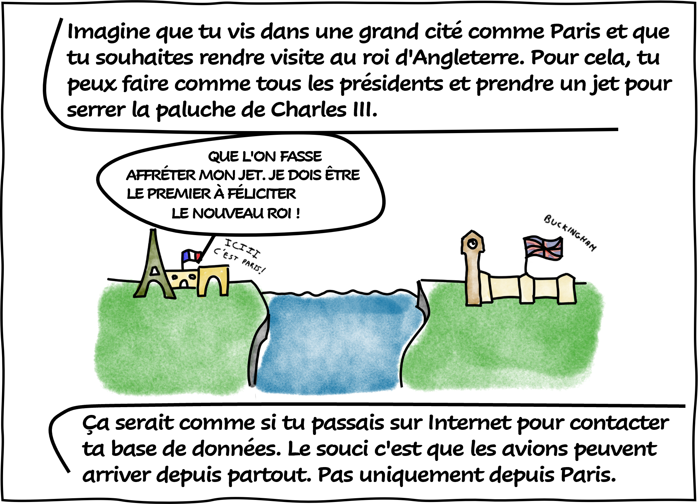
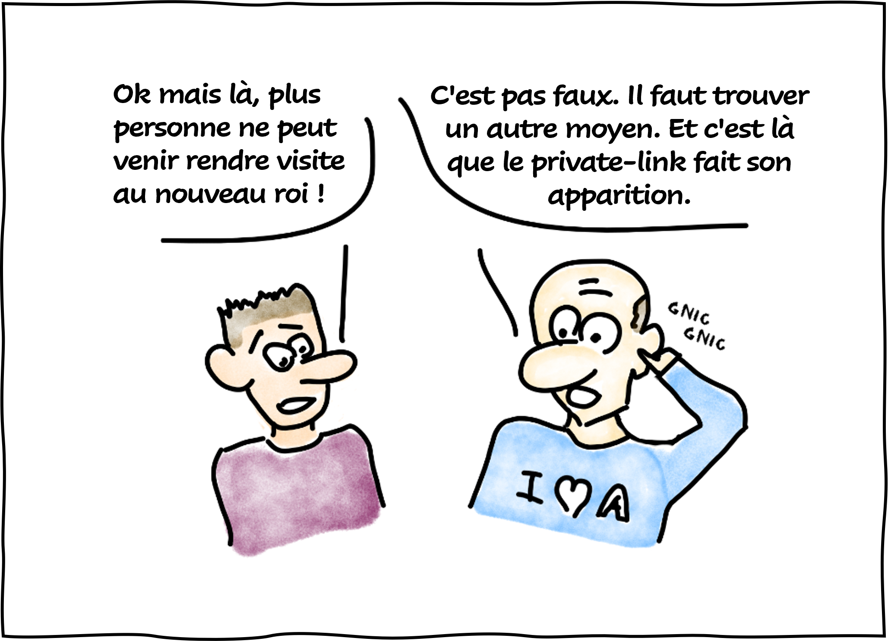
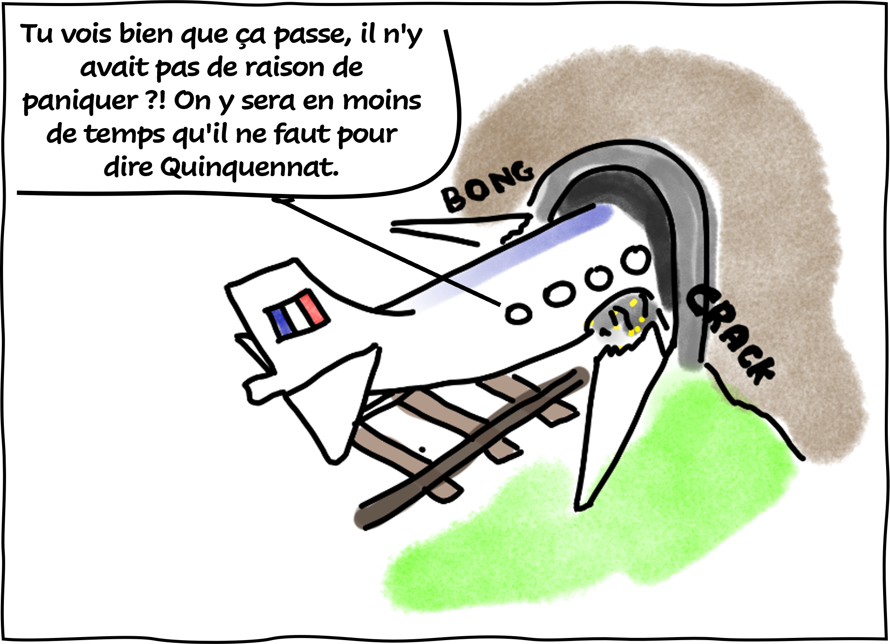
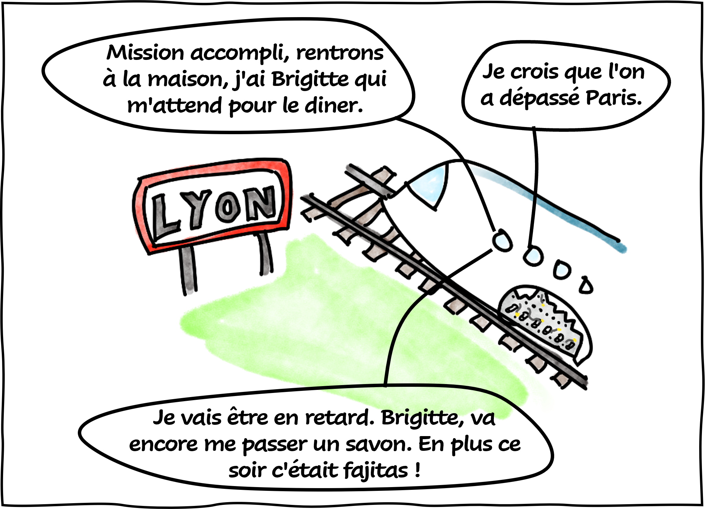
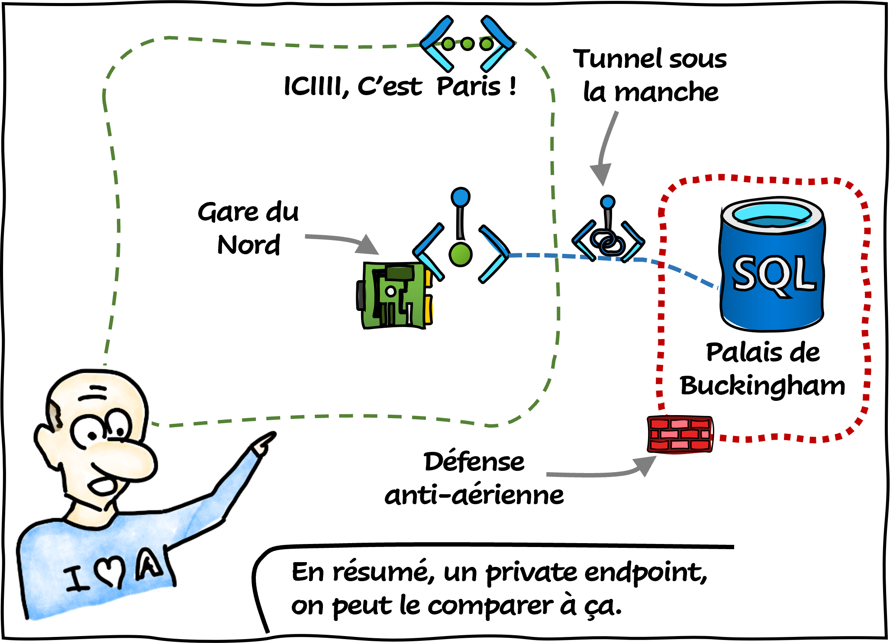

Cela fait plusieurs mois que je ne publie plus d'articles. En effet, j'ai été très occupé. Mais, j'ai eu une idée qui m'a trotté dans la tête pendant plusieurs semaines. Au bout d'un moment, je me suis lancé !

Et voilà le résultat…

Il s'agit là du premier épisode d'une longue (je l'espère) série. Je me suis directement inspiré des blogs que j'avais plaisir de parcourir il y'a quelques années (celui de Marion Montaigne et celui du LHC).

## Références

- [What is a private endpoint?](https://learn.microsoft.com/en-us/azure/private-link/private-endpoint-overview?WT.mc_id=AZ-MVP-5004832)
- [Tu mourras moins bête (blog de Marion Montaigne)](http://tumourrasmoinsbete.blogspot.com/)
- [LHC-France (La BD du LHC)](https://www.lhc-france.fr/spip.php?article689)

## Remerciements

- [Jean-Philippe SENON](https://www.linkedin.com/in/jeanphilippesenon/) : pour la relecture

_Rédigé par Philippe MORISSEAU, Publié le 13 Février 2023_