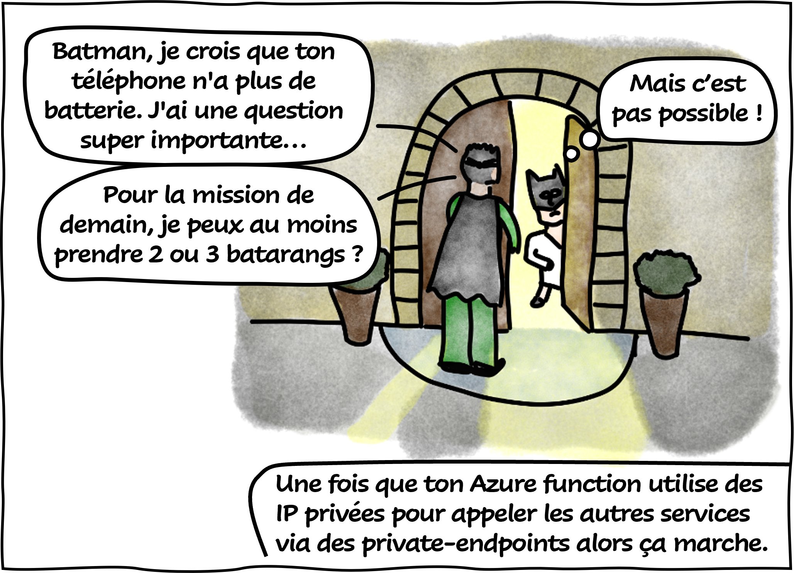
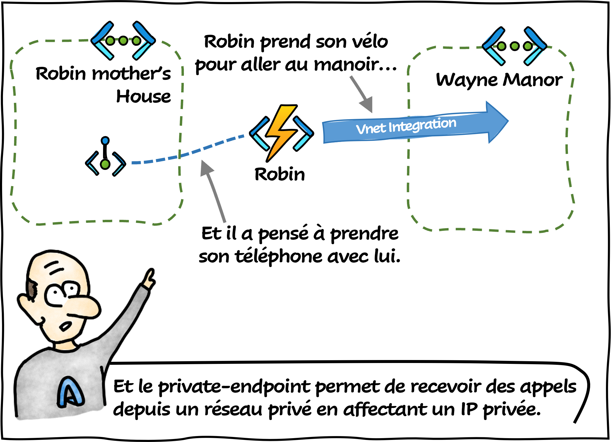

# Private Endpoint VS Vnet Integration

Aujourd'hui le **Professeur Somlintom** vous explique la différence intre le private-endpoint et le Vnet Integration ! 

## Références

- [What is a private endpoint?](https://learn.microsoft.com/en-us/azure/private-link/private-endpoint-overview?WT.mc_id=AZ-MVP-5004832)
- [Integrate your app with an Azure virtual network](https://learn.microsoft.com/en-us/azure/app-service/overview-vnet-integration?WT.mc_id=AZ-MVP-5004832)
- [Using Private Endpoints for App Service apps](https://learn.microsoft.com/en-us/azure/app-service/networking/private-endpoint?WT.mc_id=AZ-MVP-5004832)

## Remerciements

_Rédigé par Philippe MORISSEAU, Publié le 20 Février 2023_