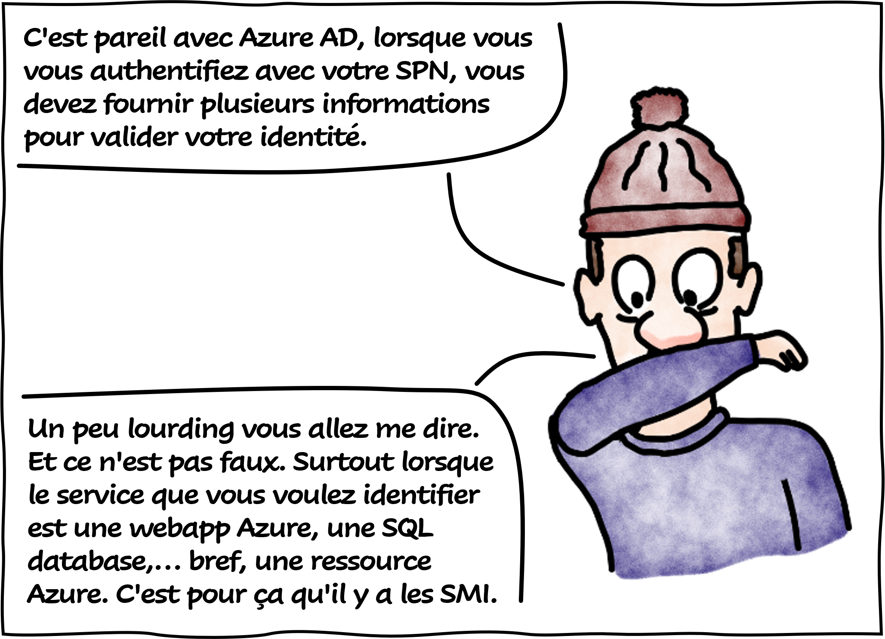
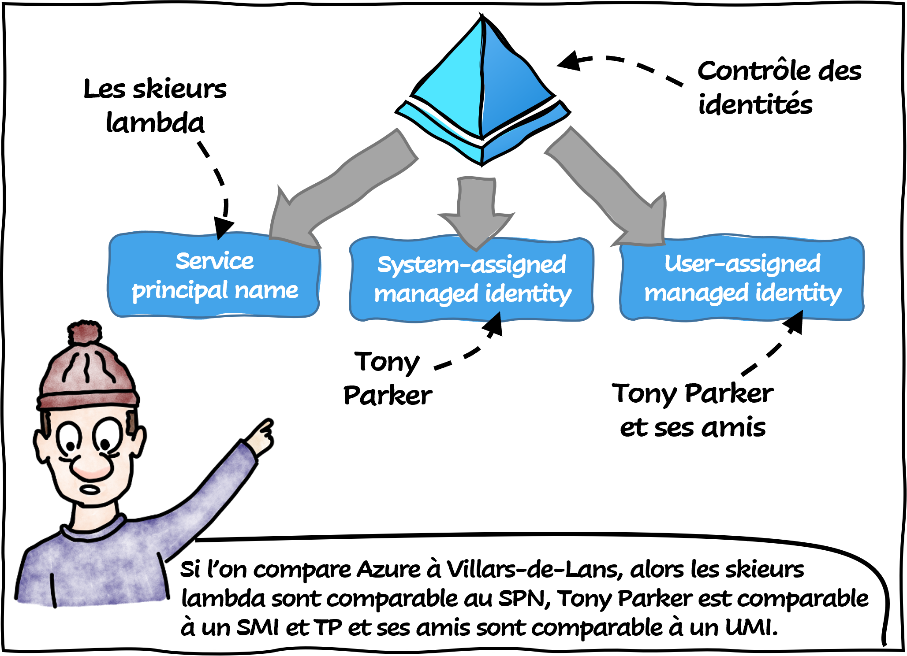

# SPN, SMI et UMI

Aujourd'hui le **Professeur Somlintom** vous explique la différence entre le service principal name, le system-assigned managed identity et le user-assigned managed identity !

*Veuillez noter que les activités de Tony Parker au Villard de Lens sont de la pure fiction et ne servent qu'à expliquer le propos.*

## Références

- [What are managed identities for Azure resources?](https://learn.microsoft.com/en-us/azure/active-directory/managed-identities-azure-resources/overview?WT.mc_id=AZ-MVP-5004832)
- [Application and service principal objects in Azure Active Directory](https://learn.microsoft.com/en-us/azure/active-directory/develop/app-objects-and-service-principals?WT.mc_id=AZ-MVP-5004832)

## Remerciements

_Rédigé par Philippe MORISSEAU, Publié le 13 Mars 2023_