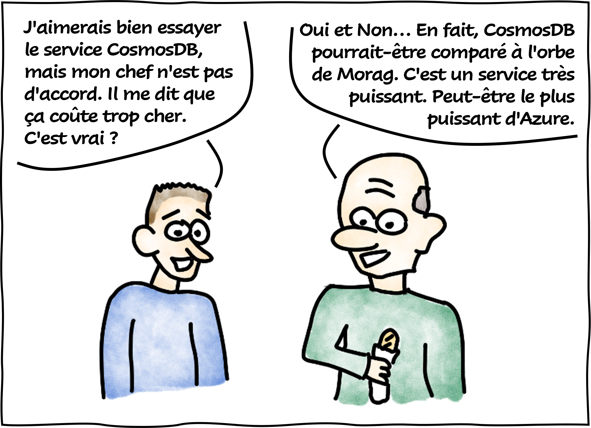
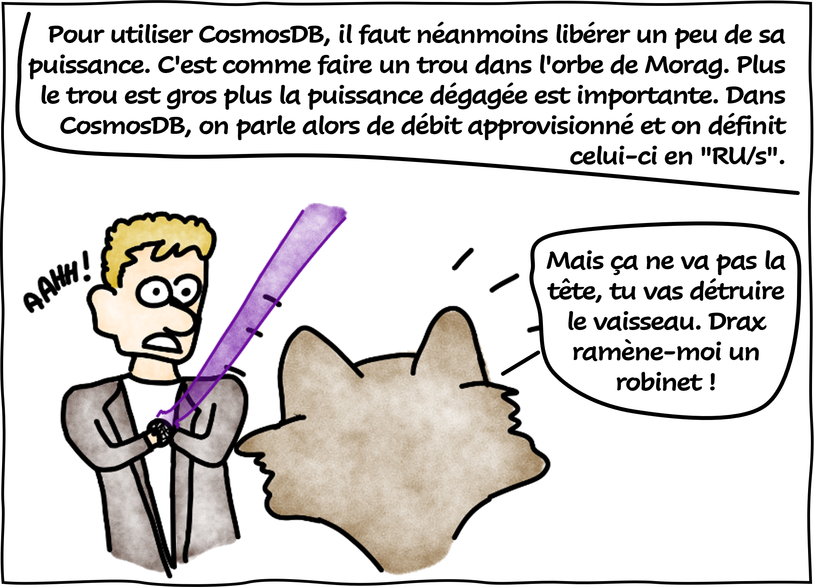
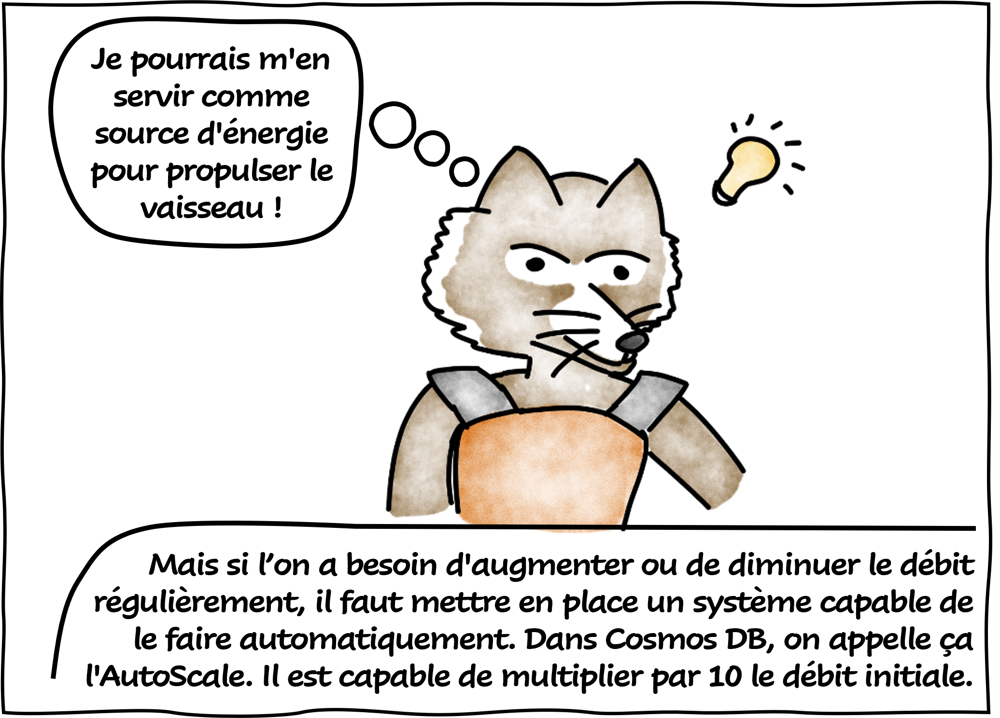
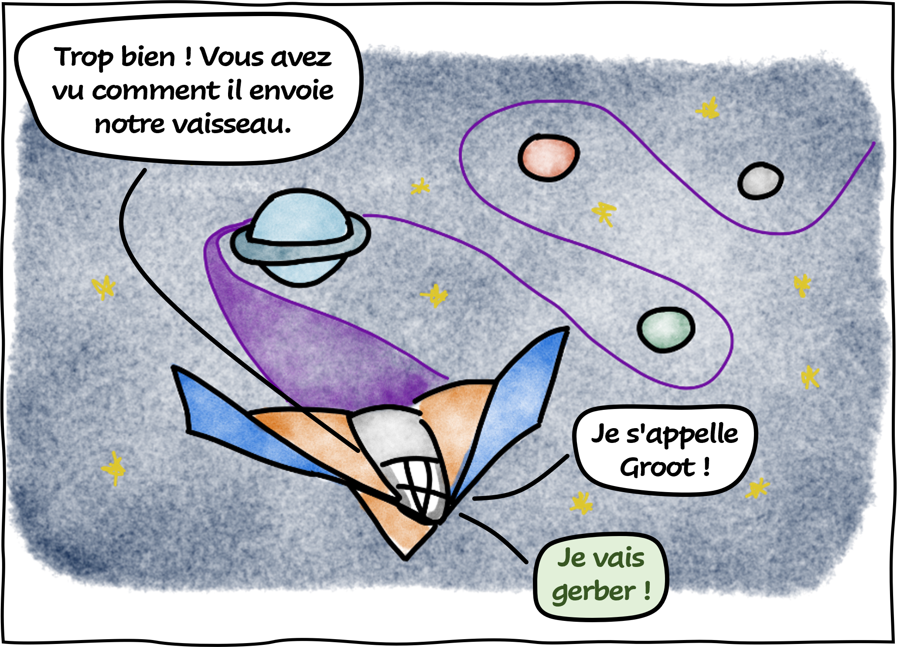
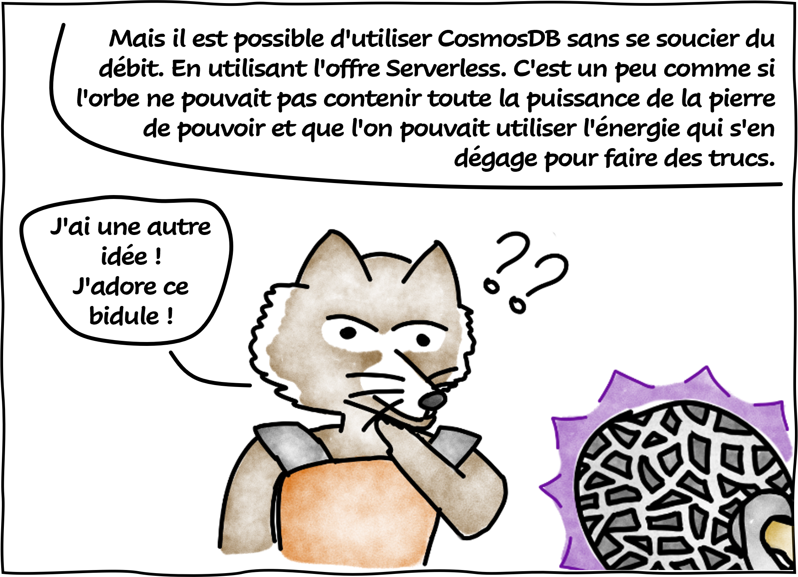
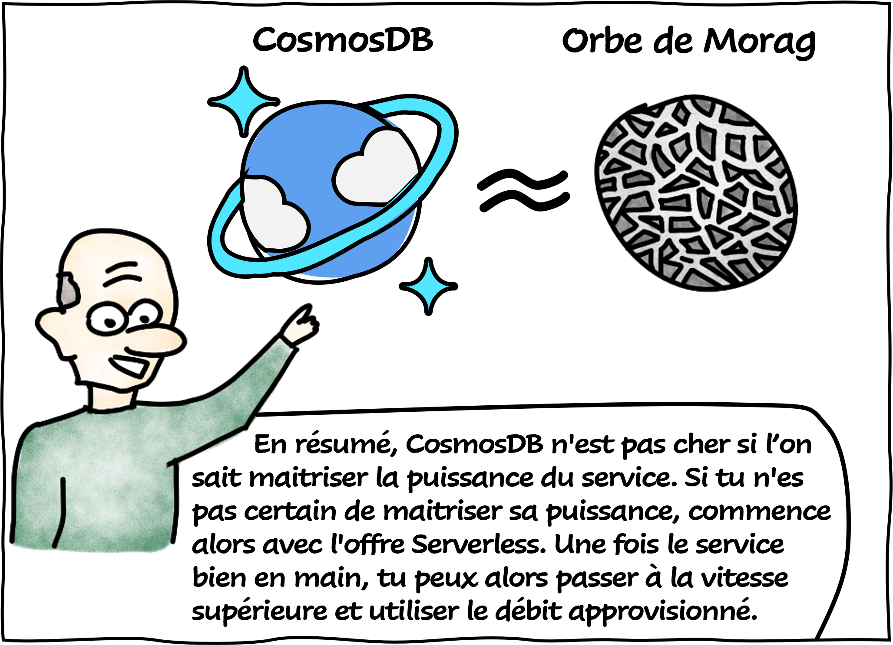

# Cosmos DB, c'est comme l'orbe de Morag

Aujourd'hui le **Professeur Somlinton** vous rassure sur l'utilisation de Cosmos DB, l'un des services les plus puissant d'Azure.

## Références

- [Request Units in Azure Cosmos DB](https://learn.microsoft.com/en-us/azure/cosmos-db/request-units?WT.mc_id=AZ-MVP-5004832)
- [Introduction to provisioned throughput in Azure Cosmos DB](https://learn.microsoft.com/en-us/azure/cosmos-db/set-throughput?WT.mc_id=AZ-MVP-5004832)
- [Create Azure Cosmos DB containers and databases with autoscale throughput](https://learn.microsoft.com/en-us/azure/cosmos-db/provision-throughput-autoscale?WT.mc_id=AZ-MVP-5004832)
- [Azure Cosmos DB serverless](https://learn.microsoft.com/en-us/azure/cosmos-db/serverless?WT.mc_id=AZ-MVP-5004832)

## Remerciements

- [Jean-Philippe SENON](https://www.linkedin.com/in/jeanphilippesenon/) : pour la relecture

_Rédigé par Philippe MORISSEAU, Publié le 27 Mars 2023_