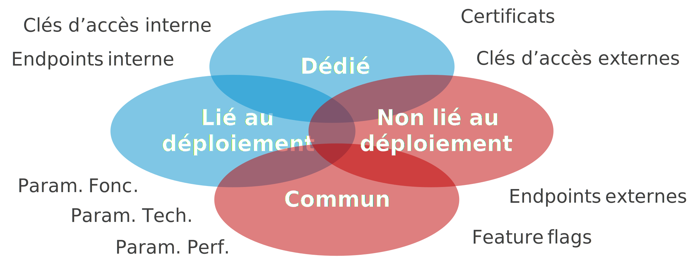

Dans mon dernier talk *"GitOps, Continuous Delivery et les environnements : comment éviter l'enfer !"*, un participant m'a fait remarquer qu'il serait bien de montrer concrètement comment mettre en place une démarche **GitOps** avec des outils modernes.

Etant un adepte des services managés d'**Azure**, je vous propose donc d'étudier comment mettre en place une démarche **GitOps** avec **Azure App Configuration**.

## Pourquoi adopter une démarche GitOps ?

Commençons par un petit rappel. 

La démarche **GitOps** est le résultat de la rencontre du monde des développeurs et du monde des administrateurs et exploitants. Cette rencontre s'est opérée au moment de la démocratisation de la démarche **DevOps**. Les développeurs travaillant avec les administrateurs, les deux mondes (autrefois bien silotés) se sont inspirés mutuellement et l'un des résultats est la démarche **GitOps**.

Mais **GitOps**, c'est quoi ?

La démarche **GitOps**,  c'est simplement l'utilisation d'outils de gestion du code comme **git** pour gérer les paramètres de configuration d'une application. Ces outils offrant les avantages suivants :

- Centralisation : grâce au serveur de **repository**,
- Historisation : grâce aux **commits**,
- Gouvernance : grâce au contrôle d'accès,
- Automatisation : grâce aux pipelines de **CI/CD**.

Cela veut-il dire que c'est le nouveau standard ?

Oui... et non. Cela va surtout dépendre du contexte de votre application. Si vous gérez une application monolithique, vous n'avez peut-être pas besoin de mettre en place une démarche **GitOps**. Vous pouvez peut-être vous contenter de gérer les paramètres de configuration de votre application directement dans votre pipeline. **"Keep it simple and stupide !"**.

Vous allez trouver l'intérêt de mettre en place une démarche **GitOps** dès que vous aurez à gérer une application distribuée. En effet, dans vos paramètres de configuration, vous devrez gérer des attributs communs aux composants de votre architecture (comme les chaines de connexion à vos bases de données) et des attributs qui ne sont pas liés au déploiement de vos composants (comme les certificats). Ces paramètres seront géré indépendamment de vos composants.



## Présentation d'Azure App Configuration

Le service **Azure App Configuration** va vous permettre de mettre en place une démarche **GitOps** sur **Azure**.
En effet, ce service managé va permettre de gérer et de distribuer vos paramètres de configuration à vos applications.

Microsoft propose pour ce service des SDK disponibles dans de nombreux langages : .NET, Java, Python, JavaScript, ...

Vous allez donc pouvoir utiliser ce service pour distribuer votre configuration à vos **Function Apps**, **Web Apps**, **Container Instances**, **Kubernetes Services**, ...

Il existe 2 niveaux de tarification : *Gratuit* et *Standard*. Vous constaterez que le niveau *Gratuit* est peut-être intéressant mais uniquement pour des environnements hors-production. L'absence de SLA et les quotas ne sont tout simplement pas envisageables pour une application en production (à moins d'avoir le goût du risque).

!!! note
    Pour en savoir plus, je vous invite à consulter la documentation de Microsoft : [ici](https://docs.microsoft.com/fr-fr/azure/azure-app-configuration/overview) 

## L'architecture

Trêve de *blabla* et rentrons directement dans le vif du sujet. Commençons par un petit schéma d'architecture.
L'objectif est d'utiliser conjointement **Azure DevOps** et **Azure App Configuration** pour distribuer la configuration aux différents éléments de notre application distribuée.


Nous allons pousser la configuration depuis **Azure DevOps** vers **Azure App Configuration** et configurer nos différents composants de notre architecture distribuée pour aller récupérer la configuration depuis ce dernier.

Il est possible d'indiquer dans **Azure App Configuration** qu'un des paramètres est dans **Azure Key Vault**. Votre application ira alors récupérer directement la configuration dans le coffre-fort à partir de la clé indiquée par **Azure App Configuration**.

Il existe 2 modes de connexion à **Azure App Configuration** :

- avec une clé d'accès,
- avec une identité managée (**System Assigned** ou **User Assigned**).

Je vous recommande fortement d'utiliser la seconde solution; la première ne devant être utilisée que si vous n'avez pas d'autre solution.

Vous pouvez aussi isoler d'un point de vue réseau ce service en utilisant un **Private Endpoint**. Mais dans ce cas-là, il faudra veiller à utiliser des **Self-hosted** agents **Azure DevOps** pour déployer votre configuration.
Voici un exemple de schéma d'architecture avec une isolation réseau :


Enfin, si vous souhaitez que vos composants soient notifiés à chaque modification de configuration, vous pouvez ajouter le service **Event Grid System Topic**.


!!! note
    Il n'est pas possible d'isoler d'un point de vue réseau un **Event Grid System Topic** avec un **Private Endpoint**. Pour résoudre ce problème, il faudra faire un "petit trou" via **Service Tag** pour autoriser le trafic provenant de votre **Event Grid** (cf. : [mon article sur l'isolation réseau](../../../classroom/01.azureClassroom.VnetEndpointFirewall/#service-tag)).

## L'implémentation dans vos applications

### Configurer vos applications .NET pour utiliser Azure App Configuration 

Pour configurer vos applications **.NET** il va falloir ajouter dans votre projet le **package nuget** `Microsoft.Azure.AppConfiguration.AspNetCore` pour vos applications **ASP.NET Core** ou `Microsoft.Extensions.Configuration.AzureAppConfiguration` pour toutes vos autres applications **.NET Core**.

Ensuite, il faut configurer le service. 

Voici un exemple de configuration simple de votre application **ASP.NET core** :

```csharp
var builder = WebApplication.CreateBuilder(args);

builder.Host.ConfigureAppConfiguration(builder =>
{
    var settings = builder.Build();
    //Connect to your App Config Store
    builder.AddAzureAppConfiguration(options =>
    {
        options.Connect(new Uri(settings["AppConfig:Endpoint"]), new ManagedIdentityCredential())
    });
    // ...
}); 
```

Dans cet exemple, nous utilisons l'identité managée pour authentifier l'application auprès du service **Azure App Configuration**. 

Enfin, Il faut donner le rôle **App Configuration Data Reader (RBAC)** au niveau de l'**Azure App Configuration** à votre application **ASP.NET core**.

### Rafraichir la configuration en mode "Pull"

Pouvoir charger la configuration de votre application depuis **Azure App Configuration** c'est bien. Mais procéder à un redémarrage de l'application pour charger la nouvelle configuration n'est pas toujours idéal.
Le SDK d'**Azure App Configuration** permet de pallier à ce problème en détectant la modification de la configuration et en rechargeant celle-ci automatiquement.

Avant tout, il faut s'assurer que le **middleware** d'**Azure App Configuration** est configuré. Pour cela dans le `HostBuilder`, il faut ajouter le service via `AddAzureAppConfiguration`.

```csharp
builder.Host.ConfigureAppConfiguration(builder =>
{
    // ...   
})
.ConfigureServices(services =>
{
    services.AddControllersWithViews();
    services.AddAzureAppConfiguration();
});
```

Puis activer le **middleware** au niveau de la `WebApplication` via `UseAzureAppConfiguration`.

```csharp
var app = builder.Build();
app.UseHttpsRedirection();
app.UseAzureAppConfiguration();
// ...
```

Puis, nous allons utiliser un paramètre "sentinelle" dans **Azure App Configuration**. A chaque changement de ce paramètre cela indiquera qu'il faut recharger la configuration.

Voici un exemple :

```csharp
builder.AddAzureAppConfiguration(options =>
{
    options.Connect(new Uri(settings["AppConfig:Endpoint"]), new ManagedIdentityCredential())
        .ConfigureRefresh(refresh => refresh.Register("TestApp:Settings:Sentinel", true);
});
// ...
```

Dans cet exemple, on va conditionner le rafraichissement de tous les paramètres à la mise à jour de `TestApp:Settings:Sentinel`. 

Ainsi notre application va contrôler régulièrement la valeur de notre paramètre "sentinelle". Par défaut la fréquence est définie à 30 secondes. Mais vous pouvez définir vous-même la fréquence :

```csharp
// ...    
refresh.Register("TestApp:Settings:Sentinel", true).SetCacheExpiration(new TimeSpan(0, 0, 10))
// ...
```

Dans cet exemple, on va controler le paramètre "sentinelle" toutes les 10 secondes.

!!! attention
    Veillez à ne pas définir une fréquence trop élevée. En effet, si vous souhaitez vous assurer que votre configuration puisse être rafraichie très rapidement vous serez tenté de réduire à une seconde ou encore moins. Mais il faut prendre en compte que chaque **web app** va faire cette vérification de façon indépendante. En définissant à 1 seconde, vos composants vont interroger au moins 2,6 millions de fois par mois **Azure App Configuration**. Imaginons que vous ayez 10 composants dans votre architecture, cela monte alors à 26 millions de requêtes. Vous allez alors avoir un impact non négligeable sur les coûts de votre service **Azure App Configuration** (~ 140 € / mois).

Si vous voulez absolument avoir une solution qui prenne en compte quasi-instantanément votre nouvelle configuration, je vous conseille alors de rafraichir la configuration de votre application en mode "Push".

### Rafraichir la configuration en mode "Push"

Le principe consiste à ce que chaque modification apportée sur votre configuration dans **Azure App Configuration** déclenche une notification qui est capturée par vos composants. Cette solution va utiliser un autre service : les **Event Grid System Topic**.

Dans le cas d'un composant ASP.NET core, il va falloir :

1. Créer un **webhook** capable de s'enregistrer auprès de l'**Event Grid**,
2. Mettre en place le mécanisme de rafraichissement du paramétrage.

Commençons par le **webhook**. Pour cela, il faut ajouter dans notre projet le **package nuget** `Azure.Messaging.EventGrid`. Puis, créer un contrôleur dédié avec une méthode **POST**. Comme ceci : 

```csharp
using Azure.Messaging.EventGrid;
using Azure.Messaging.EventGrid.SystemEvents;
using Microsoft.AspNetCore.Mvc;

namespace [yournamespace].Controllers
{
    [ApiController]
    [Route("[controller]")]
    public class ConfigurationController : ControllerBase
    {
        [HttpPost]
        public async Task<IActionResult> Post()
        {
            BinaryData events = await BinaryData.FromStreamAsync(Request.Body);
            EventGridEvent[] eventGridEvents = EventGridEvent.ParseMany(events);

            foreach (EventGridEvent eventGridEvent in eventGridEvents)
            {
                // Handle system events
                if (eventGridEvent.TryGetSystemEventData(out object eventData))
                {
                    // Handle the subscription validation event
                    if (eventData is SubscriptionValidationEventData subscriptionValidationEventData)
                    {
                        var responseData = new SubscriptionValidationResponse()
                        {
                            ValidationResponse = subscriptionValidationEventData.ValidationCode
                        };
                        return new OkObjectResult(responseData);
                    }
                    // Handle the app configuration keyvalue event
                    else if (eventData is AppConfigurationKeyValueModifiedEventData || eventData is AppConfigurationKeyValueDeletedEventData)
                    {
                        // TO DO
                    }
                }
            }
            return new OkObjectResult(string.Empty);
        }
    }
}
```

Nous sommes maintenant capables de capturer les évènements poussés par l'**Event Grid**. Il faut maintenant déclencher le rafraîchissement de la configuration.
Pour cela, il faut créer une classe en charge de déclencher le rafraîchissement auprès du **middleware** d'**Azure App Configuration**. Voici un exemple :

```csharp
using Microsoft.Extensions.Configuration.AzureAppConfiguration;

namespace [yournamespace]
{
    public class OnDemandConfigurationRefresher : IOnDemandConfigurationRefresher
    {
        private readonly List<IConfigurationRefresher> _configurationRefreshers = new List<IConfigurationRefresher>();

        public OnDemandConfigurationRefresher(IConfiguration configuration)
        {
            var configurationRoot = configuration as IConfigurationRoot;

            if (configurationRoot == null)
            {
                throw new InvalidOperationException("The 'IConfiguration' injected in OnDemandConfigurationRefresher is not an 'IConfigurationRoot', and needs to be as well.");
            }

            foreach (var provider in configurationRoot.Providers)
            {
                if (provider is IConfigurationRefresher refresher)
                {
                    _configurationRefreshers.Add(refresher);
                }
            }
        }

        public void RefreshAllRegisteredKeysAsync(PushNotification pushNotification)
        {
            _configurationRefreshers.ForEach(r => r.ProcessPushNotification(pushNotification));
        }
    }
}
```

Et ajouter cette classe en tant que service.

```csharp
builder.Host.ConfigureAppConfiguration(builder =>
{
    // ...   
})
.ConfigureServices(services =>
{
    services.AddControllersWithViews();
    services.AddAzureAppConfiguration();
    services.AddScoped<IOnDemandConfigurationRefresher, OnDemandConfigurationRefresher>();
});
```

Enfin, implémenter le déclenchement du rafraichissement depuis le **webhook** :

```csharp
using Azure.Messaging.EventGrid;
using Azure.Messaging.EventGrid.SystemEvents;
using Microsoft.AspNetCore.Mvc;
using Microsoft.Extensions.Configuration.AzureAppConfiguration;
using Microsoft.Extensions.Configuration.AzureAppConfiguration.Extensions;

namespace [yournamespace].Controllers
{
    [ApiController]
    [Route("[controller]")]
    public class ConfigurationController : ControllerBase
    {
        private readonly IOnDemandConfigurationRefresher _azureAppConfigurationRefresher;

        public ConfigurationController(IOnDemandConfigurationRefresher azureAppConfigurationRefresher)
        {
            _configuration = configuration;
            _azureAppConfigurationRefresher = azureAppConfigurationRefresher;
        }

        [HttpPost]
        public async Task<IActionResult> Post()
        {
            BinaryData events = await BinaryData.FromStreamAsync(Request.Body);
            EventGridEvent[] eventGridEvents = EventGridEvent.ParseMany(events);

            foreach (EventGridEvent eventGridEvent in eventGridEvents)
            {
                // Handle system events
                if (eventGridEvent.TryGetSystemEventData(out object eventData))
                {
                    // Handle the subscription validation event
                    if (eventData is SubscriptionValidationEventData subscriptionValidationEventData)
                    {
                        var responseData = new SubscriptionValidationResponse()
                        {
                            ValidationResponse = subscriptionValidationEventData.ValidationCode
                        };
                        return new OkObjectResult(responseData);
                    }
                    // Handle the app configuration keyvalue event
                    else if (eventData is AppConfigurationKeyValueModifiedEventData || eventData is AppConfigurationKeyValueDeletedEventData)
                    {
                        eventGridEvent.TryCreatePushNotification(out PushNotification pushNotification);
                        _azureAppConfigurationRefresher.RefreshAllRegisteredKeysAsync(pushNotification);
                    }
                }
            }
            return new OkObjectResult(string.Empty);
        }
    }
}
```

Et voilà ! 

Vous pouvez ensuite augmenter l'expiration du cache à un ou plusieurs jours : `SetCacheExpiration(TimeSpan.FromDays(10))`. 

Cette solution a un inconvénient. Si au moment de votre modification de configuration votre composant n'est pas disponible, l'évènement ne sera pas capturé et la configuration ne sera pas mise à jour.
Vous pouvez pallier ce problème en utilisant une file d'attente **Service Bus** entre votre **Event Grid** et votre **Web app**. Ainsi, votre composant pourra alors récupérer la modification de la configuration dès qu'il sera de nouveau disponible.


### Configurer pour utiliser Azure App Configuration avec Azure Key Vault

Dans vos paramètres de configuration, il n'est pas rare de trouver des éléments sensibles comme des clés d'accès, des mots de passe, des chaines de connexion. Il est fortement recommandé de protéger ces paramètres sensibles dans un coffre-fort. **Azure App Configuration** permet de référencer les paramètres sensibles de votre configuration et d'indiquer leur emplacement dans **Azure KeyVault**. Ainsi votre application pourra facilement récupérer la valeur du paramètre directement dans le coffre-fort. De plus, comme pour tous les autres paramètres de configuration, vous pourrez notifier vos composants d'une modification dans le coffre-fort.

Pour cela c'est très simple, il suffit de modifier le paramétrage d'**Azure App Configuration** dans votre composant. Voici un exemple utilisant les identités managées :

```csharp
builder.AddAzureAppConfiguration(options =>
{
    options.Connect(new Uri(settings["AppConfig:Endpoint"]), new ManagedIdentityCredential())
        .ConfigureRefresh(refresh => refresh.Register("TestApp:Settings:Sentinel", true)
        .ConfigureKeyVault(kv => kv.SetCredential(new ManagedIdentityCredential()));
});
// ...
```

!!! note
    Il faut que votre application (via son identité managée) soit autorisée à récupérer (**GET**) les valeurs dans **Azure KeyVault**. 

## Conclusion

Dans cette première partie nous avons vu comment mettre en place **Azure App Configuration** avec nos applications. 
Nous verrons dans la seconde partie, comment automatiser la mise à jour de la configuration avec **Azure DevOps**.  

A suivre...

## Références

- [Microsoft : Azure App Configuration](https://docs.microsoft.com/en-us/azure/azure-app-configuration/)
- [Azure App Configuration refresh on demand](https://www.bustroker.com/notes/azure-app-configuration-refresh-on-demand/)
  
## Remerciements

- [Etienne Louise](https://www.linkedin.com/in/etienne-louise-78154063/) : pour la relecture et la remarque qui m'a conduite à publier cet article
- [David Dubourg](https://www.linkedin.com/in/dubourg-david-7413779/) : pour la relecture
- [Michael Maillot](https://twitter.com/michael_maillot) : pour la relecture

_Rédigé par Philippe MORISSEAU, Publié le 25 Avril 2022._