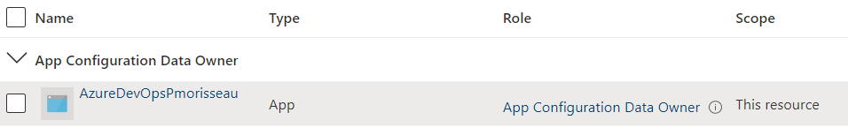
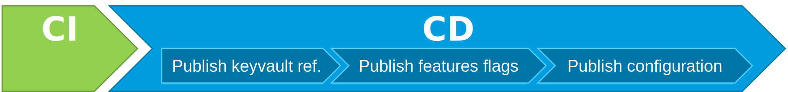

Dans la première partie nous avons vu comment utiliser **Azure App Configuration** avec différentes applications et contraintes : coffre-fort, **push** ou **pull** de la configuration.
Dans cette seconde partie nous allons voir ensemble comment utiliser les **repos git** et les pipelines **Azure DevOps** pour gérer et pousser la configuration vers **Azure App Configuration**.

## Rappel de la démarche GitOps

La démarche **GitOps** consiste à gérer la configuration des applications en utilisant un gestionnaire de source comme **git**.
**git** offre l'avantage de fournir un historique des modifications grâce aux **commits** et de pouvoir automatiser le déploiement de la configuration grâce aux pipelines de **CI/CD**.

Chaque modification de configuration produit un commit **git**. Celui-ci déclenche un pipeline qui va se charger de déployer la configuration.

A cela, on va pouvoir ajouter le **branching model** (**TBD**, **Gitflow**, **github flow**, ...) et le **semantic versioning**, pour conditionner le déploiement de la configuration.

## L'architecture (rappel)

L'objectif est d'utiliser conjointement **Azure DevOps** et **Azure App Configuration** pour distribuer la configuration aux différents éléments de notre application distribuée.


Nous allons pousser la configuration depuis **Azure DevOps** vers **Azure App Configuration** et configurer nos différents composants de notre architecture distribuée pour aller récupérer la configuration depuis ce dernier.

Si vous isolez d'un point de vue réseau **Azure App Configuration** en utilisant un **Private Endpoint**, il faudra veiller à utiliser des **Self-hosted** agents **Azure DevOps** pour déployer votre configuration.
Voici un exemple de schéma d'architecture avec une isolation réseau :


## L'implémentation Azure DevOps

### Créer la connexion Azure DevOps <-> Azure

Si vous utilisez déjà **Azure DevOps** pour déployer vos applications sur **Azure** cela veut dire que vous avez très certainement un **service connection** dans votre projet de configuré. Dans ce cas, il faudra juste noter le **Service Principal Id**. Sinon, vous pouvez suivre la procédure décrite [ici](https://docs.microsoft.com/fr-fr/azure/devops/pipelines/library/service-endpoints?view=azure-devops&tabs=yaml#create-a-service-connection).

Une fois votre **service connection** opérationnel, il va falloir lui donner l'autorisation de gérer la configuration de votre **Azure App Configuration**. Pour cela, dans **Azure**, ajouter le rôle **App Configuration Data Owner (RBAC)** au niveau de l'**Azure App Configuration**.



**Azure DevOps** peut maintenant gérer votre configuration pour vous.

### Gérer votre configuration

Votre configuration va devoir être géré dans des fichiers *Json* ou *Yaml*.

!!! note
    Je vous conseille l'utilisation du format *Json*. En effet, ce format est bien plus facile à gérer avec les extensions **Azure DevOps** que le format *Yaml* .

Afin de simplifier la gestion, je vous conseille de séparer votre configuration dans différents fichiers :

- un fichier pour les paramètres "classiques",
- un fichier pour les **Feature flags**,
- un fichier pour les références à votre **Azure Keyvault**.

Commençons par le fichiers de paramètres "classiques". Rien de plus simple. Pour chaque clé, vous allez définir la valeur. Par exemple en json vous aurez :

```yaml
TestApp:Settings:Param1: ValueOfParam1
TestApp:Settings:Param2: ValueOfParam2
All:Settings:Param3: ValueOfParam3
```

Pour le fichier contenant les **Features flags**, cela sera un peux plus compliqué. Pour chaque **Feature flags**, vous allez devoir définir un noeuds contenant les paramètres *id*, *enabled* et optionnellement *description* et *conditions*. Et la clé doit commencer par `.appconfig.featureflag/`.

Ci-dessous un exemple en json pour changer ;-) :

```json
{ 
   ".appconfig.featureflag/flag001": {
        "id": "Flag001",
        "enabled": true
   }, 
   ".appconfig.featureflag/flag002": {
        "id": "Flag002",
        "enabled": true,
        "conditions": {
            "client_filters": [
                {
                    "name": "Microsoft.TimeWindow",
                    "parameters": {
                        "Start": "Thu, 19 May 2022 22:00:00 GMT",
                        "End": "Sat, 21 May 2022 22:00:00 GMT"
                    }
                }
            ]
        }        
   },         
   ".appconfig.featureflag/flag003": {
        "id": "Flag003",
        "description": "Lorem ipsum dolor sit amet",
        "enabled": true,
        "conditions": {
            "client_filters": [
                {
                    "name": "Microsoft.Targeting",
                    "parameters": {
                        "Audience": {
                            "Users": [],
                            "Groups": [
                                {
                                    "Name": "groupA",
                                    "RolloutPercentage": 0
                                },
                                {
                                    "Name": "groupB",
                                    "RolloutPercentage": 100
                                }
                            ],
                            "DefaultRolloutPercentage": 50
                        }
                    }
                }
            ]
        }
   }   
}
```

Enfin pour le fichier contenant les références à votre **Azure Keyvault**, vous allez devoir définir un noeuds contenant le paramètre *uri* contenant l'url d'accès à votre secret.
Par exemple (en json) :

```json
{
    "TestApp:Settings:Secret1": {
        "uri":"https://[YourKeyVaultName].vault.azure.net/secrets/Secret1"
    },
    "TestApp:Settings:Secret2": {
        "uri":"https://[YourKeyVaultName].vault.azure.net/secrets/Secret2"
    },
    "TestApp:Settings:Secret3": {
        "uri":"https://[YourKeyVaultName].vault.azure.net/secrets/Secret3"
    }
}
```

Reste plus qu'à pousser ces différents fichiers sur un **repo. git** dédié...

Oui mais pas que ! Pour gérer tout cela, il va falloir automatiser le déploiement et gérer le paramètre "sentinelle" capable de d'indiquer aux applications que la configuration a changé ! (cf. [Rafraichir la configuration en mode "Pull"](../01.gitops.AzureAppConfiguration/#rafraichir-la-configuration-en-mode-pull))

### Sématique versioning et sentinelle.

Notre paramètre "sentinelle" doit indiquer une modification de la configuration afin de forcer le rafraichissement de celle-ci au niveau des applications. Pourquoi ne pas utiliser le **semantique versioning** pour faire cela.

Pour cela, nous allons executer un petit script qui va ajouter dans notre fichier de configuration "classique" un paramètre "sentinelle". Celui-ci sera valué avec la version voulu.

Ci-dessous un exemple de script powershell qui va modifier le fichier yaml afin d'ajouter le paramètre `TestApp:Settings:Sentinel` :

```powershell
# Arguments that get passed to the script when running it
param (
    [Parameter(Position=1)]
    $yamlFile,
    [Parameter(Position=2)]
    $version
)
 
# Install and import the `powershell-yaml` module
# Install module has a -Force -Verbose -Scope CurrentUser arguments which might be necessary in your CI/CD environment to install the module
Install-Module -Name powershell-yaml -Force -Verbose -Scope CurrentUser
Import-Module powershell-yaml
 
# LoadYml function that will read YML file and deserialize it
function LoadYml {
    param (
        $FileName
    )
	# Load file content to a string array containing all YML file lines
    [string[]]$fileContent = Get-Content $FileName
    $content = ''
    # Convert a string array to a string
    foreach ($line in $fileContent) { $content = $content + "`n" + $line }
    # Deserialize a string to the PowerShell object
    $yml = ConvertFrom-YAML $content
    # return the object
    Write-Output $yml
}
 
# WriteYml function that writes the YML content to a file
function WriteYml {
    param (
        $FileName,
        $Content
    )
	#Serialize a PowerShell object to string
    $result = ConvertTo-YAML $Content
    #write to a file
    Set-Content -Path $FileName -Value $result
}
 
# Loading yml, setting new values and writing it back to disk
$yml = LoadYml $yamlFile
$yml.'TestApp:Settings:Sentinel' = $version
WriteYml $yamlFile $yml
```

Lorsque je met en place des pipelines de **CI/CD**, j'apprécie tout particulièrement l'utilisation d'outils comme **GitVersion**. Cet utilitaire va vous permettre de gérer votre **sematic versioning** à partir de votre historique git : vos **commits**, vos **tags**, vos **branches**.

Pour cela, vous allez devoir ajouter un fichier *GitVersion.yml* dans votre **repo. git**. Ce fichier va définir comment déduire la version à partir de votre historique.

Voici un exemple simple avec le **Trunk Based Development** :

```yaml
mode: ContinuousDeployment
assembly-versioning-scheme: MajorMinorPatch
tag-prefix: '[vV]'
continuous-delivery-fallback-tag: ci
major-version-bump-message: '\+semver:\s?(breaking|major)'
minor-version-bump-message: '\+semver:\s?(feature|minor)'
patch-version-bump-message: '\+semver:\s?(fix|patch)'
legacy-semver-padding: 5
build-metadata-padding: 5
commits-since-version-source-padding: 5
commit-message-incrementing: Enabled
branches:
  master:
    mode: ContinuousDeployment
    tag: unstable
    increment: Minor
    prevent-increment-of-merged-branch-version: true
    track-merge-target: false
  release:
    regex: releases?[/-]
    increment: Patch
    tag: stable
    prevent-increment-of-merged-branch-version: true
    track-merge-target: false
```

Il ne reste plus qu'à automatiser le déploiement de la configuration.

### Le pipeline CI/CD

Commençons, par la **CI**. Oui la **CI** !
Contrairement à ce que l'on pourrait croire, l'intégration continue va être utile pour :

- Définir la valeur du paramètre "sentinelle",
- Empaqueter la configuration afin de pouvoir reproduire cette configuration.


Et dans le cas d'un **multi-stage** pipeline **Azure Devops**, voila ce que cela peut donner :

```yaml
stages:
- stage: Prepare
  displayName: Prepare
  jobs:  
  - job: PrepareConfiguration
    displayName: Prepare configuration
    pool:
      vmImage: 'ubuntu-latest'
    steps:
    # Télécharge gitversion (s'il n'existe pas)
    - task: gittools.gittools.setup-gitversion-task.gitversion/setup@0
      displayName: gitversion/setup
      inputs:
        versionSpec: '5.*'
    # Définit la version
    - task: gittools.gittools.execute-gitversion-task.gitversion/execute@0
      displayName: gitversion/execute
      inputs:
        useConfigFile: true
        configFilePath: GitVersion.yml
    # Définit le paramètre sentinelle
    - task: PowerShell@2
      displayName: setSentinelVersion
      inputs:
        filePath: tools/setSentinel.ps1
        arguments: '-yamlFile configuration.yml -version $(GitVersion.FullSemVer)'
    # Copie la configuration à insérer dans l'artefact
    - task: CopyFiles@2
      displayName: 'Copy Files to: $(Build.ArtifactStagingDirectory)'
      inputs:
        Contents: config*.yml
        TargetFolder: '$(Build.ArtifactStagingDirectory)'
    # Publie l'artefact
    - task: PublishBuildArtifacts@1
      displayName: 'Publish Artifact: drop'

```

Une fois notre livrable de configuration prêt, il ne reste plus qu'à le déployer sur **Azure App Configuration**.
Vous pouvez facilement le faire avec la tâche `AzureAppConfiguration.azure-app-configuration-task-push.custom-build-release-task.AzureAppConfigurationPush@3`. 
Le souci avec cette tâche, c'est qu'elle ne peut pas déployer toutes les configuration en une seule fois. Il faut réaliser le déploiement par type de paramètre en passant une valeur distincte au paramètre `ContentType` :

- Pour les références au coffre-fort : `ContentType: 'application/vnd.microsoft.appconfig.keyvaultref+json;charset=utf-8'` 
- Pour les **features flags** : `ContentType: 'application/vnd.microsoft.appconfig.ff+json;charset=utf-8'`



Et dans le cas d'un **multi-stage** pipeline **Azure Devops**, voila ce que cela peut donner :

```yaml
- stage: Deploy
  displayName: Deploy
  jobs:
  - deployment: DeployConfig
    pool: 
      vmImage: 'ubuntu-latest'
    environment: YOUR_ENVIRONMENT
    workspace:
      clean: all
    strategy:
      runOnce:
        deploy:
          steps:
          #  Publie les références à votre Azure Keyvault 
          - task: AzureAppConfiguration.azure-app-configuration-task-push.custom-build-release-task.AzureAppConfigurationPush@3
            displayName: 'Azure App Configuration KeyVault'
            inputs:
              azureSubscription: ${{variables.azureSubscription}}
              AppConfigurationEndpoint: ${{variables.AppConfigurationEndpoint}}
              ConfigurationFile: $(Pipeline.Workspace)/drop/configurationKeyVault.yml
              Separator: .
              Depth: '1'
              ContentType: 'application/vnd.microsoft.appconfig.keyvaultref+json;charset=utf-8'
          # Publie les features flags 
          - task: AzureAppConfiguration.azure-app-configuration-task-push.custom-build-release-task.AzureAppConfigurationPush@3
            displayName: 'Azure App Configuration Feature Flags'
            inputs:
              azureSubscription: ${{variables.azureSubscription}}
              AppConfigurationEndpoint: ${{variables.AppConfigurationEndpoint}}
              ConfigurationFile: $(Pipeline.Workspace)/drop/configurationFeatureFlags.yml
              Separator: .
              Depth: '1'
              ContentType: 'application/vnd.microsoft.appconfig.ff+json;charset=utf-8'
          # Publie la configuration "classique" 
          - task: AzureAppConfiguration.azure-app-configuration-task-push.custom-build-release-task.AzureAppConfigurationPush@3
            displayName: 'Azure App Configuration'
            inputs:
              azureSubscription: ${{variables.azureSubscription}}
              AppConfigurationEndpoint: ${{variables.AppConfigurationEndpoint}}
              ConfigurationFile: $(Pipeline.Workspace)/drop/configuration.yml
              Separator: .
              Depth: '1'
```

!!! note
    Les paramètres `azureSubscription` et `AppConfigurationEndpoint` correspondent respectivement au **service connection** configuré sur votre projet **Azure DevOps** et à l'**url** de votre service **Azure App Configuration**.  

Et voila. Maintenant nous avons notre **repos git** et notre pipeline **CI/CD** qui nous permet de déployer la configuration.

FIN !

## Conclusion

Attendez un peu...

Nos configurations seront certainement différentes en fonction de nos environnements. 
Comment gérer ces configurations distincts ?
La modification de la configuration de l'environnement de recette n'a pas à impacter la configuration de l'environnement d'intégration ou de production. Cela veut-il dire que je dois mettre cela dans des fichiers distincts ? dans des **repos** distincts ? ou même ailleurs ?

Nous aborderons dans la troisième partie la gestion de la configuration par environnement.

A suivre...

## Références

- [Microsoft : Azure App Configuration](https://docs.microsoft.com/en-us/azure/azure-app-configuration/)
- [Azure DevOps : Créer une connexion de service](https://docs.microsoft.com/fr-fr/azure/devops/pipelines/library/service-endpoints?view=azure-devops&tabs=yaml#create-a-service-connection)
- [GitVersion](https://gitversion.net/)
- [Envoyer des paramètres vers App Configuration avec Azure Pipelines](https://docs.microsoft.com/fr-fr/azure/azure-app-configuration/push-kv-devops-pipeline)
  
## Remerciements

_Rédigé par Philippe MORISSEAU, Publié le 03 Mai 2022._