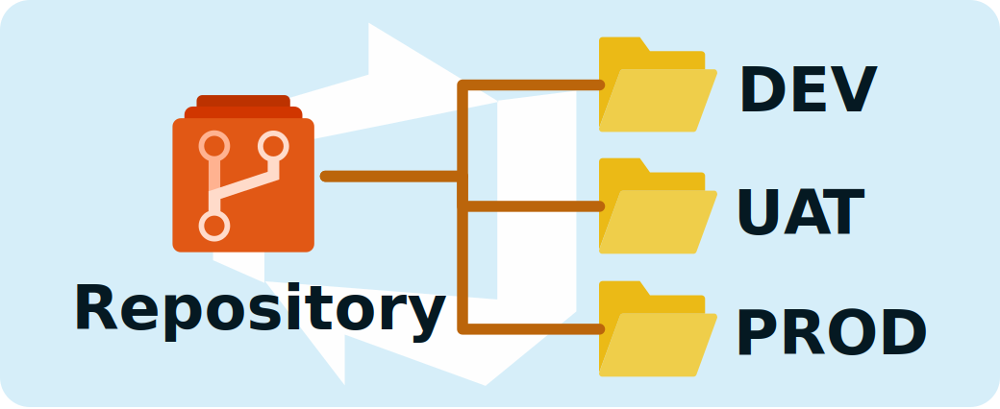
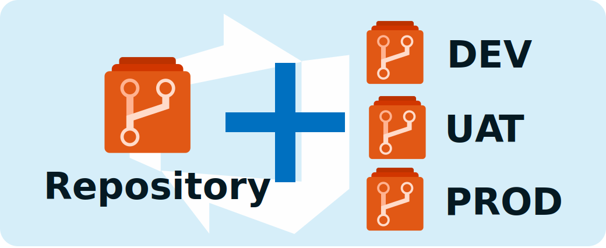
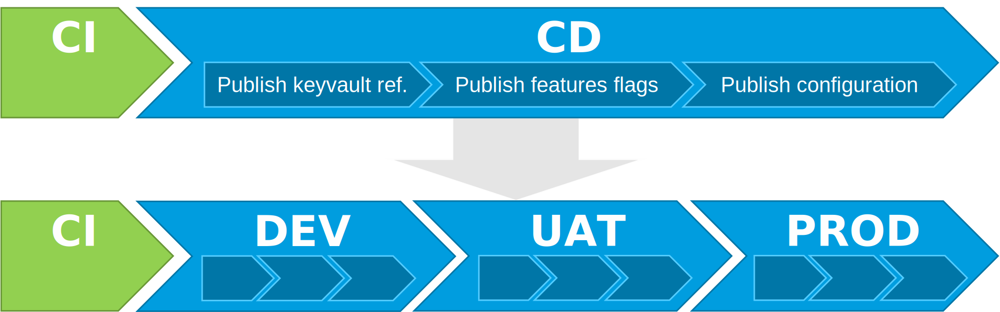
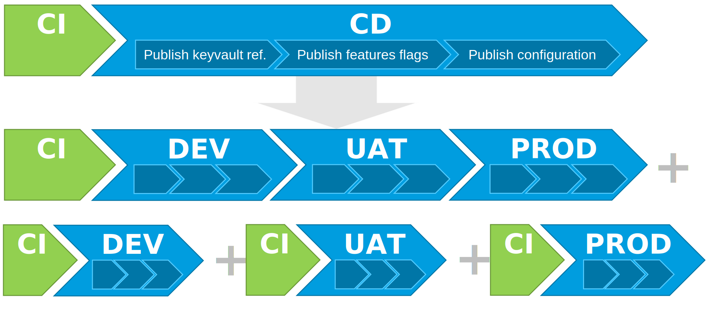
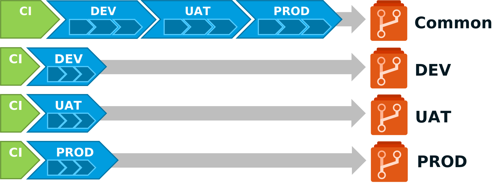

Dans la seconde partie nous avons vu comment utiliser les **repos git** et les pipelines **Azure DevOps** pour gérer et pousser la configuration vers **Azure App Configuration**. Mais nos configurations seront certainement différentes en fonction de nos environnements. Comment gérer ces configurations distinctes ?
La modification de la configuration de l'environnement de recette n'a pas à impacter la configuration de l'environnement d'intégration ou de production. Cela veut-il dire que je dois mettre cela dans des fichiers distincts ? dans des **repos** distincts ? ou même ailleurs ?

## Gérer votre configuration d'environnement

Avant, il faut se poser quelques questions :

 - Est-ce que vous avez besoin d'avoir un historique de la configuration spécifique à chacun de vos environnements ?
 - Combien de paramètres d'environnement (en dehors des paramètres sensibles) vous allez devoir gérer ?
 - Quel est la fréquence de vos mises à jour d'environnement ?

Si vous avez de nombreux paramètres d'environnement, l'utilisation d'un fichier de configuration par environnement dans votre **repo. git** est probablement la solution.

Si vous prévoyez de modifier votre configuration d'environnement régulièrement, peut-être que des **repos** par environnement est une bonne solution.

Cela va vraiment dépendre de votre situation. Je vais quand même vous proposer de décrire quelques solutions qui peuvent être mises en place avec **Azure DevOps**.

### Gérer votre configuration d'environnement avec les libraries Azure DevOps.

Si vous n'avez pas besoin de l'historique de vos configurations d'environnement, les **libraries Azure DevOps** sont suffisantes.


Utilisé conjointement dans votre pipeline **CD** avec une tâche du type `replacetokens`, vous pourrez alors surcharger votre configuration commune par les spécificités de vos environnements.

Par exemple, si vous définissez dans une libraire **Azure DevOps** les paramètres :

- NB_NODES : Nombre de nœuds de votre **cluster**,
- ALLOW_ANONYMOUS_ACCESS : Top indiquant si la **webApp** est accessible sans authentification,
- SUPER_ADMIN_USER : Identité du super administrateur du **cluster**. 

En utilisant, la tâche `replacetokens`, vous aurez un fichier de configuration dans votre **repo git** de ce type :

  ```yaml
  TestApp:Settings:Param1: ValueOfParam1
  TestApp:Settings:Param2: ValueOfParam2
  All:Settings:Param3: ValueOfParam3
  Cluster:Settings:NbNodes: #{NB_NODES}#
  WebApp:Settings:AllowAnonymousAccess: #{ALLOW_ANONYMOUS_ACCESS}#
  Cluster:Settings:SuperAdmin: #{SUPER_ADMIN_USER}#
  ```

L'inconvénient c'est que vous aurez un autre référentiel de configuration à gérer. Ce n'est pas l'idéal en termes de maintenabilité.

### Gérer votre configuration d'environnement dans des dossiers distincts.

Dans ce cas, si vous avez de nombreux paramètres d'environnement, l'utilisation d'un fichier de configuration par environnement dans votre **repo. git** est peut-être la solution.



Reprenons notre exemple avec les paramètres :

- NB_NODES : Nombre de nœuds de votre **cluster**,
- ALLOW_ANONYMOUS_ACCESS : Top indiquant si la **webApp** est accessible sans authentification,
- SUPER_ADMIN_USER : Identité du super administrateur du **cluster**. 

Vous aurez :

- un fichier *config.json* contenant les paramètres de configuration commun contenant :
    ```json
    {
        "TestApp:Settings:Param1": "ValueOfParam1",
        "TestApp:Settings:Param2": "ValueOfParam2",
        "All:Settings:Param3": "ValueOfParam3",
        "Cluster:Settings:NbNodes": 2,
        "WebApp:Settings:AllowAnonymousAccess": true,
        "Cluster:Settings:SuperAdmin": null
    }
    ```
- un fichier *config.dev.json* contenant les paramètres de configuration spécifique à l'environnement de *DEV*,
    ```json
    {
        "Cluster:Settings:SuperAdmin": "admin_dev@test.fr"
    }    
    ``` 
- un fichier *config.uat.json* contenant les paramètres de configuration spécifique à l'environnement de *UAT*, 
    ```json
    {
        "WebApp:Settings:AllowAnonymousAccess": false,
        "Cluster:Settings:SuperAdmin": "admin_uat@test.fr"
    }
    ``` 
- un fichier *config.prd.json* contenant les paramètres de configuration spécifique à l'environnement de *PROD*.
    ```json
    {  
        "Cluster:Settings:NbNodes": 5,
        "WebApp:Settings:AllowAnonymousAccess": false,
        "Cluster:Settings:SuperAdmin": "admin_prd@test.fr"
    }
    ``` 

Ensuite en utilisant ce script powershell vous pourrez fusionner les fichiers afin d'avoir un fichier de configuration complet :

```powershell
# Arguments that get passed to the script when running it
param (
    [Parameter(Position=1)]
    $jsonSrcFile,
    [Parameter(Position=2)]
    $jsonEnvFile
)

Install-Module -Name JoinModule -Force -Verbose -Scope CurrentUser

# LoadJson function that will read Json file and deserialize it
function LoadJson {
    param (
        $FileName
    )
	# Load file content to a string array containing all Json file lines
    [string[]]$fileContent = Get-Content $FileName
    $content = ''
    # Convert a string array to a string
    foreach ($line in $fileContent) { $content = $content + "`n" + $line }
    # Deserialize a string to the PowerShell object
    $json = ConvertFrom-Json $content
    # return the object
    Write-Output $json
}
 
# WriteJson function that writes the Json content to a file
function WriteJson {
    param (
        $FileName,
        $Content
    )
	#Serialize a PowerShell object to string
    $result = ConvertTo-Json $Content
    #write to a file
    Set-Content -Path $FileName -Value $result
}

function MergeObject {
    param (
        $1,
        $2
    )

    $Merged = $1 | Merge $2

    Write-Output $Merged;
}
 
# Loading json, setting new values and writing it back to disk
$jsonSrc = LoadJson $jsonSrcFile
$jsonEnv = LoadJson $jsonEnvFile
$merged = MergeObject $jsonSrc $jsonEnv 
WriteJson $jsonEnvFile $merged
```

L'incovénient, c'est que si vous faites une modification dans l'un des fichiers de configuration d'environnement cela provoquera un incrément de version pour tous les environnements. Par exemple, si votre configuration est actuellement en version `1.0.0` et que vous réalisez une modification suite à un problème de paramétrage sur la configuration d'*UAT*, vous allez incrémenter en version `1.0.1` pour tous vos environnements même si la configuration était correcte en production. 

De plus, vous ne pourrez pas appliquer une gouvernance permettant de limiter la modification de votre environnement de production à une population d'utilisateur restreint. On veut certainement permettre à notre équipe de modifier rapidement la configuration en *DEV* mais pas faire de même en *PROD*.

### Gérer votre configuration d'environnement avec des repos distincts

Si vous souhaitez suivre indépendamment les modifications de vos environnements et limiter l'accès aux configurations de vos environnements, il faut peut-être répartir la configuration de vos environnements sur des **repos** distincts.



Si l'on reprend l'exemple ci-dessus avec 3 environnements *DEV*, *UAT* et *PROD*, il faudra 4 **repos git** de configuration. 

- Un pour la configuration commun aux environnments,
- Un pour la configuration spécifique à l'environnement de *DEV*,
- Un pour la configuration spécifique à l'environnement de *UAT*,
- Un pour la configuration spécifique à l'environnement de *PROD*.

Le gros inconvénient de cette solution, c'est que cette méthode multiple rapidement le nombre **repository**. Ce qui va apporter de la complexité à votre projet **Azure DevOps**.

## Déployer votre configuration d'environnement

Maintenant que l'on a une vague idée de comment on veut gérer notre configuration, il faut être en capacité de la déployer correctement et au bon moment. Il faut se poser la question suivante : A quel moment je dois modifier la configuration sur mon environnement ?

De mon point de vue il y a 2 cas totalement différents qui vont nécessiter de modifier votre configuration :

- Lorsque l'on apporte une modification à l'application : 
  
    - Evolution de l'application,
    - Correction du comportement de l'application

- Lorsque l'on apporte une modification à votre environnement :
  
    - Renouvellement d'un certificat ou d'un mot de passe,
    - Modification d'un paramètre technique,
    - Activation d’une fonctionnalité déjà déployée (Feature flag),
    - ...

Votre pipeline de déploiement de votre configuration doit être adapté à ces 2 cas.

### Déployer votre configuration d'environnement suite à une modification applicative.

Dans le cas où vous apportez une évolution applicative vous allez vouloir tester/vérifier votre configuration sur des environnements hors production avant de déployer celle-ci en production. Il faut vous calquer sur les pipelines de vos composants applicatifs.

Par exemple, si votre application est hébergée sur trois environnements : *DEV*, *UAT* et *PROD*, vous devez avoir un pipeline de CI/CD qui va ressembler à cela :



Votre pipeline *yaml* **Azure DevOps** avec un **branching model TBD** ressemblera à ça :

```yaml
trigger:
- main
- release/*

stages:
- stage: Prepare
  displayName: Prepare
  jobs:  
  - job: PrepareConfiguration
    displayName: Prepare configuration
    pool:
      vmImage: 'ubuntu-latest'
    steps:
    # 
    # Define steps to prepare configuration for each environnments
    #
    # Publie l'artefact
    - task: PublishBuildArtifacts@1
      displayName: 'Publish Artifact: drop'
- stage: DeployDEV
  displayName: Deploy DEV
  dependsOn: Prepare  
  jobs:
  - deployment: DeployConfig
    pool: 
      vmImage: 'ubuntu-latest'
    environment: DEV
    workspace:
      clean: all
    strategy:
      runOnce:
        deploy:
          steps:
            # 
            # Define steps to publish configuration for DEV environnment
            #
- stage: DeployUAT
  displayName: Deploy UAT
  dependsOn: DeployDEV
  condition: and(succeeded(), startsWith(variables['Build.SourceBranch'], 'refs/heads/release/'))
  jobs:
  - deployment: DeployConfig
    pool: 
      vmImage: 'ubuntu-latest'
    environment: UAT
    workspace:
      clean: all
    strategy:
      runOnce:
        deploy:
          steps:
            # 
            # Define steps to publish configuration for UAT environnment
            #
- stage: DeployPRD
  displayName: Deploy PROD
  dependsOn: DeployUAT
  condition: and(succeeded(), startsWith(variables['Build.SourceBranch'], 'refs/heads/release/'))
  jobs:
  - deployment: DeployConfig
    pool: 
      vmImage: 'ubuntu-latest'
    environment: PRD
    workspace:
      clean: all
    strategy:
      runOnce:
        deploy:
          steps:
            # 
            # Define steps to publish configuration for PROD environnment
            #
```

Ainsi, vous vous assurez que votre configuration sera testée et validée sur vos environnements hors production avant de déployer votre configuration en production.

### Déployer votre configuration pour modifier un environnement.

Mais lorsque vous souhaitez modifier votre configuration après un évènement propre à votre environnement et non lié à une modification de votre application, vous n'avez dans ce cas pas besoin de valider votre configuration sur d'autres environnements. Votre besoin de déploiement est spécifique à un environnement.
Pourquoi redéployer une configuration en *DEV* lorsque l'on a uniquement besoin de modifier la configuration en *UAT* ou en *PROD* ?

Dans ce cas, une solution consiste à créer un pipeline spécifique pour chaque environnement en plus du précédent.



Maintenant, reprenons nos 3 méthodes pour gérer notre configuration et voyons comment appliquer cette approche à chacune d'elles.

#### Déployer votre configuration en utilisant Azure DevOps Library

Malheureusement, aujourd'hui avec **Azure DevOps**, il n'existe pas de moyen simple et entièrement intégré pour déclencher un pipeline suite à la modification d'une librairie.
Si vous souhaitez quand même le faire, il faudra passer par la case développement et utiliser les différentes **API** d'**Azure DevOps**.
Vous devrez développer une **Azure Function** avec un **TimeTrigger** pour vérifier régulièrement s'il y a eu une mise à jour sur les librairies et déclencher votre pipeline.

Vous en conviendrez, l'utilisation des **Azure DevOps Libraries** n'est pas très adaptée pour une utilisation avec des pipelines spécifiques par environnement. 

!!! note
    Si vous êtes tous de même motivé pour faire cela, voici les api **Azure DevOps** qu'il faudra utiliser :

    - [Azure DevOps API : Get Variables Groups](https://docs.microsoft.com/en-us/rest/api/azure/devops/distributedtask/variablegroups/get-variable-groups?view=azure-devops-rest-6.0&WT.mc_id=AZ-MVP-5004832),
    - [Azure DevOps API : Run Pipeline](https://docs.microsoft.com/en-us/rest/api/azure/devops/pipelines/runs/run-pipeline?view=azure-devops-rest-6.0&WT.mc_id=AZ-MVP-5004832)

#### Déployer votre configuration en utilisant des dossiers dans votre repository git

Si vous avez fait le choix d'utiliser des dossiers et des fichiers distincts pour chaque environnement dans votre **repositiory git**, la mise en œuvre sera beaucoup plus facile. En effet, vous pouvez préciser dans votre pipeline les dossiers à inclure ou à exclure du déclencheur.
Donc, si vous modifiez votre configuration pour un unique environnement seuls les fichiers dans le dossier correspondant à votre environnement seront modifiés.

Votre pipeline spécifique à chaque environnement ressemblera à ça :

```yaml
trigger:
  branches :
    include :
    - main
    - release/*
  paths :
    include :
    - YOUR_ENV/*

stages:
- stage: Prepare
  displayName: Prepare
  jobs:  
  - job: PrepareConfiguration
    displayName: Prepare configuration
    pool:
      vmImage: 'ubuntu-latest'
    steps:
    # 
    # Define steps to prepare configuration for each environnments
    #
    # Publie l'artefact
    - task: PublishBuildArtifacts@1
      displayName: 'Publish Artifact: drop'
- stage: Deploy
  displayName: Deploy YOUR_ENV
  dependsOn: Prepare  
  jobs:
  - deployment: DeployConfig
    pool: 
      vmImage: 'ubuntu-latest'
    environment: YOUR_ENV
    workspace:
      clean: all
    strategy:
      runOnce:
        deploy:
          steps:
            # 
            # Define steps to publish configuration for DEV environnment
            #
```

Et pour ne pas déclencher le pipeline de configuration commun aux environnements, il faudra modifier celui-ci pour exclure le déclenchement au moment d'un modification spécifique à un environnement. Soit :

```yaml
trigger:
  branches :
    include :
    - main
    - release/*
  paths :
    exclude :
    - YOUR_ENV/*
```

#### Déployer votre configuration en utilisant des repository git

Si vous avez choisi d'utiliser des **repository git** distincts pour gérer la configuration de chaque environnement, la solution est encore plus simple, il vous suffira de définir votre pipeline spécifique dans chacun de vos **repos**.



Pour chacun des pipelines spécifiques, il faudra penser à référencer le **repo.** contenant votre configuration commune.
Pour cela, il faudra rajouter dans votre pipeline *yaml* :

```yaml
trigger:
  branches :
    include :
    - main
    - release/*

resources:
  repositories:
  - repository: common
    type: git
    name: YOUR_COMMON_REPOSITORY_NAME
```

Et pour votre pipeline commun, il faudra penser à référencer les repos contenant les configurations spécifiques aux environnements. Par exemple :

```yaml
trigger:
  branches :
    include :
    - main
    - release/*

resources:
  repositories:
  - repository: DEV
    type: git
    name: YOUR_DEV_REPOSITORY_NAME
  - repository: UAT
    type: git
    name: YOUR_UAT_REPOSITORY_NAME
  - repository: PROD
    type: git
    name: YOUR_PROD_REPOSITORY_NAME
```

## Conclusion

Voici la preuve que l'on peut facilement adopter une démarche **GitOps** grâce au duo **Azure App Configuration** et **Azure DevOps**.
Vous avez pu constater que tout n'est pas parfait. Il aurait été appréciable de pouvoir déclencher un pipeline suite à la modification d'une **library Azure DevOps**. Peut-être que cette fonctionnalité sera disponible dans les prochaines **releases d'Azure DevOps**. D'ailleurs, comment cela se passe-t-il avec l'autre produit concurrent d'**Azure DevOps** mais aussi propriété de **Microsoft** : **Github** ?

Nous verrons cela dans la quatrième partie.

A suivre...

## Références

- [Azure DevOps : YAML schema reference for Azure Pipelines](https://docs.microsoft.com/en-us/azure/devops/pipelines/yaml-schema/?view=azure-pipelines&WT.mc_id=AZ-MVP-5004832)
  
## Remerciements

_Rédigé par Philippe MORISSEAU, Publié le 25 Mai 2022._
