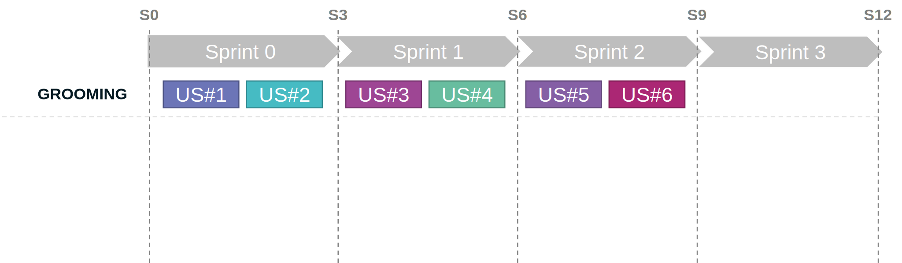
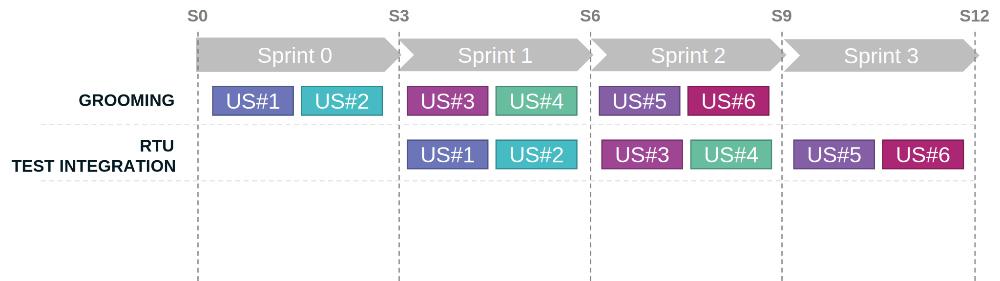
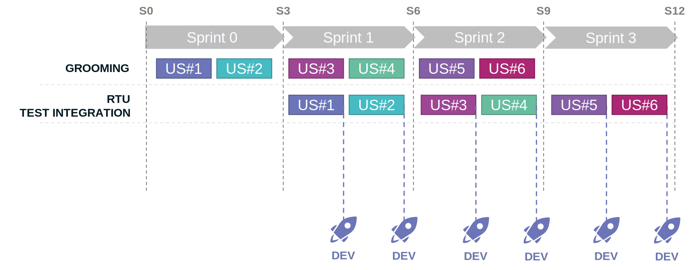
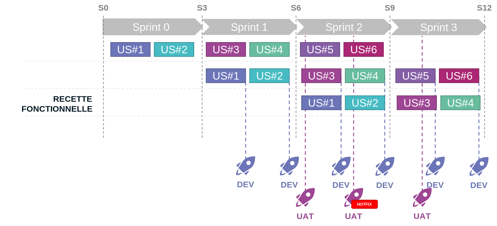
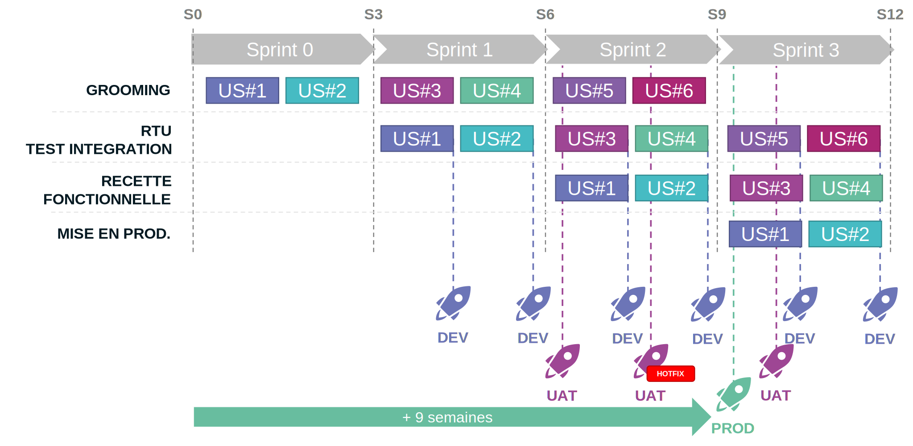
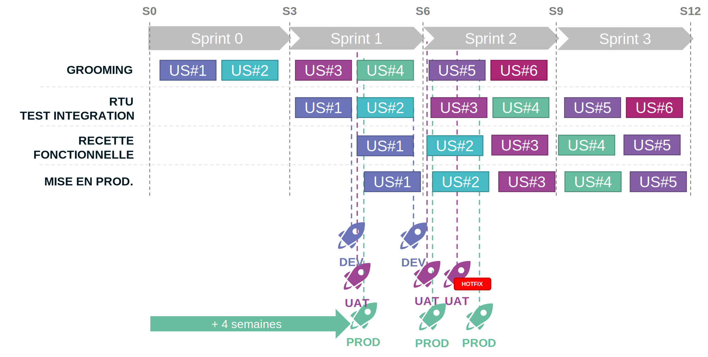

## L'agilité

Bien que l'agilité ne soit pas un pré-requis au DevOps et vice-versa, l'un et l'autre sont bien plus efficaces s'ils sont utilisés conjointement.

Imaginons que nous avons un nouveau projet d'application basé sur une architecture microservice plutôt complexe. Ce projet est conduit avec la méthode agile.
Nous définissons les règles suivantes :

1. Les itérations ont une durée de 3 semaines,
2. La recette fonctionnelle doit être faite par une équipe métier indépendante de l'équipe de réalisation,
3. Les tests d’intégration sont inclus dans le **Definition Of Done** de l’équipe de réalisation,
4. Les délais doivent être réduit au maximum.

Les 2 derniers points pouvant être résolus par le DevOps, cette démarche apparait comme évidente. Mais dans le cas où nous avons plusieurs dizaines de microservices, le DevOps n'est pas si simple que cela à mettre en oeuvre.

### L'agilité et le DevOps

Reprenons notre exemple avec des itérations de 3 semaines et imaginons le cycle de vie de nos **UserStory**.

La première étape consiste à **Groomer** nos **UserStory** afin que l'équipe puisse engager sereinement celles-ci dans le sprint.

Cela veut aussi dire que nos **UserStory** doivent à minima être **Groomées** un sprint avant d'être engagées par l'équipe de réalisation.

Les tests d'intégration étant inclus dans le **Definition Of Done** de l'équipe de réalisation, cela veut donc dire que durant l'itération l'équipe devra à minima déployer une fois sur un environnement d'intégration (dans notre cas, nommé DEV) pour chaque **UserStory**.

A la fin de l'itération l'équipe de réalisation va présenter son travail ; l'ensemble des **UserStory** réalisées (la démo.). Suite à cette présentation et après validation des **UserStory**, l'équipe va pouvoir procéder au déploiement sur l'environnement de recette fonctionnelle (dans notre cas, nommé UAT).

Si durant la recette métier de notre **UserStory** un bug bloquant est détecté, alors il faudra procéder à un hotfix. Donc à minima nous aurons un déploiement en UAT par sprint. Une fois la recette métier réalisée et l'ensemble des **UserStory** validées par notre équipe métier, l'équipe peut donc procéder au déploiement en production.

Ainsi on peut constater :

- qu'il nous faut environ 9 semaines entre le moment ou l'on a groomé notre **UserStory** et le moment ou celle-ci est disponible en production. Certes, en imaginant un grooming efficace et une recette métier rapide, on peut réduire à 4 ou 5 semaines. Cela reste fictionnel !
- qu'il faudra multiplier les déploiements durant tout le cycle. Et pour peu que nos **UserStory** impactent plusieurs microservices, c'est autant de déploiements de microservices qu'il faudra réaliser une ou plusieurs fois pour chaque environnement.

### Les features flags

L'utilisation de **feature flag** peut être un très bon moyen pour résoudre notre problématique de délai. En effet, on peut imaginer que les **UserStory** soient déployées au fil de l'eau de leurs réalisations et sans attendre la fin de l'itération sur les environnements de recette métier (UAT) et de production.

On peut même imaginer de se passer de nos environnements de recette intégration (DEV) et métier (UAT) et de déployer directement en production en mode partiellement caché (limité à l'équipe de réalisation et de recette métier). 

L'utilisation de **feature flag** implique que nos microservices qui implémentent nos **UserStory** doivent permettre d'activer ou de désactiver à tout moment la nouvelle fonctionnalité (ou de permettre d'éxecuter en même temps plusieurs versions d'un même microservice). Cela entraine plus de complexité au niveau de l'implémentation et/ou de l'infractructure. Certes, il existe des frameworks permettant de simplifier l'implémentation et des services PaaS permettant de simplifier l'infrastructure. 
Mais dans certains cas, l'utilisation de **features flags** est presque impossible à mettre en place ou entraîne une complexité technique et architecturale accrue. Par exemple :

- Les Workflows : Comment passer d'une version à l'autre d'un design de workflow pour une même instance ?
- Les ETL : Comment maintenir plusieurs versions d'une même transformation de données ? En multipliant les destinations ?
- Les Infrastructures : Comment maintenir plusieurs versions d'une infrastructure sur un même environnement ? En multipliant les environnements ?

### En résumé

Bien que les **feature flag** permettent en partie de résoudre nos problématiques, elles ne sont pas à elles seules la réponse à notre problématique de mise en place du DevOps dans une architecture microservice complexe.
Très souvent, pour des raisons économiques évidentes, les **feature flags** sont mises de coté.

Ne pouvant pas forcément réduire encore plus nos délais, il faudra donc se concentrer sur la multitude des déploiements à réaliser (en automatique) en veillant à ne pas oublier une partie !

Nous verrons dans le prochain chapitre que la démarche DevOps peut elle aussi apporter au projet son lot de problématiques.

A suivre...

## Références

- [Martin Fowler - Feature Toggles (aka Feature Flags)](https://martinfowler.com/articles/feature-toggles.html)

## Remerciement

- [Michael Maillot](https://twitter.com/michael_maillot) : pour la relecture
- [Laurent Mondeil](https://www.linkedin.com/in/laurent-mondeil-0a87a743/) : pour la relecture

_Rédigé par Philippe MORISSEAU, Publié le 04 Octobre 2021_
