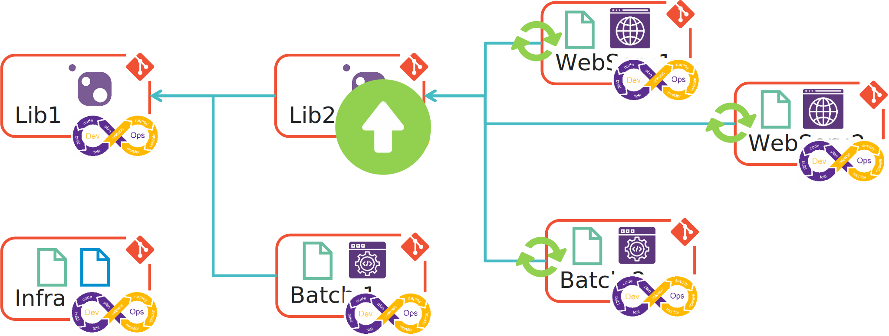

## Le DevOps

La démarche DevOps, comme on peut la comprendre dans la littérature trouve ses limites dans des projets microservices complexes.

Imaginons que nous avons un nouveau projet d'application basé sur une architecture microservice plutôt complexe. Ce projet souhaite avoir une démarche "Full" DevOps.

!!! info
    J'utilise régulièrement le terme **Full DevOps** pour indiquer qu'il n'y a aucun livrable du projet qui ne soit pas intégré entièrement dans la démarche DevOps. Cela inclus donc les démarches GitOps, DevSecOps, Dev{andMore}Ops, MLOps, DataOps, xOps, ...
    
Nous définissons les règles suivantes :

1. L’infrastructure, le code, la documentation : Tout doit être déployé automatiquement => "Full DevOps"
2. En cas de souci lors du déploiement d’un composant les composants dépendants doivent être bloqués.
3. Ne déployer en UAT que ce qui a été validé en DEV.
4. Ne déployer en PROD que ce qui a été validé en UAT.
5. Utiliser le branching model TBD.

### L’infrastructure, le code, la documentation : Tout doit être déployé automatiquement.

Comme je suis un "fana." d'Azure, on va imaginer que notre projet de microservices doit être déployé sur des services managés Azure.
Il faudra donc déployer cette infrastructure pour pouvoir ensuite déployer nos microservices.
Notre équipe produisant aussi de la documentation (spécifications, schéma d'architecture, ...), on souhaite avoir une démarche DevOps pour mettre à jour notre documentation sur un portail.

Pour arriver à cette fin nous allons nous appuyer sur les **repository** git.

- Notre infrastructure sera décrite en **InfraAsCode** avec **Terraform**, **Bicep** ou **ARM json**.
- Nos libraires seront réparties dans des **repository** en fonction de leur utilisation. Il n'est pas pertinent de mettre dans un repo à part une libraire qui n'est destinée qu'à un seul microservice.
- Nos microservices (application web, batch, services, ...) seront répartis dans des **repository**.

Dans chacun de ces **repository** nous aurons le code (IaC ou code "classic"), mais aussi la documentation décrite en **DocAsCode** avec **Markdown**, **AsciiDoc** ou **reStructuredText**.

Enfin pour chaque **repository** nous allons mettre en place un pipeline de CI/CD afin d'automatiser la compilation, la validation et le déploiement à chaque commit.

Jusqu'ici, tout va bien.

### Les dépendances

Le premier souci que l'on peut rencontrer se trouve au niveau du build.
En effet, une libraire créée dans le cadre d'un projet pensé pour être utilisé par plusieurs microservices ou par d'autres libraires aura son propre **repository**.
Ce qui implique que des microservices et des libraires peuvent dépendre de libraires. On ne pourra pas compiler un microservice si les libraires qui sont utilisées par celui-ci ne sont pas disponibles.

C'est ce que j'appelle : **la dépendance de compilation**. 

!!! example
    - La **Lib2** utilise la **Lib1**,
    - Le **Batch1** utilise la **Lib1**,
    - Les **WebService1**, **WebService2** et **Batch2** utilisent la **Lib2**
    

Afin de garantir la robustesse de la solution, je veux m'assurer qu'une évolution sur une libairie ne va pas provoquer une regression sur les composants (libraires et microservices) qui dépendent d'elle.
Dans mon pipeline je vais donc mettre en place un **trigger** sur ma libraire.

!!! example
    La **Lib2** est mise à jour. Les **WebService1**, **WebService2** et **Batch2** qui utilisent la **Lib2** doivent être recompilés et testés afin de vérifier la non régression.
    

Le second souci que l'on peut rencontrer se trouve au niveau du déploiement.
En effet, pour déployer un microservice il parait évident que son infrastructure doit être déployé avant. Il peut aussi être nécessaire qu'un autre microservice soit déployé pour qu'un microservice soit operationnel (dans le cas des workflows par exemple).

C'est ce que j'appelle : **la dépendance de déploiement**.

!!! example
    - Les batchs et les webservices nécessitent que l'infrastructure soit déployée.
    - Le **WebService2** pour fonctionner nécessite que le **WebService1** soit déployé. 
    

Encore une fois, afin de garantir la robustesse de la solution, je veux m'assurer que s'il y a un souci lors de déploiement d'un composant, que l'ensemble des composants qui en dépendent et qui nécessites d'être déployés ne le soient pas.

!!! example
    Le déploiement du **WebService1** est en erreur, le **WebService2** qui nécessite d'être déployé doit être bloqué. 
    

### Le cycle de mise en production

J'aime à penser que les créateurs du logo DevOps, le fameux symbole infini ou *le 8 allongé* n'ont pas choisi ce logo de façon anodine. En effet, ils auraient pu choisir un cercle. Mais non...

#### La boucle de rejet

La boucle de rejet consiste à rejeter tous développements réalisés qui ne correspondent pas aux standards de qualité définit par l'équipe.
Ce qui veut dire qu'à la sortie de la phase **Test** de notre boucle DevOps en cas d'échec, il faut passer directement à la phase **Plan** pour corriger l'anomalie.

#### Le boucle de succès

La boucle de succès consiste à déployer sur l'environnement suivant le composant validé sur l'environnement actuel.
Ce qui implique qu'à la sortie de la phase **Monitor** de notre boucle DevOps en cas de succès (les tests d'intégration, de performance ou fonctionnel sont concluant), on peut passer directement à la phase **Deploy** pour procéder au déploiement du composant sur l'environnement suivant.

#### Ne déployer que ce qui a été validé

Reprenons notre cycle Agile avec les différentes phases de validation sur les environnements d'intégration puis de recette métier.

- Pendant le sprint, chaque **UserStory** sera déployé sur l'environnement d'intégration (DEV) afin de valider en continue les tests d'intégration.
  
  

- En fin de sprint, suite à la démo. et à la validation des **UserStory**, les développements sont déployés sur l'environnement de recette métier (UAT).

  

- A la fin de la recette métier, les développements sont déployés sur l'environnement de production.

  

On constate ainsi que l'on ne déploie que ce qui a été validé sans pour autant repasser par les phases **Plan**, **Code**, **Build** et **Test**. On utilise "la boucle de succès". 

!!! note
    L'utilisation de **feature flag** nous permettra dans certain cas d'éviter un déploiement, mais ce n'est pas pour autant qu'il n'y aura pas de phase dans notre pipeline. Il faudra prévoir à la place du déploiement l'activation ou la desactivation de tel ou tel **feature**.

### Le Trunk-Based Development

Le **Trunk-Based Development** est un **branching model** git très plébicité dans la communauté DevOps.
Il a l'intêret d'être simple à gérer avec une unique branche de développement et compatible avec le maintient opérationnel de plusieurs versions techniques d'un composant grace à ses branches de **release**.

!!! note
    Les branches de **feature** sont autorisées mais doivent être très courte dans le temps.

Dans le cadre de notre cycle Agile, à la fin de chaque sprint, nous allons tirer une branche de release pour chacun des composants qui ont évolué durant le sprint et qui ont été validés durant la démo.
Ces branches de **release** vont contenir le code "sanctuarisé". Le code contenu dans ces branches a passé l'intégralité des tests et des mesures de qualité et de sécurité imposé par l'équipe de réalisation. Le code est **stable**.

C'est depuis la branche **master**, **main** ou **trunk** contenant le code en cours de développement que nos déploiements sur l'environnement d'intégration (DEV) seront réalisés. Comme ce qui est en cours de développement est potentiellement **instable**, nous devons empècher que ce qui est produit sur cette branche puisse être déployé sur les environnements de recette métier ou de production.

Et c'est depuis les branches de **release** que le code qui a été préalablement validé (qualité, sécurité, fiabilité, intégrité, maintenabilité, ...) et dit **stable** va pouvoir être déployé sur les environnements de recette métier (UAT) puis de production. Si durant la recette métier (ou pire, en production), nous constatons une anomalie, celle-ci pourra être corrigé avec un **Hotfix** en utilisant des **cherry-pick**.
Et pour garantir que ce qui est déployé en production est toujours fiable, à chaque fois, le code doit être déployé auparavant sur les environnements d'intégration, puis de recette métier.

Nous devons appliquer cette méthodologie pour chaque **repository** (et donc chaque composant) de notre solution.

## En résumé

Les dépendances de compilations ou de déploiement, le cycle de mise en production et **branching model** sont des facteurs clés de la mise en place d'une démarche DevOps. Il est très important lors de l'initialisation de votre projet de bien cadrer ces éléments qui peuvent parfois être très complexes réajuster en cours de route.

Nous verrons dans le prochain chapitre un sujet que j'affectionne tout particulièrement "L'entropie des systèmes" et nous verrons que la démarche DevOps n'échappe pas à **la formule de Boltzmann**.

A suivre...

## Références

## Remerciement

_Rédigé par Philippe MORISSEAU, Publié le 12 Octobre 2021_
