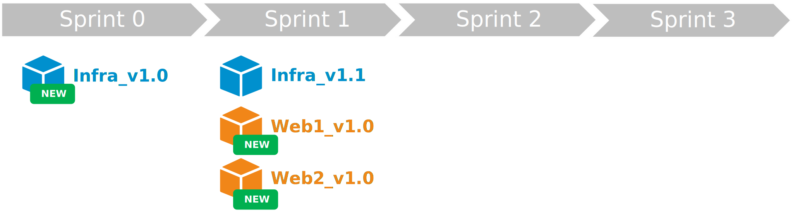

## L'entropie

Comme pour tout, le temps fait son œuvre. La démarche **DevOps** n'y échappe pas. Vous pouvez avoir une démarche très aboutie, au bout de plusieurs mois ou plusieurs années, celle-ci aura naturellement du plomb dans l'aile.

Reprenons notre projet d'application basé sur une architecture microservice plutôt complexe. Ce type d'application (souvent cœur métier) est voué à évoluer régulièrement avec des nouvelles fonctionnalités, mais aussi des plus anciennes qu'il faut décommissionner.
Le choix d'une architecture microservice est permet de simplifier l'ajout et le décommissionnement de fonctionnalités en réduisant le périmètre de l'impact. Mais avec le temps, cela peut s'avérer complexe à gérer au niveau de la démarche **DevOps**.

!!! example "Sprint 0 à 3"
    1. Durant le **Sprint 0** l'équipe initialise l'infrastructure permettant d'héberger notre solution. A la fin de ce sprint, elle livre l'**Infra (v1.0)**.
    
    2. Ensuite, au **Sprint 1** l'équipe réalise les 2 premiers microservices web **Web1 (v1.0)** et **Web2 (v1.0)** et apporte déjà une petite évolution à l'infrastructure **Infra (v1.1)**.
    
    3. Puis, au **Sprint 2** l'équipe réalise un microservice batch **Batch1 (v1.0)**. Elle constate que certains développements réalisés pour le microservice **Web1** peuvent être réutilisés pour le **Batch1**. L'équipe décide de créer une libraire contenant le code commun et de faire évoluer le microservice **Web1** pour utiliser cette librairie. A la fin du sprint l'équipe livre : **Lib1 (v1.0)**, **Batch1 (v1.0)** et **Web1 (v1.1)**.
    
    4. Et, au **Sprint 3** avec le feedback des premiers utilisateurs, l'équipe constate que le microservice **Web2** n'est pas utilisé et n'apporte rien à la solution. Elle décide de décommissionner celle-ci et de remplacer la fonctionnalité par un autre microservice **Batch2 (v1.0)**. Une faille de sécurité web ayant été identifié sur la solution, l'équipe décide de corriger celle-ci en modifiant l'infrastructure **Infra (v1.2)** et le microservice **Web1 (v1.2)**.
    

Vous pouvez constater que l'agilité et la démarche **DevOps** permettent une très grande flexibilité-évolutivité. Mais lorsque notre projet s'étale sur des dizaines de sprints, cela peut vite dérouter l'équipe qui a besoin d'un minimum de stabilité pour maitriser l'intégralité du code de la solution.

Imaginons que notre équipe arrive au **Sprint 63** (Oui ! Pour le vivre actuellement pour un client, cela arrive). Il n'est pas compliqué d'imaginer qu'au bout de 63 itérations notre application qui est maintenant composé d'une trentaines de microservices a vécue des milliers de builds et de déploiements. A chaque fin de sprint, il y a eu un nombre variables mais globalement croissant d'ajout, d'évolution ou de décommissionement de microservices. Ces changements successifs vont avoir un impact délétère sur la démarche **DevOps**. C'es l'entropie du **DevOps** !

!!! note "Posez-vous la question"
    Est-ce que je suis capable de redéployer from scratch mon application à l'état ou elle était il y a 4 ou 5 itérations ?

## Le cocktail Agilité + DevOps + Entropie !

On constate que l'agilité, la démarche **DevOps** et le temps (l'entropie) apportent chacun leur lot de problématiques.
Mais si l'on additionne tout cela, on obtient un cocktail difficile à digérer.

!!! example "Sprint X"
    La **UserStory X** dans le **Sprint X** impacte la librairie **Lib2**. L'équipe procéde à l'évolution sur le tronc (on est en TBD). Suite à la démo. celle-ci crée une nouvelle branche de **release** pour relivré la librairie. Pour assurer la résilience de la solution, on veut reconstruire l'ensemble des microservices utilisant cette librairie : **Web1** et **Web2** (dépendance de build). L'équipe doit relancer le pipeline de CI/CD des microservices à partir de leur dernière branche de **release**. Finalement, la **UserStory X** déclenche la création d'une nouvelle version de la **Lib2**, mais aussi le redéploiement de l'ensemble des microservices utilisant la libairie : **Web1** et **Web2**.  
    

!!! example "Sprint X+1"
    Durant le **Sprint** suivant, la **UserStory Y** consiste à créer un nouveau microservice **Web3**. Et pour héberger ce nouveau microservice nous allons devoir mettre à jour notre infrastructure (par exemple, instancier une nouvelle **Azure WebApp**). L'équipe : 
    - crée une nouveau **repository** qui contiendra le code de notre microservice **Web3**.
    - réalise une évolution sur le tronc du **repository** de l'infrastructure.
    Après la démo., l'équipe crée une nouvelle branche de **release** pour livrer le microservice **Web3** et l'évolution de l'infrastructure. Afin de pouvoir déployer le nouveau microservice elle doit aussi avoir au préalable déployer la mise à jour de l'infrastructure (dépendance de déploiement).
    Durant ce **Sprint**, l'équipe de recette métier détecte une anomalie sur le service **Web1** lié à la dernière évolution de la **Lib2**, l'équipe doit donc faire un **hotfix** sur le **Web1**. Elle procède à la correction sur le tronc du **repository**. Puis une fois validée sur l'environnement d'intégration, l'équipe procède à un **cherry-pick** des commits de correction sur la branche de **release** correspondant à la version à relivrer. Encore une fois il faut procéder à une validation sur l'environnement d'intégration afin de s'assurer qu'il n'y a pas eu de regression avant de pouvoir déployer sur l'environnement de recette métier.
    
    Suis-je capable de redéployer from scratch mon application à l'état du Sprint X ?

## Le phénomène d'accumulation

Il y a pire encore...
Reprenons l'exemple au-dessus de l'anomalie détecté. L'équipe de réalisation ayant beaucoup de **repository** à gérer (Et même si celle-ci maitrise parfaitement tous son code et sa démarche) met plusieurs jours pour relivrer le **hotfix** en recette métier. L'équipe métier va vouloir procéder à nouveau à la recette et constate qu'elle arrive en fin de **Sprint** et décide donc de décaler la recette de cette **UserStory** au **Sprint** suivant.
On arrive là devant un dilemme : 
1. Doit-on livrer tous nos composants sauf celui-ci en production ? Ou, 
2. Doit-on conditionner la mise en production à la validation de cette **UserStory** et donc décaler la mise en production au **Sprint** suivant ?

Dans certains cas, vous pourrez choisir l'option 1 et donc limiter le phénomène d'accumulation à un seul composant. Mais dans d'autres cas, vous serez obligé de choisir l'option 2.

!!! note "Les features flags"
    L'utilisation de **feature flags** vous permet d'éviter ce phénomène.

## Conclusion

### 1. Le nombre de déploiement
Plus l’équipe a la capacité de produire des **UserStory** dans un **sprint** plus le nombre de déploiement est important. Lorsque l’on a plusieurs dizaines de microservices, comment s’assurer qu’aucune mise à jour n’a été oublié ?

### 2. Les dépendances
Les composants d’une architecture microservice présentent des dépendances. Mais lorsque l'on a des dizaines de dépendance de build, comment s’assurer que chaque composant utilise la bonne version de ses dépendances ? Lorsque l'on a des dizaines de dépendance de déploiement, comment stopper tous les processus de mise à jour des dépendances en cas d’échec de déploiement d’un composant ?

### 3. La gestion des repository Git
Si chaque composant et chaque libraire à son propre **repository git**, le projet d'application peut rapidement cumuler plusieurs dizaines de **repository**. Lors d'une mise en recette métier, comment s’assurer que toutes les évolutions et corrections apportées dans le **Sprint** vont être embarquées par la création d'une branche sur les **repository** impactés et uniquement ceux impactés ? Comment maintenir le model branching sur tous les **repository** ? Comment maintenir le semantique versioning ?

### 4. Les cycles de recette
Les recettes métiers sont réalisés après la démo. du **sprint** sur un environnement de validation par une équipe de test. Comment s’assurer que les réalisations du **sprint** sont poussées rapidement et correctement (les point 1,2 et 3) afin de permettre à la recette de se passer dans les meilleures conditions ? En cas d'anomalie détecté par l'équipe de recette, comment relivrer rapidement le correctif afin de ne pas bloquer le cycle des recettes ?

Mais alors, comment lutter contre l’entropie tout en maintenant une méthodologie agile soutenable ?

Dans la prochaine partie, je vous présenterais une solution que j'ai élaboré pour répondre à ces problématiques en mettant en place des solutions basées sur des concepts simples et éprouvés tel que la machine à état et les manifestes.

A suivre...

## Références

## Remerciement

_Rédigé par Philippe MORISSEAU, Publié le 25 Octobre 2021_