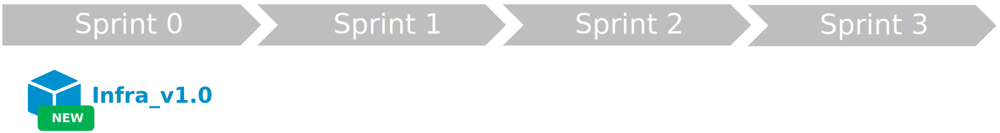

## L'entropie

Comme pour tout, l'entropie fait son œuvre. La démarche DevOps n'y échappe pas. Vous pouvez avoir la démarche très aboutie, au bout de plusieurs mois ou plusieurs années, celle-ci aura naturellement du plomb dans l'aile.

Reprenons notre projet d'application basé sur une architecture microservice plutôt complexe. Ce type d'application (souvent cœur métier) est vouée à évoluer régulièrement avec des nouvelles fonctionnalités, mais aussi des plus ancienne qu'il faut décommissionner.
L'ajout et le décommissionnement de fonctionnalités est généralement plus simple avec une architecture microservice. Le choix de ce type d'architecture est donc cohérent. Mais avec le temps, cela peut s'avérer complexe à gérer au niveau de la démarche DevOps.

!!! example
    1. Durant le **Sprint 0** l'équipe initialise l'infrastructure permettant d'héberger notre solution. A la fin de ce sprint, elle livre l'**Infra (v1.0)**.
    2. Au **Sprint 1**, l'équipe réalise les 2 premiers microservices web **Web1 (v1.0)** et **Web2 (v1.0)** et apporte déjà une petite évolution à l'infrastructure **Infra (v1.1)**.
    3. Au **Sprint 2**, l'équipe réalise un microservice batch **Batch1 (v1.0)**. Elle constate que certains développements réalisés pour le microservice **Web1** peuvent être réutilisés pour le **Batch1**. L'équipe décide alors de créer une libraire contenant le code commun et de faire évoluer le microservice **Web1** pour utiliser cette librairie. A la fin du sprint l'équipe livrera : **Lib1 (v1.0)**, **Batch1 (v1.0)** et **Web1 (v1.1)**.
    4. Au **Sprint 3**, avec le feedback des premiers utilisateurs, l'équipe constate que le microservice **Web2** n'est pas utilisé et n'apporte rien à la solution. Elle décide donc de décommissionner celle-ci et de remplacer la fonctionnalité par un autre microservice **Batch2 (v1.0)**. Une faille de sécurité web ayant été identifié sur la solution, l'équipe décide de corriger celle-ci en modifiant l'infrastructure **Infra (v1.2)** et le microservice **Web1 (v1.2)**.
    

Vous pouvez constater que l'agilité et la démarche DevOps permettent une très grande flexibilité-évolutivité. Mais lorsque notre projet s'étale sur des dizaines de sprints, cela peut vite déroute l'équipe qui a besoin d'un minimum de stabilité pour maitriser l'intégralité du code de la solution.

Imaginons que notre équipe arrive au **Sprint 63** (Oui ! Pour le vivre actuellement pour un client, cela arrive). Les évolutions successives des 63 **Sprints** précédents (je compte le **Sprint 0**), vont très certainement entrainer notre application dans une direction qui n'a pas grand-chose à voir avec sa version des premiers **Sprints**. Ces changements successifs vont avoir un impact délétère sur nos microservices : L'entropie !

## Le cocktail Agilité + DevOps + Entropie !

On constate que l'agilité, la démarche **DevOps** et le temps (l'entropie) apportent chacun leur lot de problématiques.
Mais si l'on additionne tout cela, on obtient un cocktail difficile à digérer.

!!! exemple "Sprint X"
    La **UserStory X** dans le **Sprint X** impacte la librairie **Lib2**. Celle-ci est donc relivré. Pour assurer la résilience de notre solution, on va reconstruire l'ensemble des microservices utilisant cette librairie : **Web1** et **Web2** (dépendance de build). Finalement, la **UserStory X** déclenchera la création d'une nouvelle version de la **Lib2**, mais aussi le redéploiement de l'ensemble des microservices utilisant votre libairie : **Web1** et **Web2**.  
    

!!! exemple "Sprint X+1"
    Durant le **Sprint** suivant, la **UserStory Y** consiste à créer un nouveau microservice **Web3**. Et pour héberger ce nouveau microservice nous allons devoir mettre à jour notre infrastructure (par exemple, instancier une nouvelle **Azure WebApp**). Afin de pouvoir déployer mon nouveau microservice nous devons avoir au préalable déployer la mise à jour de l'infrastructure (dépendance de déploiement).
    Durant ce **Sprint**, l'équipe de recette métier détecte une anomalie sur le service **Web1** lié à la dernière évolution de la **Lib2**, l'équipe va donc faire un **hotfix** sur le **Web1**. 
    

## Conclusion

### 1. Le nombre de déploiement
Plus l’équipe a la capacité de produire des **UserStory** dans un **sprint** plus le nombre de déploiement est important. Lorsque l’on a plusieurs dizaines de microservices, comment s’assurer qu’aucune mise à jour n’a été oublié ?

### 2. Les dépendances
Les composants d’une architecture microservice présentent des dépendances. Comment s’assurer que chaque composant utilise la bonne version de ses dépendances ? Comment stopper le processus de mise à jour des dépendances en cas d’échec de déploiement d’un composant ?

### 3. Les cycles de recette
Les recettes métiers sont réalisés après la démo. du **sprint** sur un environnement de validation par une équipe de test. Comment s’assurer que les réalisations du **sprint** sont poussées rapidement et correctement afin de permettre à la recette de se passer dans les meilleures conditions ? 

### 4. L’entropie des systèmes
Chaque **sprint** apporte ses évolutions. Des nouveaux composants, des composants mis à jour, des composants décommissionnés. Comment s’assurer que la solution garde ses qualités (résilience, performance, disponibilité,…) au fur et à mesure que les itérations s’enchaines ? 

Mais alors, comment lutter contre l’entropie des systèmes tout en maintenant une méthodologie agile soutenable ?

Dans la prochaine partie, je vous présenterais une solution que j'ai élaboré pour répondre à ces problématiques en mettant en place des solutions basées sur des concepts simples et éprouvés tel que la machine à état et les manifestes.

A suivre...

## Références

## Remerciement

_Rédigé par Philippe MORISSEAU, Publié le 25 Octobre 2021_