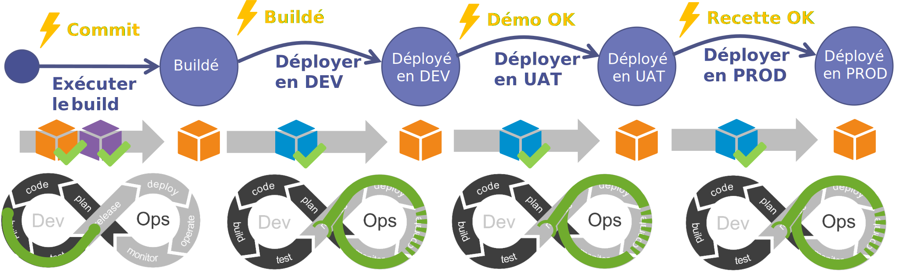

Nous avons pu constater dans la première partie qu'il y avait de multiples moyens pour faire "partir en vrille" la démarche **DevOps**.
Pour avoir été confronté à ces problématiques, j'ai cherché un bon moment quel serait le meilleur moyen pour résoudre ces différents problèmes. 

La solution est arrivée lors d'une discussion en voiture avec un de mes collègues de travail. Je lui parlais de mes soucis de mise en UAT et de mise en PROD. Que j'avais pourtant mis en place une démarche **DevOps** dans les règles de l'art mais que pourtant il me fallait facilement une journée pour réaliser mes mises en UAT ou en PROD. 

Mon collègue me répond : *"T'as essayé d'utiliser une machine à état ?"*

**EUREKA !**

## La machine à état

Voici un bref exemple d'une machine à état :

Imaginons que nous souhaitions définir le fonctionnement d'un film sur notre lecteur BluRay. 
Le film à 3 états :

- Arrêté
- En cours (de lecture)
- En pause
  
Pour passer d'un état à un autre nous avons des actions :

- Lancer le film
- Stopper le film
- Mettre en pause
- Reprendre le film

Nous représenterons alors notre machine à état sous la forme du schéma ci-dessous.

La modélisation d'un système sous forme d'une machine à état permet de simplifier la compréhension des différents moyens possibles pour passer d'un état à un autre.

Ce que l'on n'a pas représenté ici mais qui est essentiel, c'est le déclencheur. Dans le cas de notre film BluRay, ce sera le fait que l'utilisateur appuie sur tel ou tel bouton de sa télécommande. 
Pour notre lecteur BluRay, nous aurons les déclencheurs :

- Appuie sur **Play**
- Appuie sur **Pause**
- Appuie sur **Stop**

Appliquons maintenant cette modélisation à notre démarche DevOps.
Indépendamment des microservices qui composent notre application, celle-ci à ses propres états :

- Buildé : l'application est compilée et livrée mais pas encore déployée,
- Déployé en DEV : l'application est déployée sur l'environnement d'intégration,
- Déployé en UAT : l'application est déployée sur l'environnement de recette métier,
- Déployé en PROD : l'application est déployée en PROD

Pour passer d'un état à l'autre nous aurons les actions suivantes :

- Exécuter le build
- Déployer en DEV
- Déployer en UAT
- Déployer en PROD

Certes l'exemple ci-dessus nous montre une machine à état très linéaire. Mais ce qui va nous intéresser particulièrement dans la notre ce sont les déclencheurs et les conditions.

### L'état "Buildé"

Chaque composant à son propre cycle DevOps et chacun peut influer sur le comportement global de l'application. Si l'équipe décide de réaliser une modification sur une librairie utilisé par plusieurs composants, son **build** doit déclencher le **re-build** de composants dépendants (dépendance de compilation).
Ce qui veut dire que l'évènement déclencheur au niveau du **pipeline DevOps** de la librairie sera le **commit-push** et en cas de succès du **build** de la librairie, ce sera celui-ci l'évènement déclencheur des composants.

Au niveau de l'application on considérera que l'application est **buildée** à partir du moment où la librairie et tous les composants dépendants seront buildés. Pour passer à l'état "Buildé", on a :

- Un évènement déclencheur : Le commit sur le repo de la librairie,
- Une condition : Le succès du build de la librairie et des composants dépendants.

!!! example "Evolution sur une librairie"
    Au cours de mon sprint l'équipe réalise une évolution sur la libraire **Lib1**. Celle-ci est utilisée par le composant **Batch1**. 

    L'évènement déclencheur est le commit sur le repo et la condition est le succès du build de notre librairie et de notre batch.
    

    Notre librairie étant embarquée dans notre batch au moment de la compilation, celle-ci ne sera pas un livrable à déployer.

### Les états "Déployé"

Pour pouvoir déployer notre composant sur un environnement, il faut au préalable s'assurer que l'environnement soit prêt à l'accueillir (dépendance de déploiement) :

- l'infra. est disponible, 
- les composants avec lesquels il va communiquer sont opérationnels.

Il peut y avoir de multiples évènements déclencheurs pour passer de notre état "Buildé" à notre état "Déployé" :

- Le fait d'être dans l'état "Buildé" : On parlera ici de déploiement automatique ou de **continuous deployment**.
- L'approbation par une ou plusieurs personnes.
- La validation d'un ou plusieurs critères :
  
    * **UserStory** à l'état livrée,
    * **Health Check**,
    * ...

En termes de condition, on veillera à s'assurer que les dépendances de déploiement sont respectées.

!!! example "Evolution sur une librairie et déploiement en DEV"
    Reprenons notre exemple précédent. 
    
    Notre composant **Batch1** pour pouvoir fonctionner nécessite que l'infrastructure soit déployée.

    Le fait que notre application soit à l'état "Buildé" est l'évènement déclencheur pour procéder au déploiement de notre **Batch1** (Déploiement continu).
    

Les conditions pour passer d'un état "Déployé" à un autre identique seront les mêmes peu importe l'environnement.

!!! example "Evolution sur une librairie et déploiement en UAT et en PROD"
    Notre composant **Batch1** pour pouvoir fonctionner en UAT ou en PROD nécessite que l'infrastructure soit déployée (notre condition).

    L'évènement déclencheur pour passer à l'état déployé en UAT est la validation de notre démo. en fin de sprint.

    L'évènement déclencheur pour passer à l'état déployé en PROD est la validation de notre application à la fin de la recette métier.
    

### Conclusion

En prenant un peu de recul on s'aperçoit que notre machine à état reprend les codes de notre cycle **DevOps**.

Ce qui veut dire que l'on a un cycle **DevOps** au niveau de notre application. Ce cycle doit pouvoir piloter les **pipelines DevOps** de tous nos composants et librairies. Il doit aussi s'assurer que les conditions (dépendances de build et de déploiement) sont respectées.

Dans le prochain article nous verrons en détail comment mettre en place les conditions et les actions nécessaires au pilotage des builds.

[A suivre...](05.comment.build.md)  

## Références

## Remerciements

- [Nicolas Giraud](https://www.linkedin.com/in/nicolas-giraud-17a44383/) : pour l'idée de la machine à état
- [Michael Maillot](https://twitter.com/michael_maillot) : pour la relecture
- [Fabrice Weinling](https://www.linkedin.com/in/%E2%99%A0-fabrice-weinling-%E2%99%A0-414187114/) : pour la relecture

_Rédigé par Philippe MORISSEAU, Publié le 08 Novembre 2021_