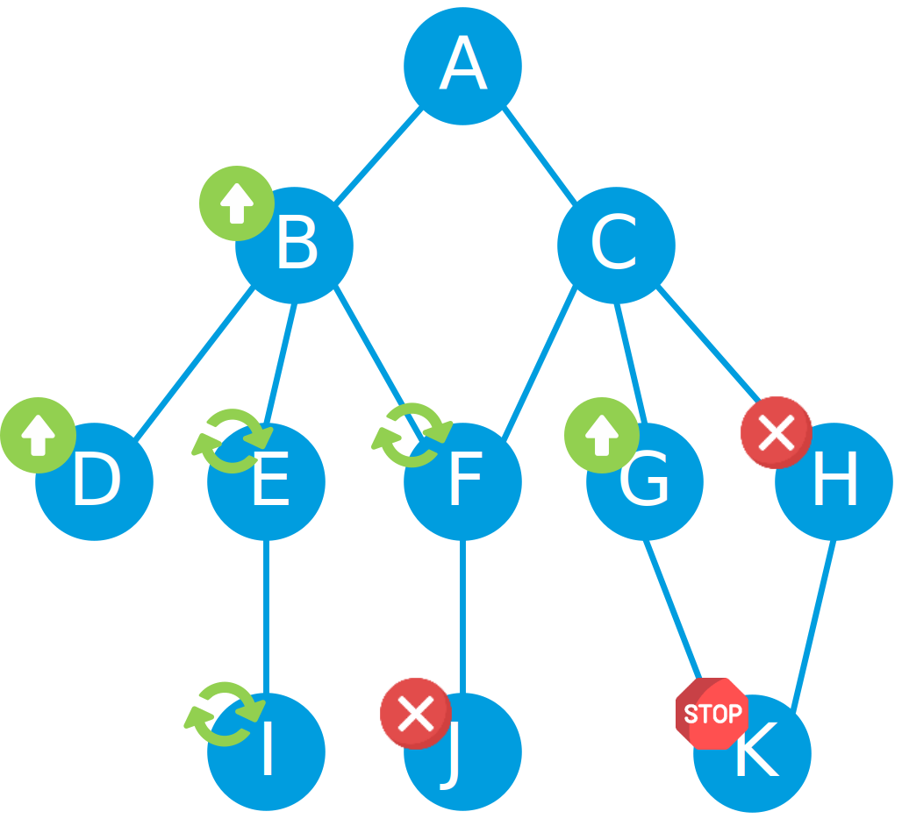
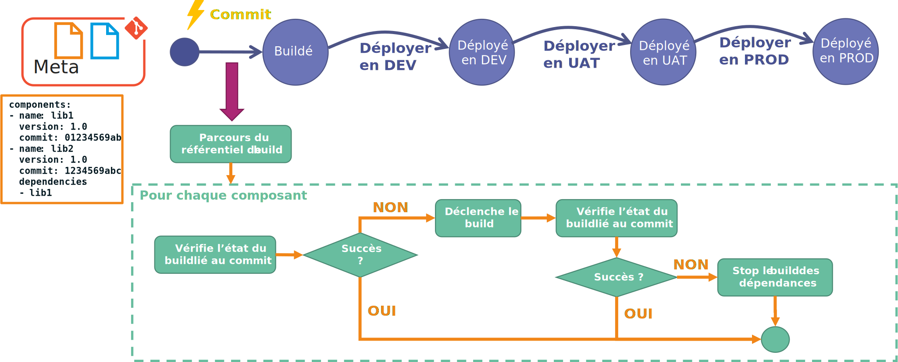
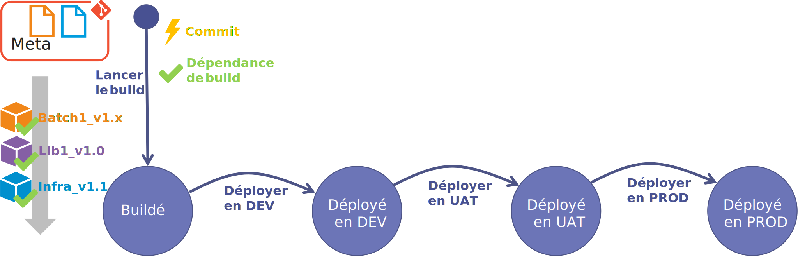
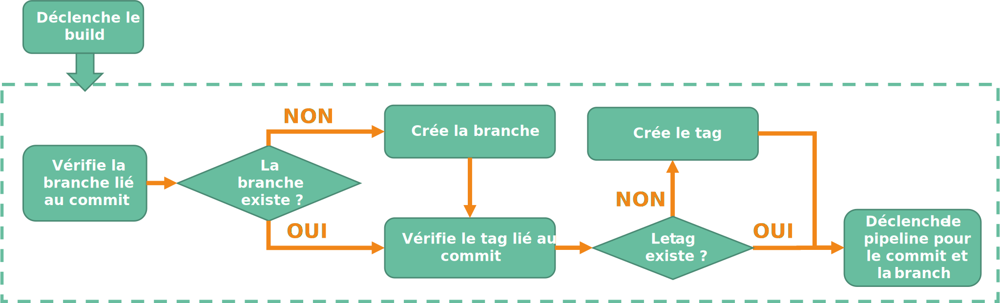
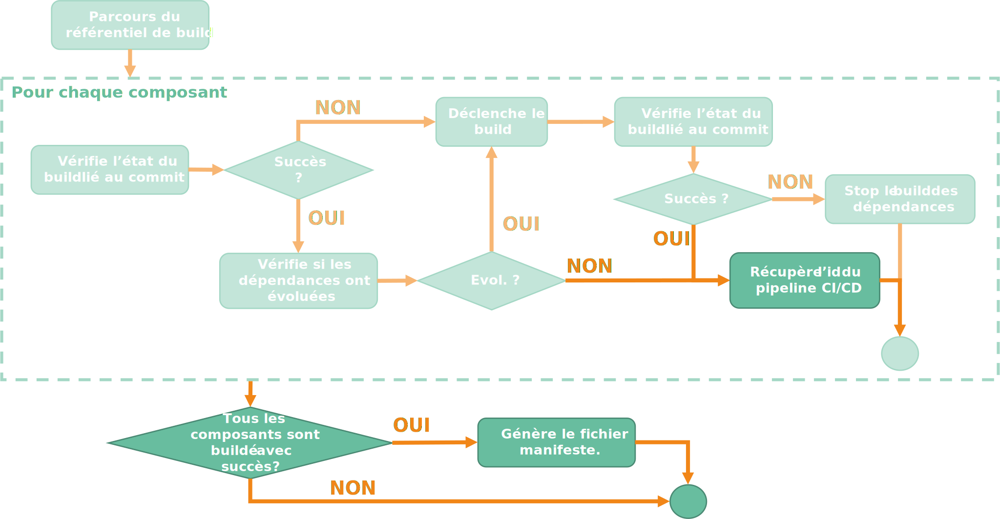

Maintenant que nous avons conceptualisé le principe de machine à état dans un "meta" pipeline **CI/CD**, comment faire pour que le **build** de nos différents composants puisse être géré de façon harmonieuse.

Comment faire pour s'assurer qu'une évolution sur une librairie va entrainer systématiquement la recompilation de composants utilisant cette librairie ?

Comment faire pour ne recompiler que ce qu'il y a besoin de recompiler ?

## La conceptualisation du processus de build

Pour commencer, il nous faut un référentiel de **build**. 

### Le référentiel de build

Ce référentiel aura pour unique but d'identifier chaque composant de notre application, avec :

- le nom du **repository git**
- la dernière version,
- l'id du commit git lié à la dernière version,
- les dépendances du composant

!!! sample "exemple"
    Imaginons 2 librairies : **Lib1** et **Lib2**. **Lib2** dépend de **Lib1**.

    Voici ce que pourrait donner notre référentiel au format **yaml** :

    ```yaml
    components:
    - name: lib1
      version: 1.0
      commit: 0123456789ab
    - name: lib2
      version: 1.0
      commit: 123456789abc
      dependencies: 
      - lib1
    ```

Ce référentiel va évoluer au fur et à mesure des itérations pour correspondre exactement à l'état souhaité de tous les composants de l'application. Et pour permettre une historisation des évolutions au fur et à mesure des itérations, quoi de mieux qu'un **repository Git**.
On va donc mettre notre référentiel de **build** dans un **repo.** que l'on va nommer "meta".

### Le processus de build

Imaginons que j'apporte une modification sur mon référentiel de **build**, cela implique que j'ai ajouté, modifié ou supprimé un ou plusieurs composants de mon application. Pour ne pas prendre de risque je vais donc parcourir chaque composant déclaré dans mon référentiel et pour chacun, vérifier :

- s'il a déjà été **buildé** : il n'y aura donc rien à faire,
- s'il y a une mise à jour : il faudra déclencher le **build** du composant,
- s'il y a eu une mise à jour d'une des dépendances : il faudra redéclencher le **build** du composant,
- s'il y a eu un échec d'une dépendance : il ne faudra pas lancer le **build**.

C'est comme un arbre où chaque composant correspond à un noeud.

!!! sample "exemple"
    Imaginons que durant notre **sprint** nous ayons fait évoluer nos composants B, D, G et H et l'arbre de dépendance ci-dessous :
    

    Lors de l'exécution de notre "meta" pipeline pour passer notre application à l'état buildé, il faudra :

    - Ignorer les composants A et C,
    - Compiler les composant B, D, G et H,
    - Recompiler les composants E, F, I, J et K qui ont vu leurs dépendances évoluer (vérification de la non-régression)
    
    Si durant le processus, le composant H est en échec (erreur remonté lors de la compilation ou de l'exécution des tests unitaires), alors il faudra veiller à stopper le processus et ne pas builder les composants dépendants. Le composant K est donc bloqué par son prédécesseur le composant H.

Notre **build** applicatif peut se représenter sous la forme du processus ci-dessous : 



Le processus va parcourir le référentiel de **build** en commençant par ceux qui n'ont pas de dépendance, puis par ceux qui dépendent de ces premiers, et ainsi de suite. 

!!! note
    Je vous recommande d'utiliser des processus parallèles pour parcourir l'arbre.

!!! sample "exemple" 
    Si on reprend notre exemple ci-dessus, on aura par ordre de passage :

    1. A
    2. B et C
    3. D, E, F, G et H
    4. I, J, K

Pour chaque composant,

1. on vérifie si celui-ci a déjà été correctement buildé (commit déjà buildé).
2. si oui, on vérifie que ses dépendances n'ont pas évoluées.
3. si c'est le cas, on passe au composant suivant. Sinon, on déclenche le **build**.
4. si celui-ci n'a pas déjà été correctement buildé, on déclenche le **build**.
5. on attend la fin du **build** et on récupère le résultat.
6. si le **build** est OK, on passe au composant suivant.
7. si le **build** est KO, on stoppe le **build** des composants dépendants.

Une fois le référentiel totalement parcouru, on peut déterminer l'état de notre application. Si tous les composants ont été correctement buildé, alors on peut considérer que notre application est correctement buildée.

Ainsi nous pouvons passer l'état de notre application à "Buildé".



### Le pilotage des repositories Git

Cependant, pour pouvoir déclencher le **build** de nos différents composants, il va falloir piloter les **repositories Git** de chacun des composants.

Par exemple, en fin de **sprint** et suite à la validation par le client de la démo., je vais vouloir builder une version stable de l'ensemble des composants de l'application avec pour objectif de déployer les évolutions de l'application jusqu'en production. 

- Si je suis en **Trunk Based Developement**, je vais vouloir créer des branches de **release** et poser des **tags** sur les **repositories** de mes composants.
- Si je suis en **Github Flow**, je vais vouloir poser des **tags** sur la branche **main** sur les **repositories** de mes composants.

Dans le détail, l'étape de déclenchement du **build** va se décomposer comme ceci :



Nous devons déclencher le pipeline CI/CD de nos composants pour pouvoir déclencher nos **build** !

### Le pilotage des pipelines de CI/CD

Mais pour pouvoir ensuite faire avancer les pipelines **CI/CD** de nos différents composants, il va falloir identifier exactement les pipelines correspondants aux **build** de nos composants.
Notre phase de **Build** doit donc générer un fichier manifeste permettant d'identifier les pipelines de chaque composant.



!!! sample "exemple"
    Voici notre manifeste au format yaml :

    ```yaml
    components:
      - name: web1
        pipelineId: id1
      - name: web2
        pipelineId: id2
      - name: infra
        pipelineId: id3
      - name: batch1
        pipelineId: id4
    ```

## Conclusion

Nous avons vu dans ce chapitre comment gérer le **build** des composants d'une application. Cette phase de notre "meta" pipeline va nous mettre à disposition un manifeste qui nous permettra dans un second temps de piloter le déploiement de nos différents composants. Nous verrons cela dans le prochain chapitre.

A suivre...

## Références


## Remerciements

- [Etienne Louise](https://www.linkedin.com/in/etienne-louise-78154063/) : pour la relecture
- [Samy Mameri](https://www.linkedin.com/in/samy-mameri-60649079/) : pour la relecture
- [Fabrice Weinling](https://www.linkedin.com/in/%E2%99%A0-fabrice-weinling-%E2%99%A0-414187114/) : pour la relecture

_Rédigé par Philippe MORISSEAU, Publié le 06 Décembre 2021_