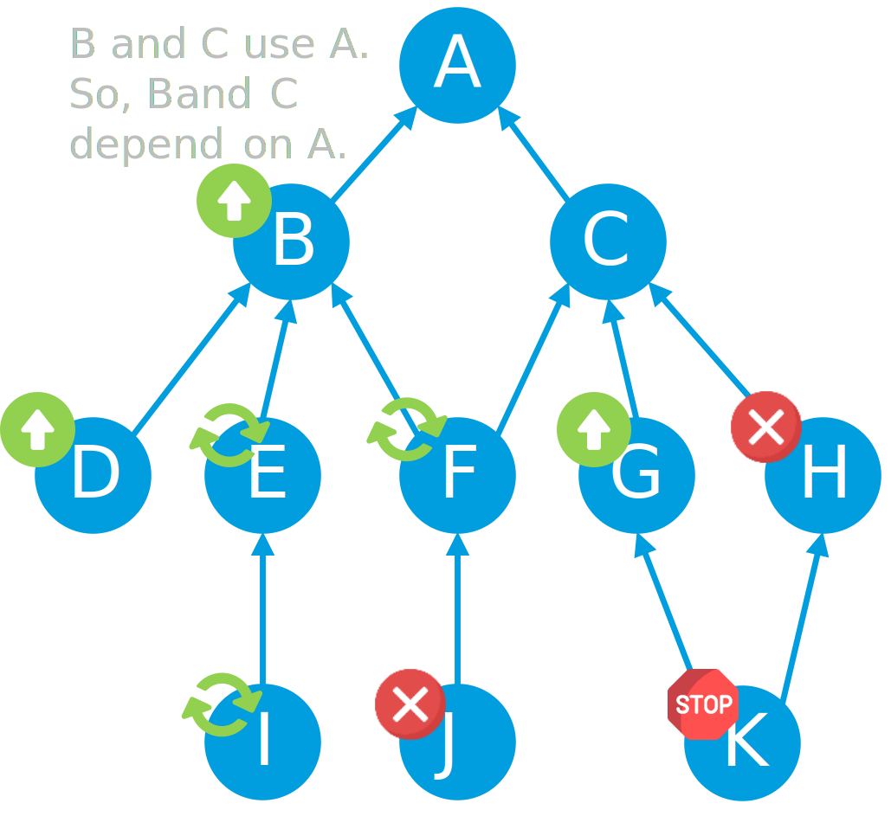
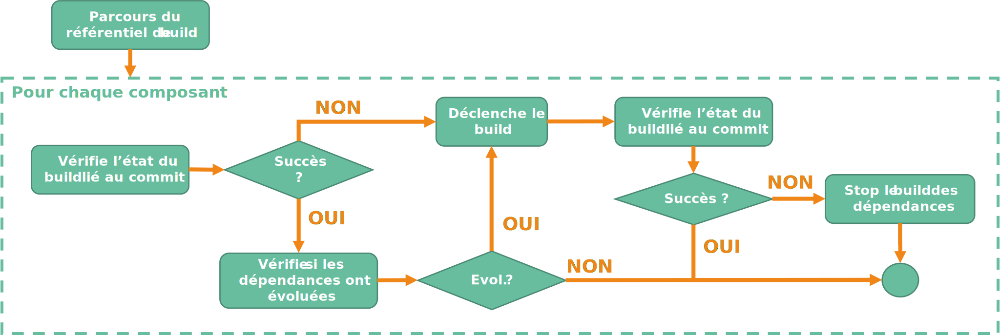

Maintenant que nous avons conceptualisé le principe de machine a état dans un "meta" pipeline CI/CD, comment faire pour que le build de nos différents composants puisse être géré de façon harmonieuse.

Comment faire pour m'assurer qu'une évolution sur une librairie va entrainer systématiquement la recompilation de composants utilisant cette librairie ?

Comment faire pour ne recompiler que ce qu'il y a besoin de recompiler ?

## La conceptualisation du processus de build

Pour commencer, il nous faut un référentiel de build. 

### Le référentiel de build

Ce référentiel aura pour unique but d'identifier pour chaque composant de notre application :

- la dernière version,
- le commit git lié à la dernière version,
- les dépendances

!!! sample "exemple"
    Imaginons 2 librairies : **Lib1** et **Lib2**. **Lib2** dépend de **Lib1**.

    Voici ce que pourrait donner notre référentiel au format yaml :

    ```yaml
    components:
    - name: lib1
      version: 1.0
      commit: 0123456789ab
    - name: lib2
      version: 1.0
      commit: 123456789abc
      dependencies: 
      - lib1
    ```

Ce référentiel va évoluer au fur et à mesure des itérations pour correspondre exactement à l'état souhaité de tous les composants de mon application.
Et pour permettre une historisation de évolution au fur et à mesure des itération, quoi de mieux qu'un repository Git.
On va donc mettre notre référentiel de build dans un repo "meta".

### Le processus de build

Imaginons que j'apporte une modification sur mon référentiel de build, cela implique que j'ai ajouté, modifié ou supprimé un ou plusieurs composants de mon application. Pour ne pas prendre de risque je vais donc parcourir chaque composant décléré dans mon référentiel et pour chacun, vérifier :

- s'il a déjà été build : il n'y aura donc rien à faire,
- s'il y a une mise à jour : il faudra déclencher le build du composant,
- s'il y a une mise à jour d'une des dépendances : il faudra redéclencher le build du composant,
- s'il y a un échec d'une dépendance : il ne faudra pas lancer le build.

C'est comme un arbre où chaque composant correspond à un noeud.

!!! sample "exemple"
    Imaginons que durant notre sprint nous ayons fait évolué nos composants B, D, G et H et l'arbre de dépendance ci-dessous :
    

    Lors de l'exécution de notre "meta" pipeline pour passer notre application à l'état buildé, il faudra :

    - Ignorer les composants A et C,
    - Compiler les composant B, D, G et H,
    - Recompiler les composants E, F, I, J et K qui ont vu leur dépendances évoluer (vérification de la non-régression)
    
    Si durant le processus, le composant H est en échec (erreur remonté lors de la compilation ou de l'exécution des tests unitaires), alors il faudra veiller à stopper le processus et ne pas buildé les composants dépendants. Le composant K est donc bloqué par son prédecesseur le composant H.

Pour résumer notre build applicatif peut se représenter sous la forme du processus ci-dessous : 



Le processus va parcourir le référentiel de build en commençant par ceux qui n'ont pas de dépendance, puis par ceux qui dépendent de ces premiers, et ainsi de suite. Bien entendu pour gagner du temps, on va utiliser des processus parallèles.

!!! sample "exemple" 
    Dans notre exemple ci-dessus, on va avoir :

    1. A
    2. B et C
    3. D, E, F, G et H
    4. I, J, K

Pour chaque composant,

1. on vérifie si celui-ci a déjà été correctement buildé (commit déjà buildé).
2. si oui, on vérifie que ses dépendances n'ont pas évoluées.
3. si c'est le cas, on passe au composant suivant. Sinon, on déclenche le build.
4. on attend la fin du build et on récupère le résultat.
5. si le build est OK, on passe au composant suivant. Sinon, on stop le build de toutes les dépendances.


## Références


## Remerciement


_Rédigé par Philippe MORISSEAU, Publié le 06 Décembre 2021_