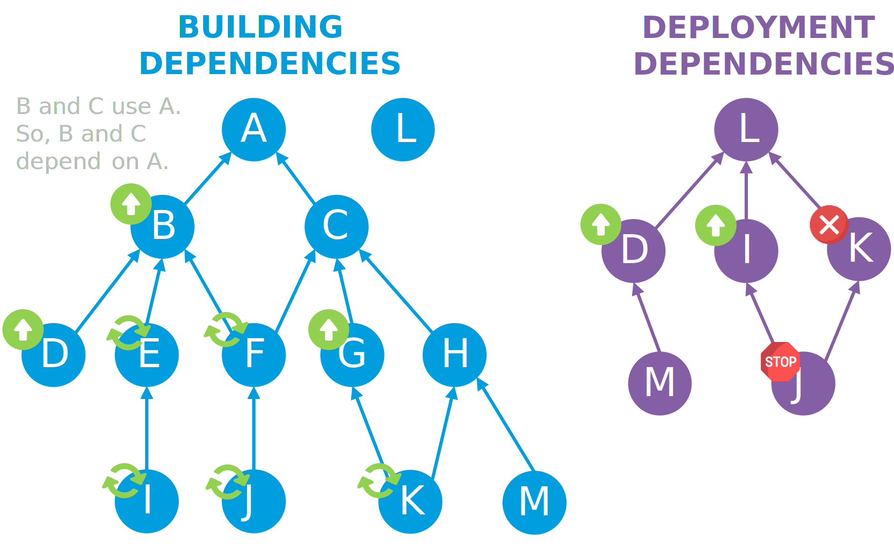
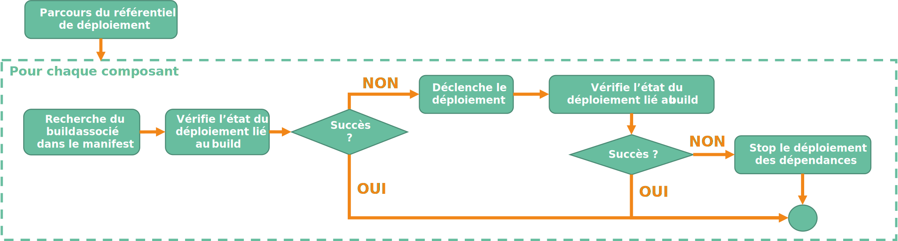
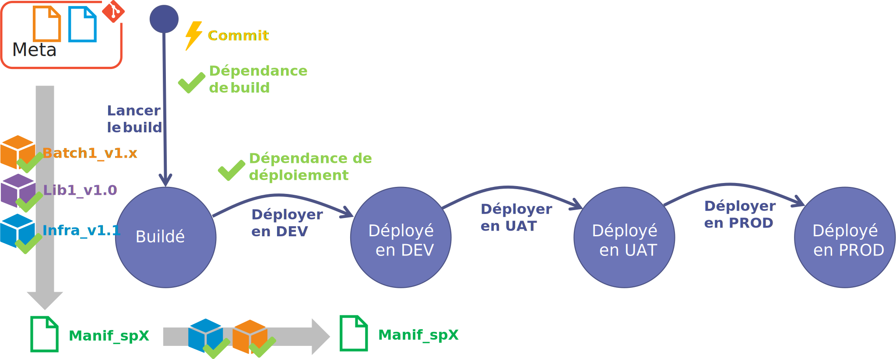
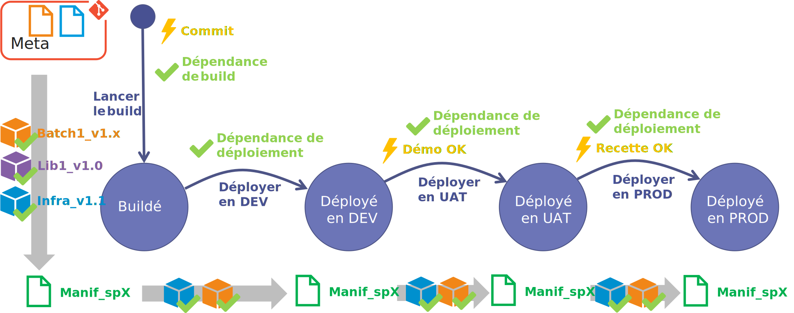
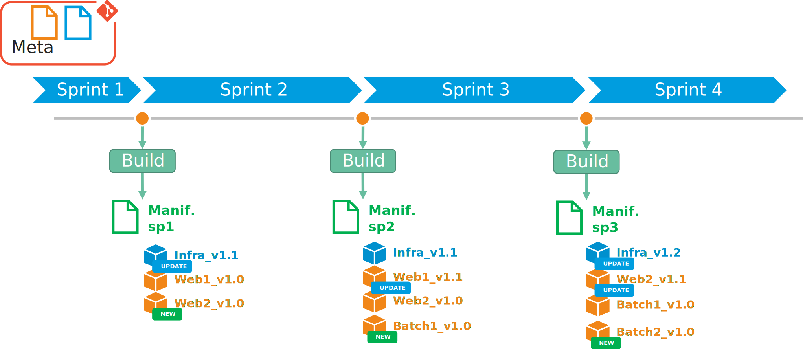

Maintenant que nous avons réussi à **builder** notre application, comment faire pour déployer tous ses composants (infra., microservices,...) correctement ?

Comment faire pour stopper le processus de déploiement applicatif si le déploiement d'un des composants échoue ?

Comment s'assurer de pouvoir faire un rollback de l'application avec seulement les composants impactés à tout moment ?

## La conceptualisation du processus de déploiement

Pour commencer, il nous faut un référentiel de déploiement. 

### Le référentiel de déploiement

Ce référentiel aura pour but d'identifier chaque composant à déployer de notre application, avec :

- le nom du composant (du **repository Git**)
- les dépendances du composant

!!! sample "exemple"
    Imaginons 2 applications web : **WebFront** et **WebBack**. **WebFront** dépend de **WebBack**. Et tous les deux dépendent de l'**infra** qui va les héberger. 

    Voici ce que pourrait donner notre référentiel au format **yaml** :

    ```yaml
    components:
    - name: webfront
      dependencies:
      - webback
    - name: webback
      dependencies: 
      - infra
    ```

Ce référentiel va évoluer au fur et à mesure des itérations pour déployer ou décommissionner les composants de l'application. Et donc, tout comme notre référentiel de **build**, nous allons mettre notre référentiel de déploiement dans le même **repository**.

### Le processus de déploiement

Imaginons qu'il y ai une mise à jour du référentiel de **build**. Cela implique qu'il y a eu une mise à jour d'un composant. Le processus de **build** va générer un nouveau manifeste avec l'ensemble des pipelines de **CI/CD** de chaque composant.
A partir de ce manifeste, pour notre environnement cible et pour chaque composant, il faut déterminer :

- s'il n'est pas nécessaire de le déployer (dans le cas d'une librairie par exemple) : il n'y aura donc rien à faire,
- s'il a déjà été déployé : il n'y aura rien à faire aussi,
- s'il y a une mise à jour à déployer : il faudra déclencher le déploiement du composant,
- s'il y a eu une erreur lors du déploiement d'une dépendance : il ne faudra pas lancer le déploiement.

Encore une fois, comme pour le **build**, c'est comme un arbre où chaque composant correspond à un nœud.

!!! sample "exemple"
    Imaginons que durant notre **sprint** nous ayons fait évoluer nos composants B, D, G. 
    Ci-dessous les arbres de dépendances correspondants :
    

    Lors de l'exécution de notre meta-pipeline pour passer notre application à l'état **buildé**, le manifeste indique que des pipelines **CI/CD** ont été déclenchés pour les composants B, D, G mais aussi pour les composants E, F, I, J et K. Ensuite pour passer notre application à l'état déployée sur notre environnement, il faudra :

    - Ignorer les composants A, B, C, D, E, F, G et H qui n'ont pas besoin d'être déployés,
    - Ignorer les composants L et M qui ont été déjà déployés,
    - Déployer les composants D, I, K et J.
    
    Si le déploiement du composant K est en échec, alors il faudra veiller à stopper le processus et ne pas déployer les composants dépendants. Le composant J sera donc bloqué par son prédécesseur le composant K.

Notre déploiement applicatif peut se représenter sous la forme du processus ci-dessous : 



Le processus va parcourir le référentiel de déploiement en commençant par ceux qui n'ont pas de dépendance, puis par ceux qui dépendent de ces premiers, et ainsi de suite. 

!!! note
    Je vous recommande d'utiliser des processus parallèles pour parcourir l'arbre.

!!! sample "exemple" 
    Si on reprend notre exemple ci-dessus, on aura par ordre de passage :

    1. L
    2. D, I et K
    3. M et J

Pour chaque composant,

1. on recherche le composant dans le manifeste pour obtenir le pipeline associé,
2. on vérifie si celui-ci a déjà été correctement déployé (déterminé par l'état du pipeline).
  
!!! note
    Comme il est possible que le déploiement du composant ne se passe pas correctement, il faut prévoir la possibilité de relancer le déploiement en échec ultérieurement.

2. si oui, on passe au composant suivant,
3. si non, on déclenche le déploiement du composant.
4. on attend la fin du déploiement et on récupère le résultat.
5. si le déploiement est OK, on passe au composant suivant.
6. si le déploiement est KO, on stoppe le déploiement des composants dépendants.

Une fois le référentiel totalement parcouru, on peut déterminer l'état de notre application. Si tous les composants ont été correctement déployés, alors on peut considérer que notre application est correctement déployée.

Imaginons que nous ayons 3 environnements : DEV, UAT et PROD. Avec ce processus, nous pourrons passer notre application de l'état "Buildé" à "Déployé en DEV".



Le passage aux états "Déployé en UAT" et "Déployé en PROD" suivront le même processus.



### L'effet inattendu 

Afin de pouvoir déployer nos composants, nous devons en plus des référentiels de **build** et de déploiement générer un manifeste afin d'identifier de façon unique les instances de pipelines de chacun des composants.

A chaque fois que nous executons notre meta-pipeline, nous avons un nouveau manifeste qui est généré au passage à l'état **buildé** de notre application. 



Le manifeste est une image exacte de notre application avec :

- le code de nos différents composants,
- la configuration de ceux-ci portée par le pipeline de **CI/CD** de chacun des composants,

Couplé à nos 2 référentiels qui décrivent :

- la façon dont on doit **builder** les composants (référentiel de **build**),
- la façon dont on doit déployer tous les composants (référentiel de **déploiement**).

Cela revient à dire que l'on est en capacité de reconstruire notre application **from scratch** en déployant les composants dans le bon ordre et avec les bons paramètres d'environnement. Cela va simplifier et sécuriser grandement les opérations de **rollback**.

## Conclusion

L'utilisation conjointe du manifeste et du référentiel de dépendance de déploiement, nous permet d'assurer le déploiment de tous les composants de notre architecture micro-service en limitant les risques d'oublis ou d'échecs en cascade. 

De plus, le manifeste généré durant la phase de **build** de notre meta-pipeline nous permet aussi de pouvoir redéployer rapidement notre architecture micro-service à l'état exacte d'une version précédente de notre application.

Tout ça est beau mais reste purement théorique. Pour prouver la valeur de notre idée, je vous présenterais dans la prochaine et dernière partie :

- notre implémentation,
- notre expérimentation et 
- nos retours d'expériences. 

A suivre...

## Références


## Remerciements

- [Fabrice Weinling](https://www.linkedin.com/in/%E2%99%A0-fabrice-weinling-%E2%99%A0-414187114/) : pour la relecture

_Rédigé par Philippe MORISSEAU, Publié le 04 Janvier 2022_