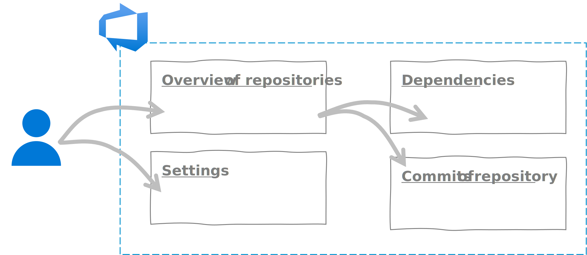
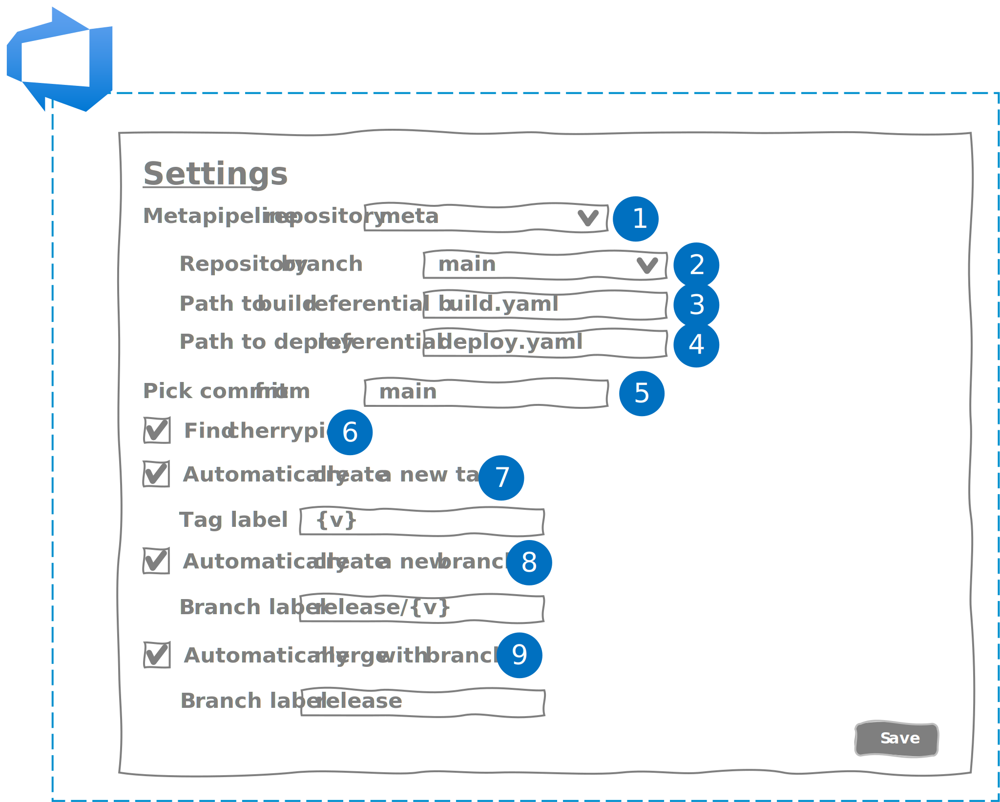
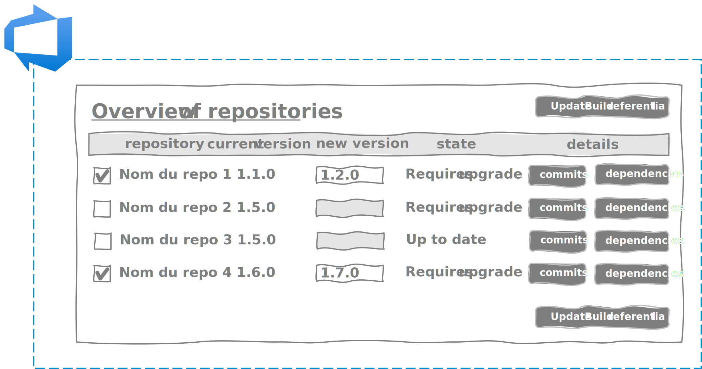
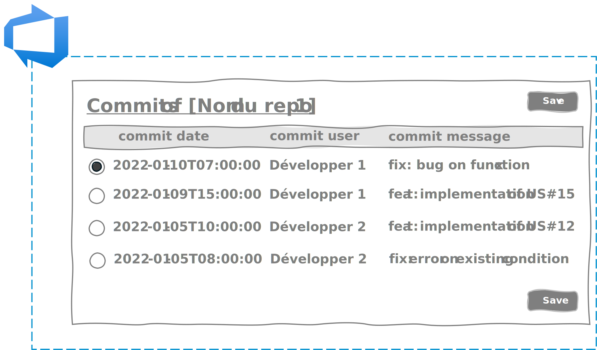
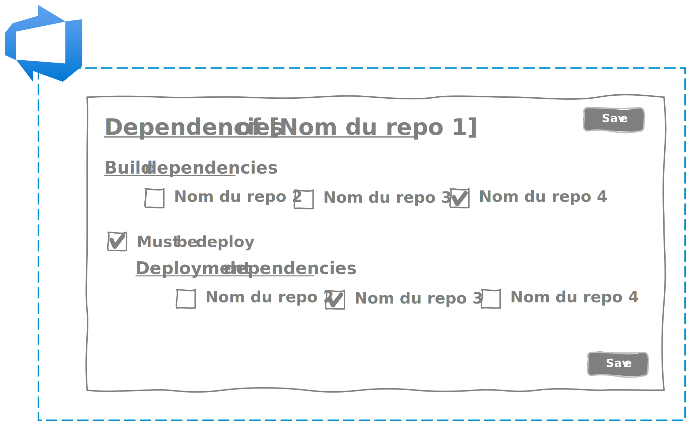

Durant la première partie nous avons détaillé comment nous pouvions atteindre les limites du DevOps et faire partir en vrille notre démarche. Ensuite, dans la seconde partie, je vous ai exposé une idée qui permettrait de passer au-delà des limites. 
Dans cette troisième partie d'un unique chapitre, je vais vous présenter l'implémentation concrète de notre idée.

## L'implémentation

### Nos objectifs au travers de l'implémentation de notre idée

Avant de foncer tête baissée dans la réalisation de notre idée, il faut prendre un peu de recul et se poser les bonnes questions. Que doit apporter notre solution ?

Notre solution doit permettre à l'équipe projet de :

- conserver un rythme et des cérémonies agiles,
- simplifier le processus de déploiement,
- garantir la qualité des composants dans le temps.

Notre solution doit offrir au client la possibilité de :

- réduire le délai entre l’approbation et le **Go Live**,
- intervenir rapidement en cas de panne,
- garantir la qualité de l'application dans le temps.

### Ce que l'on ne veut pas

Il est évident que chaque client, chaque entreprise, chaque projet a sa propre organisation. Notre solution ne doit pas imposer une organisation spécifique. Cela irait à l'encontre de l'agilité et de la démarche DevOps.

Notre solution ne doit pas contraindre :

- à un **Branching Model**. Notre solution doit être compatible avec les processus **Gitflow, GithubFlow, Trunk Based Development** ou **custom**.
- à un processus de mise en production. Chaque entreprise ayant son propre processus de **delivery** applicatif avec ses environnements propres hors production, notre solution doit s'adapter à l'organisation et non l'inverse.
- à un **Semantic Versioning**. Notre solution doit autoriser n'importe quel type de **Semantic Versioning** : SemVer1.0, SemVer2.0, ...  
- à un environnement technique. Chaque SI d'entreprise a son propre écosystème avec ses **OS**, ses **framewoks**, ses solutions d'hébergement (**Cloud**, **OnPremise**, ...). Notre solution ne doit pas imposer un hébergeur cloud par exemple.

Au final, notre solution doit être le plus "agnostique" possible.

### Le choix de la plateforme de production logicielle

Une fois cela dit, notre solution doit quand même s'ancrer à une solution de production logicielle. Ayant une grande affinité et une bonne connaissance de la **stack** de Microsoft, mon choix s'est porté rapidement sur **Azure DevOps Services**, l'usine logicielle **SaaS** de Microsoft.

**Azure DevOps Services** offre l'avantage de pouvoir intégrer vos propres extensions (ou celles déjà disponibles sur le **Marketplace**). Vous pouvez :

- réaliser vos extensions web pour augmenter les fonctionnalités des interfaces **Azure DevOps** en **react**,
- développer  en **powershell** ou en **node.js** vos extensions de tâches pour augmenter les fonctionnalités de vos pipelines de **CI/CD**,
- définir vos propres connexions afin de sécuriser et de simplifier les communications entre **Azure DevOps** et vos services.  

Dans notre cas, nous avons réalisé 2 extensions :

- Une extension **Web** pour simplifier la mise à jour des référentiels de **build** (cf. [Partie 2 - Chapitre 2](05.comment.build.md)) et de déploiement (cf. [Partie 2 - Chapitre 3](06.comment.deploy.md)) en :
    - parcourant l’ensemble des **repos**,
    - identifiant les **repos** ayant évolués en un coup d’œil,
    - sélectionnant les **repos** devant intégrés,
    - définissant la version de chaque composant

- Une extension **Task** pour simplifier l'orchestration des **builds** et des déploiements dans notre meta-pipeline en :
    - s’intégrant dans un pipeline **CI/CD Azure DevOps**, 
    - gérant le **semantic versioning** défini dans notre référentiel de **build**,
    - prenant en compte le **Branching Model** du projet,
    - gérant les dépendances de **build**,
    - pilotant les approbations manuelles ou automatiques,
    - gérant les dépendances de déploiement.

### L'extension Web

Voici la cinématique imaginée dans **Azure DevOps** pour notre utilisateur :



En arrivant sur l'extension web, 2 onglets lui permettent : 

- de visualiser l'ensemble des **repositories git** du projet,
- d'accéder aux paramètres de la solution.

L'onglet "paramétrage" va permettre à notre utilisateur de pouvoir configurer la solution afin de répondre aux différentes organisations projets.



1. Sélection du **repository git** contenant les référentiels de **build** et de déploiement,
2. Sélection de la branche utilisée pour mettre à jour les référentiels de **build** et de déploiement,
3. Chemin complet du fichier yaml contenant le référentiel de **build**,
4. Chemin complet du fichier yaml contenant le référentiel de déploiement,
5. Nom des branches des composants de l'application depuis lesquelles les pipelines seront déclenchées,
6. Indique s'il faut identifier les **commits** qui ont été **cherrypickés** pour les exclure de la recherche d'évolution d'un composant (par exemple, dans le cas du **Trunk Based Development**, les **cherrypick** sont utilisés pour réaliser des **hotfix**),
7. Indique si vous souhaitez créer un tag lorsque vous réalisez une montée de version de votre composant. Si oui, vous pourrez personnaliser votre tag, l'instruction "{v}" correspondant à votre numéro de version. Par exemple, si vous définissez "v{v}" et que le numéro de version est "1.0.1" alors votre tag sera "v1.0.1".
8. Indique si vous souhaitez créer une branche lorsque vous réalisez une montée de version de votre composant. Si oui, vous pourrez personnaliser votre branche. Par exemple, si vous saisissez release/{v}, alors le numéro de version sera préfixé de "release/" dans votre branche.
9. Indique si vous souhaitez réaliser un **merge** sur une branche lorsque vous réalisez une montée de version de votre composant. Si oui, indiquer le nom de la branche vers laquelle vous souhaitez réaliser votre **merge**.

!!! sample "Exemple"
    Si l'équipe utilise le **gitflow**, alors il faudra réaliser la configuration suivante :
    ```
    Pick commit from : "main"
    Find cherrypick : décoché
    Automatically create a new tag : coché
    Automatically create a new branch : décoché
    Automatically merge with branch : décoché
    ```

L'onglet de visualisation des **repositories git** permet de visualiser l'ensemble des **repos** de votre application et d'avoir un aperçu instantané des composants nécessitant une montée de version. 



En fonction du paramétrage, le système va déterminer automatiquement s'il y'a eu des mises à jour (des nouveaux **commits**) sur le **repository** du composant. 

L'utilisateur a le dernier mot et peut décider d'embarquer le composant en cochant la case et en saisissant un numéro de version.

Par défaut, l'extension va prendre le dernier **commit** de la branche, mais il est possible de le sélectionner en allant sur le détail des **commits**.



Enfin, l'interface de gestion des dépendances va permettre de définir les dépendances de **build** et de déploiement.



### L'extension Task

Pour l'extension **Task**, il faut que celle-ci soit la plus simple possible pour permettre une intégration rapide et facile.

Le nombre de paramètres est donc limité au strict minimum :

- un sélecteur pour indiquer si l'on souhaite utiliser l'extension pour le **build** ou pour le déploiement,
- afin d'éviter de réquisitionner tous les agents de **build** ou de déploiement disponible, un paramètre pour indiquer le nombre maximum d'agents à utiliser en parallèle,
- un paramètre indiquant l'emplacement du référentiel de **build** ou de **release**,
- un paramètre indiquant l'emplacement du manifeste de **build**.

!!! sample 
    Voici un exemple de notre tâche de **build** dans le meta-pipeline :
    ``` yaml
    steps:
      - task: meta-pipeline-build-deploy-task@0
        displayName: 'Meta-pipeline Task : Build'
        inputs:
            EnvironmentStage: Build
            NbAgents: 3
            Referential: '$(System.DefaultWorkingDirectory)\build.yml'
            BuildManifest: '$(Build.ArtifactStagingDirectory)\manifest.yml'
    ```

!!! sample 
    Voici un exemple de notre tâche de déploiement dans le meta-pipeline :
    ``` yaml
    steps:
      - task: meta-pipeline-build-deploy-task@0
        displayName: 'Meta-pipeline Task : Deploy'
        inputs:
            EnvironmentStage: Deploy   
            NbAgents: 3
            Referential: '$(System.DefaultWorkingDirectory)\deploy.yml'  
            BuildManifest: '$(Build.ArtifactStagingDirectory)\manifest.yml'
    ```

### Les choix 

Malheureusement, faute de temps et de moyens nous avons dû déprioriser des fonctionnalités et particulièrement sur l'extension web. 
Par exemple, nous n'avons pour le moment pas implémenté l'interface de configuration des dépendances.
Cependant, cela a un moindre impact pour l'expérimentation. En effet, on modifie rarement les dépendances entre les composants. L'édition des fichiers Yaml (**build** et **release**) permet dans un premier temps de palier à ce manque.

## L'expérimentation / Les premiers retours

Cela fait maintenant 18 mois que notre solution fonctionne pour gérer une solution de plus de 40 **repository git**, autant de pipelines de **CI** et environ 30 pipelines de **CI/CD**.
Et les retours sont positifs sur plusieurs aspects.

### Simplification

La simplification réside dans l'existence du meta-pipeline. Celui-ci joue le rôle de chef d'orchestre en s'assurant de **builder** et de déployer les composants à notre place. L'équipe et particulièrement le **tech-lead** se retrouve soulagés d'avoir un nouveau "membre" qui s'occupe de cela à sa place. L'équipe peut maintenant se consacrer pleinement sur l'implémentation des composants. 

### Rapidité

L'orchestration et la parallèlisation des **builds** et des déploiements permettent d'optimiser au maximum le processus de **CI/CD**. Dès qu'un composant a fini d'être **buildé** ou déployé, notre orchestrateur passe automatiquement au composant suivant. L'équipe n'a plus besoin de surveiller les notifications pour déclencher le déploiement du composant suivant.

### Fiabilité

L'utilisation de référentiel de **build** et de déploiement permet de systématiser l'orchestration. Notre "chef d'orchestre" joue la partition à la lettre !
De plus l'automatisation réduit les opérations manuelles et donc les risques d'erreurs ou d'oublis.

### Traçabilité

Les **commits** réalisés à chaque modification de référentiel, les logs du meta-pipeline et la génération du manifeste sont autant d'éléments qui permettent d'avoir une traçabilité :

- sur l'ensemble des mises à jour des composants et de leurs dépendances à partir des **commits** réalisés sur le **repository git**,
- sur ce qui s'est réellement passé au moment de l'exécution de notre meta-pipeline (quel composant a échoué et à quel moment ?) à partir des logs,
- sur l'ensemble des versions de chaque composant à chaque exécution du meta-pipeline à partir du manifeste.

### Reproductivité

Grace au manifeste, il est possible de redéployer à moindre effort tous les composants de l'application même à son état antérieur (plusieurs **sprints** auparavant).

!!! warning
    Cela ne veut pas dire que la solution vous permet de gérer tout le **rollback** de votre application, et notamment de vos données. Mais si vous faites attention à prendre en compte l'évolutivité de vos modèles de données dans la conception de vos composants avec ou sans outils (entity framework, liquibase, ...) vous ne devriez pas avoir trop de problèmes au moment du **rollback**.

## Conclusion

Pour le moment, la solution que nous avons mise en place est encore "verte". Certes, nous l'avons éprouvée longuement auprès d'un client et de nombreuses fois sur des **Proof of Concept**, mais de mon point de vue elle nécessite encore un certain nombre d'ajustements et d'améliorations pour être mise à la disposition de tous.
Si vous souhaitez participer, contribuer ou réagir, je vous invite à me contacter en privé via **LinkedIn**. Je serai ravi d'échanger avec vous. 

Je pense avoir tout dit sur le sujet durant les 7 articles qui composent cette série. Ce qu'il faut surtout retenir c'est qu'il est possible en toute circonstance d'appliquer une démarche **DevOps**, que ce soit pour une toute petite application monolithique ou une énorme application distribuée.

La démarche **DevOps** ne s'arrête pas à la mise en place de pipeline **CI/CD**. C'est une démarche qui impactera forcément votre organisation : les développeurs, les architectes, les intégrateurs, les testeurs, les exploitants, mais aussi les représentants métiers (**Product Owner**, **Business Analyst**). Et pour ces derniers le couple Agilité + **DevOps** prend tout son sens.

## Remerciements

- [Michael Maillot](https://twitter.com/michael_maillot) : pour la relecture
- [Laurent Mondeil](https://www.linkedin.com/in/laurent-mondeil-0a87a743/) : pour la relecture
- [Samy Mameri](https://www.linkedin.com/in/samy-mameri-60649079/) : pour la relecture
- [Oussama Mouchrit](https://www.linkedin.com/in/mouchritoussama/) : pour la relecture
- [Nicolas Giraud](https://www.linkedin.com/in/nicolas-giraud-17a44383/) : pour l'idée de la machine à état
- [Fabrice Weinling](https://www.linkedin.com/in/%E2%99%A0-fabrice-weinling-%E2%99%A0-414187114/) : pour la relecture
- [Etienne Louise](https://www.linkedin.com/in/etienne-louise-78154063/) : pour la relecture

_Rédigé par Philippe MORISSEAU, Publié le 08 Février 2022_