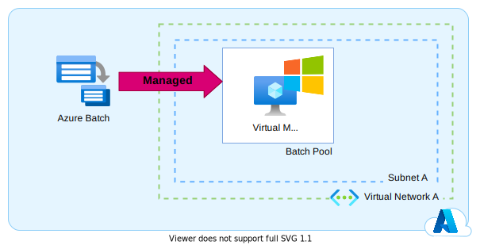

## Le scénario

Vous souhaitez proposer des services ayant une durée de vie limité, executable sous Linux ou Windows et isolé dans votre **Virtual Network**. Par exemple : Des runners **self-hosted** pour github.

On imagine donc une architecture avec des **Azure Container Instance** du style :   

Cela fonctionne pour nos conteneurs Linux mais pas pour nos conteneurs Windows... 

## L'exception

Après quelques tests infructueux, nous avons fait une petite recherche et découvert rapidement que l'utilisation d'**Azure Container Instance** dans un **Virtual Network** comportait quelques exceptions et notamment celle-ci : 

!!! tldr "Extrait [docs.microsoft.com](https://docs.microsoft.com/fr-fr/azure/container-instances/container-instances-virtual-network-concepts#other-limitations)" 
    Actuellement, seuls les conteneurs Linux sont pris en charge dans un groupe de conteneurs déployé sur un réseau virtuel.

## Contournement

Les **Azure Container Instance** ne permettant pas d'intégrer des conteneurs Windows dans votre Vnet, il ne nous reste que peu d'options :

1. Microsoft avait annoncé fin 2020 que cette fonctionnalité serait disponible début 2021. Si l'on admet un retard pris, on peut espérer que cette fonctionnalité sera bientôt disponible. Donc, la première option est d'attendre.
2. La seconde option, consiste à remplacer notre **Azure Container Instance** par **Azure Batch** avec un pool **Windows**.
   
   

Vous pouvez aussi utiliser un **AKS** ou un **VM Scale Set**, mais de mon point de vue, c'est un peu "overkill".  

## Conclusion

Si vous êtes vraiment pressé par le temps ou vous doutez que Microsoft propose l'integration Vnet des **Azure Container Instance** Windows rapidement, je serais tenté de vous orienter vers **Azure Batch**. Un service managé d'Azure pas assez mis en valeur à mon goût !

## Dans la série

- [Chapitre 1 : Azure Container Registry et Azure Container Instance dans votre Vnet](../01.azureException.acrAndAciInYourVnet/)
- [Chapitre 3 : Les firewall et les régions Azure](../03.azureException.firewallAndRegion.md)

## Références

- [Ressources et scénarios relatifs aux réseaux virtuels](https://docs.microsoft.com/fr-fr/azure/container-instances/container-instances-virtual-network-concepts)
- [Azure Container Instances (ACI) under the hood - Azure Friday](https://youtu.be/giQLmxMKAKE?t=412)
- [Exécuter des applications de conteneur sur Azure Batch](https://docs.microsoft.com/fr-fr/azure/batch/batch-docker-container-workloads)
- [Utiliser des conteneurs Windows Server](https://docs.microsoft.com/fr-fr/azure/aks/windows-container-cli)

## Remerciements

- [Michael Maillot](https://twitter.com/michael_maillot) : pour la relecture
- [Oussama Mouchrit](https://www.linkedin.com/in/mouchritoussama/) : pour la relecture
- [Laurent Mondeil](https://www.linkedin.com/in/laurent-mondeil-0a87a743/) : pour la relecture
- [Etienne Louise](https://www.linkedin.com/in/etienne-louise-78154063/) : pour la relecture

_Rédigé par Philippe MORISSEAU, Publié le 20 Septembre 2021_