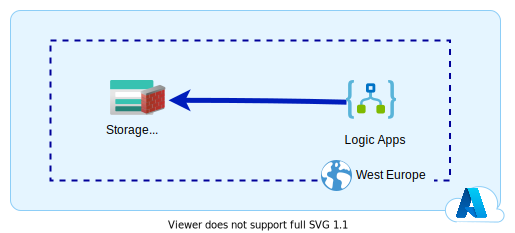
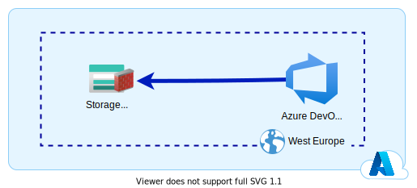
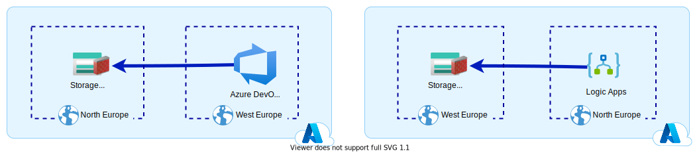

## Le scénario

Vous souhaitez connecter un service PaaS ou SaaS Azure avec un **Storage Account**. Même si votre service est accessible publiquement (pas d'isolation réseau), vous ne souhaitez pas exposer publiquement votre **Storage Account**. Vous savez que Microsoft vous permet de limiter l'exposition réseau via les règles firewall de votre **Storage Account**. Vous **whitlistez** donc les IP de votre service. 

Sur le papier cela fonctionne parfaitement. Dans la réalité, ce n'est pas le cas...

## L'exception

Ce phénomène, j'ai pu l'observer. Il y a certainement d'autres cas similaires avec d'autres services Azure. Je vais vous présenter les 2 cas que j'ai pu rencontrer.

### LogicApp et Storage Account

Nous souhaitions déclencher un workflow lorsqu'un nouveau fichier est déposé dans un container blob de notre **Storage Account**. Nous décidons d'utiliser le service **Logic Apps** pour notre workflow. Nous ne voulions pas investir dans un **Integration Service Environment** (environ 720 € / mois) ou dans un **Workflow Standard WS1** (environ 150 € / mois) afin d'isoler notre workflow.

Mais afin de ne pas exposer notre **Storage Account** publiquement, nous souhaitions mettre une règle firewall sur celui-ci afin de n'autoriser que le service **Logic Apps**. 

!!! note 
    Microsoft fournit la liste des IP sortantes des connecteurs **Logic Apps** : [ici](https://docs.microsoft.com/en-us/connectors/common/outbound-IP-addresses#azure-logic-apps)

Naturellement, nous avions mis nos 2 services dans la même région Azure.

**Erreur fatale !** Lorsque les 2 ressources Azure sont sur la même région, Microsoft va très régulièrement (pas toujours !) privilégier son réseau interne pour router la communication. Ainsi notre **Logic Apps** va contacter notre **Storage Account** avec une adresse IP privée. 

*"Ce n'est pas grave ça ! Il suffit juste de whitelister les adresses IP privées !"* 

**Eh bien non !** Vous ne pouvez pas mettre de règles firewall sur des plages IP privées. 

### Azure DevOps Services et Storage Account

Nous souhaitions notifier un évènement depuis une extension **Azure DevOps Services** Agentless vers une queue de notre **Storage Account**. Encore une fois, afin de ne pas exposer notre **Storage Account** publiquement, nous voulions mettre une règle firewall sur celui-ci afin de n'autoriser que le service **Azure DevOps Services**.

!!! note
    Microsoft fournit la liste des IP sortantes de **Azure DevOps Services** : [ici](https://docs.microsoft.com/fr-fr/azure/devops/organizations/security/allow-list-IP-url?view=azure-devops&tabs=IP-V4#inbound-connections)

Encore une fois, nous avons mis nos 2 services dans la même région Azure.

**Je vous le donne en mille, Emile !** Lorsque nos 2 services Azure sont sur la même région, Microsoft va très régulièrement privilégier son réseau interne pour router la communication. Ainsi notre **Azure DevOps Services** va contacter notre **Storage Account** avec une adresse IP privée. 

## Contournement

On pourrait penser que le problème vient uniquement de notre **Storage Account** qui ne permet pas d'identifier l'origine du service appelant. On pourrait se dire qu'avec l'utilisation de **Service Tag** on pourrait résoudre notre problème. Malheureusement, non ! 

Les **Service Tag** permettent de simplifier la gestion des IP publiques des services Azure. En ajoutant un **Service Tag** à notre firewall on va whitlister uniquement les IP publiques de celui-ci.

Finalement, la seule solution de contournement simple est de changer la région d'un des 2 services.

En utlisant 2 régions, on force nos services à utiliser les IP publiques. les règles firewall peuvent donc être appliquées.

## Conclusion

J'avoue qu'utiliser plusieurs régions Azure pour éviter une exposition réseau trop large d'un service est un peu affligeant. 
Dans le cas des **Logic Apps**, si l'on a un petit peu de budget, je vous conseillerais d'utiliser un **Workflow Standard WS1** afin d'isoler d'un point de vue réseau notre service.
Dans le cas d'**Azure DevOps Services**, étant pour le moment uniquement publique, vous n'aurez pas beaucoup d'autres solutions.

## Dans la série

- [Chapitre 1 : Azure Container Registry et Azure Container Instance dans votre Vnet](../01.azureException.acrAndAciInYourVnet/)
- [Chapitre 2 : Azure Container Instance et Windows dans votre Vnet](../02.azureException.aciWindowsWithVnet/)

## Références

- [Managed connectors outbound IP addresses](https://docs.microsoft.com/en-us/connectors/common/outbound-IP-addresses#azure-logic-apps)
- [Azure DevOps Services - Adresses IP et URL de domaine autorisées](https://docs.microsoft.com/fr-fr/azure/devops/organizations/security/allow-list-IP-url?view=azure-devops&tabs=IP-V4#inbound-connections)
- [Azure IP Ranges and Service Tags – Public Cloud](https://www.microsoft.com/en-us/download/details.aspx?id=56519)

## Remerciement

- [Michael Maillot](https://twitter.com/michael_maillot) : pour la relecture
- [Laurent Mondeil](https://www.linkedin.com/in/laurent-mondeil-0a87a743/) : pour la relecture
- [David Dubourg](https://www.linkedin.com/in/dubourg-david-7413779/) : pour la relecture

_Rédigé par PhilIPpe MORISSEAU, Publié le 17 Octobre 2021_