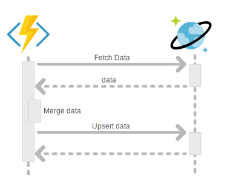
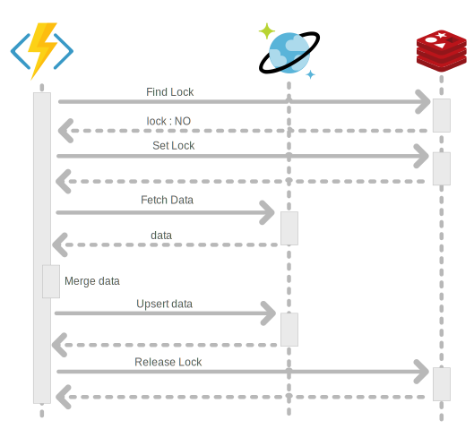
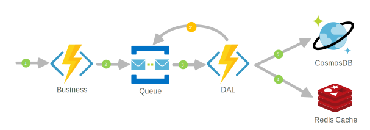

Cela fait maintenant : 

- 6 ans que cette idée a été remonté à Microsoft, 
- 2 ans et demi que le sujet est dans la roadmap de Microsoft, 
- 1 ans et demi que celui-ci est commencé et... 

toujours rien.

Pourtant, cette fonctionnalité pourrait tout changer ! J'ai eu l'occasion de rencontrer des clients qui pour cette unique raison préféraient partir sur MongoDB Atlas.

Mais pourquoi cette fonctionnalité change tout ?

### Constat : Atomicité des mises à jour DocumentDB

Via le mécanisme de contrôle d’accès concurrentiel optimiste (etag - Transactions optimistic concurrency) de l'api SQL, Microsoft garanti que les transactions envoyées vers un Conteneur CosmosDB sont ACID. Mais à y regarder de plus près on constate que le classique "UPDATE" SQL n'est pas dans la liste des opérations pris en charge. Mais comment faire une mise à jour alors ?

Aujourd'hui, pour faire une mise à jour dans un conteneur CosmosDB, il faut :

1. récupérer le document, 
2. le mettre à jour (merge entre la donnée reçu et celle exitant dans CosmosDB) et 
3. l'enregistrer dans le conteneur.



Mais lorsque plusieurs composants sont suceptibles de réaliser cette mise à jour ou que vous utilisez des mécanismes de scalabilités horizontal, il y'a un risque d'écrasement de la donnée (et donc de perte de donnée).

En effet, prenons 2 composants A et B réalisant une mise à jour au même moment sur la même donnée.

- L'identifiant est lié à la proriété "id" (je mets de coté volontairement la notion de clé de partition),
- Le composant A met à jour la date de naissance ainsi que l'adresse email,
- Le composant B met à jour la date de naissance et le numéro de téléphone. 

| Data Composant A | Data Composant B | Data CosmosDB |
| - | - | - |
| {<br>&nbsp;&nbsp;"id": "99039816",<br>&nbsp;&nbsp;,"birthdate": "1984-**06**-16T00:00:00Z",<br>&nbsp;&nbsp;**"email": "joe.doe@yopmail.com"**<br>} | {<br>&nbsp;&nbsp;"id": "99039816",<br>&nbsp;&nbsp;"birthdate": "1984-**07**-16T00:00:00Z",<br>&nbsp;&nbsp;**"phone": "+33.8.76.54.32.10"**<br>} | {<br>&nbsp;&nbsp;"id": "99039816",<br>&nbsp;&nbsp;"firstname": "joe",<br>&nbsp;&nbsp;"lastname": "doe",<br>&nbsp;&nbsp;"birthdate": "1984-05-16T00:00:00Z",<br>}

Dans un traitement classique suite à la mise à jour de la donnée par les 2 composants nous devrions avoir :

- Si le composant A est passé avant le composant B :
```
{
    "id": "99039816",
    "firstname": "joe",
    "lastname": "doe",
    "birthdate": "1984-07-16T00:00:00Z",
    "email": "joe.doe@yopmail.com",
    "phone": "+33.8.76.54.32.10"
}
```
- Si le composant B est passé avant le composant A :
```
{
    "id": "99039816",
    "firstname": "joe",
    "lastname": "doe",
    "birthdate": "1984-06-16T00:00:00Z",
    "email": "joe.doe@yopmail.com",
    "phone": "+33.8.76.54.32.10"
}
```

Imaginons maintenant le séquencement suivant :

1. Composant A : Fetch Data
2. Composant B : Fetch Data
3. Composant A : Merge data
4. Composant A : Upsert data
5. Composant B : Merge data
6. Composant B : Upsert data

Suite à la mise à jour de la donnée par les 2 composants nous aurons dans CosmosDB :
```
{
    "id": "99039816",
    "firstname": "joe",
    "lastname": "doe",
    "birthdate": "1984-07-16T00:00:00Z",
    "phone": "+33.8.76.54.32.10"
}
```
L'information adresse email est **PERDU** ! 

Le problème, c'est que le composant A ne sait pas que le composant B réalise une opération de mise à jour au même moment. Et chaque composant fait sa mise à jour de son coté croyant qu'il est seul au monde !

Mais comment résoudre ce problème ?

Il s'agit d'un problème d'atomicité. Il va falloir s'assurer que les opérations de récupération, de fusion et d'enregistrement soient réalisée de manière atomique. 

Je reprend mes vieux cours d'informatique et la solution est "le verrou".

### Une solution : CosmosDB + Redis

Dans le cloud Azure, le service "cache redis" est bien pratique. Il ne sert pas qu'à faire du cache ! Il peut aussi gérer notre verrou.

##### Le principe

Chaque composant voulant réaliser une opération de mise à jour doit systématiquement poser un verrou dans Redis avant de réaliser la mise à jour (fetch-merge-upsert). Si le cache contient déjà ce verrou, alors le composant sait qu'un autre composant est en train de réaliser une opération de mise à jour.
Ainsi, grace au verrou l'atomicité de l'operation de mise à jour est préservée.
Il faudra bien entendu penser à libérer le verrou une fois l'opération terminée.



Il ne reste plus qu'à l'encapsuler dans une petite couche technique (DAL) afin d'abstraire tout cela du traitement métier.

!!! note
    Pour le verrou, il faut utiliser l'identifiant (la clé primaire) de la donnée en tant que clé. Par exemple pour notre exemple ci-dessus, on utilisera "99039816" comme clé. 

Parfait !

Mais que se passe-t-il s'il y a un verrou de posé ? 

On attends !

Oui, mais imaginons que l'on ai une vague de mise à jour sur la même donnée (c'est un cas extrème), ou que le cache redis ou que le comosdb ne réponde pas ? Mon composant ne va pas attendre éternellement ! 

C'est vrai. Pour cela, je conseille d'utiliser une file d'attente.

#### L'architecture

L'idée est de découper le traitement de mise à jour en 2. Le premier composant (Business) va pousser sa demande mise à jour dans une file d'attente. Le second composant (DAL) va lui traiter cette file d'attente et réaliser les mises à jour. En cas d'impossibilité de réaliser une mise à jour par le second composant, celui-ci va remettre la demande en file d'attente (celle-ci sera traité ultérieurement)  


```
1 - Demande de mise à jour
2 - Mise en file d'attente de la mise à jour par le composant métier
3 - Consommation de la file d'attente par le composant DAL
4 - Vérification du verrou
5 - Upsert de la donnée
5'- Remise en file d'attente en cas d'échec. 
```

!!! note
    Je préconise de tenter 5 à 10 fois la mise à jour par le composant avant de remettre la demande  en file d'attente.

#### Cas au limite

C'est bien cette histoire de file d'attente, mais du coup, j'ai un risque que les opérations de mise à jour soient réalisées dans le désordre.

C'est vrai.

Pour cela, on peut se baser sur le timestamp de la donnée (il faudra alors stocker cette information en plus dans CosmosDB). Ainsi, si la mise à jour à traiter est antérieur à la dernière mise à jour dans CosmosDB, l'opération peut-être abandonnée.

Cela reste imparfait...

### Conclusion

Il faut se doter de plusieurs ressources azure et réaliser un peu de développement pour obtenir une solution capable de gérer presque proprement les mises à jour dans CosmosDB.

Il existe d'autres solutions :

- Une qui pourrait sembler être plus "sexy" serait d'utiliser les procédures stockées JS de CosmosDB. En effet, les ProcStock permettent de garantir l'atomicité de l'opération. Mais à mon avis, si vous devez gérer des données complexe dans votre conteneur CosmosDB, vous allez galérer à implémenter et maintenir celles-ci.
- Une autre, consiste à utiliser les Azure Function Durable Entities. Mais je n'ai pas encore eu l'occassion de tester. 

Le partial update permettrait de se défaire de cette problèmatique en n'envoyant dans CosmosDB que les propriétés à mettre à jour. Le CosmosDB ce chargeant de réaliser les opérations de fetch-merge-upsert lui même. Cela simplifierait beaucoup de chose.

Vivement le Partial Update !

### Références

- [Feedback Azure](https://feedback.azure.com/forums/263030-azure-cosmos-db/suggestions/6693091-be-able-to-do-partial-updates-on-document?page=4&per_page=20#{toggle_previous_statuses})
- [Wikipédia](https://fr.wikipedia.org/wiki/Propri%C3%A9t%C3%A9s_ACID)
- [CosmosDB - Stored Procedures](https://docs.microsoft.com/fr-fr/azure/cosmos-db/stored-procedures-triggers-udfs)
- [CosmosDB - Transactions optimistic concurrency](https://docs.microsoft.com/fr-fr/azure/cosmos-db/database-transactions-optimistic-concurrency)
- [Azure Function Durable Entities](https://docs.microsoft.com/fr-fr/azure/azure-functions/durable/durable-functions-entities?tabs=csharp)
  
### Remerciement

- [Quentin Joseph](https://www.linkedin.com/in/quentin-joseph-a4962b87/) : pour la relecture
- [Benjamin Dufour](https://www.linkedin.com/in/benjamin-dufour-01288b51/) : pour les  Azure Function Durable Entities ;-)
- [Laurent Mondeil](https://www.linkedin.com/in/laurent-mondeil-0a87a743/) : pour la relecture

_Rédigé par Philippe MORISSEAU, Publié le 20 Novembre 2020_
