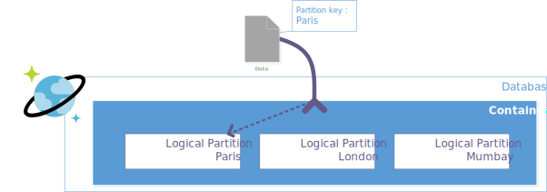

Dans CosmosDB, la notion de clé de partition est essentielle. En effet, contraitement à d'autres systèmes de stockage de données classique (SQL par exemple), l'unicité d'une donnée est basée sur le couple **identifiant** - **clé de partition**.

Les conteneurs CosmosDB sont découpés en partitions logiques. Chaque partition logique gère indépendamment l'unicité de ses éléments en se basant sur l'identifiant **id**. 

C'est un peu comme un dossier qui s'assure qu'à l'intérieur de lui, il n'y a pas 2 fois le même nom de fichier. 
Donc, dans un même conteneur vous pouvez très bien avoir le même **identifiant** dans 2 partitions logiques différentes.

La clé de partition peut-être définie à partir de n'importe quelle propriété de la donnée. Mais il y a quelques contraintes à respecter :

- Cette propriété doit être obligatoirement valuée (tout comme l'identifiant).
- Cette propriété doit être immuable (tout comme l'identifiant).
- Le stockage sur une clé est limité à 20 Go. 
- Le nombre de valeur possible de cette propriété doit être proportionnel au nombre d'éléments stockés dans le conteneur (je conseille un rapport compris entre 1/1 000 et 1/10 000).
- La répartition du stockage doit être uniforme entre toutes les clés.
- La répartition des requêtes doit être de préférence uniforme entre toutes les clés.

Dans ces conditions il est parfois difficile de trouver la propriété répondant à tous ces critères !

**Pas de panique, j'ai une solution !** Elle consiste à calculer la clé de partition.

## La fausse bonne idée !

Une solution simple serait de définir de façon aléatoire la clé de partition. Ainsi on maitrise le nombre de partition et on s'assure que la répartition du stockage et des requêtes est uniforme. 

Parfait ! Sauf que s'il on a 2 processus qui réalise au même moment l'ajout de la même donnée chacun va calculer sa propre clé de partition et les 2 ajouts seront enregistrés. Nous aurons un doublon !

Et ne croyez pas que j'exagère et que mon exemple ne peux pas arriver ! J'aime souvent citer la loi de Murphy dans ce type de cas : "Tout ce qui est susceptible d'aller mal, ira mal.". Et personnellement, je déteste les doublons !

## Une solution : Un CRC en guise de clé de partition.

Pourquoi ne pas déduire la clé de partition à partir de l'identifiant ! 

Un peu comme les 2 derniers chiffres de votre numéro de sécurité sociale... 

L'idée est d'utiliser le CRC (Contrôle de redondance cyclique) pour déduire la clé de partition à partir de l'identifiant. Le nombre de bits du CRC, va permettre de jouer sur le nombre de valeurs possible.

Voici un petit tableau de correspondance :

| Nombre de bits (CRC-x) | Nombre de partition | Volumétrie de donnée |
|-|-|-|
| 2 | 4 | entre 4 000 et 40 000 |
| 3 | 8 | entre 8 000 et 80 000 |
| 4 | 16 | entre 16 000 et 160 000 |
| 5 | 32 | entre 32 000 et 320 000 |
| 6 | 64 | entre 64 000 et 640 000 |
| 7 | 128 | entre 128 000 et 1 280 000 |
| 8 | 256 | entre 256 000 et 2 560 000 |

Ainsi, contrairement à l'attribution aléatoire de la valeur de la clé de partition, on garantit que peu importe le processus réalisant une opération sur le conteneur il n'y a aucun risque de se retrouver avec des doublons.

L'autre avantage, est que si vous souhaitez récupérer une donnée à partir de son identifiant, vous pouvez automatiquement déduire sa clé de partition. Ainsi, lorsque vous interrogez votre conteneur cosmosdb vous pouvez préciser la partition et ainsi vous récupérez plus rapidement et/ou pour moins cher (moins de RU consommés) votre donnée.

## Conclusion

En intégrant ce mécanisme de déduction de la clé de partition directement dans votre modèle de données, vous faites abstraction de cette contrainte technique.

Certe vous aurez dans votre conteneur une donnée technique en plus qui ne sert pas à grand chose fonctionnellement. Mais bon, c'est mieux que d'avoir des doublons en pagaille !

!!! note
    Cette solution peut aussi s'appliquer pour les Table Storage Azure ;-).

## Références

- [Partitions CosmosDB](https://docs.microsoft.com/fr-fr/azure/cosmos-db/partitioning-overview#choose-partitionkey)
- [Jim Blackler CRCTool](http://svn.jimblackler.net/jimblackler/trunk/Visual%20Studio%202005/Projects/PersistentObjects/CRCTool.cs)
  
## Remerciements

- [Quentin Joseph](https://www.linkedin.com/in/quentin-joseph-a4962b87/) : pour la relecture
- [Laurent Mondeil](https://www.linkedin.com/in/laurent-mondeil-0a87a743/) : pour la relecture

_Rédigé par Philippe MORISSEAU, Publié le 27 Novembre 2020_