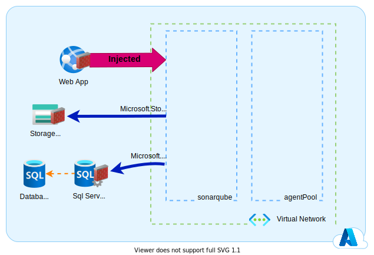

Dans le cadre de mes différentes missions clients j'ai eu le besoin de déployer l'outil Sonarqube. Sonarqube propose ses images sur docker hub. En même temps les **Azure WebApp** permettent d'executer des conteneurs docker. Pourquoi ne pas faire tourner Sonarqube sur une **Azure WebApp** ?

### Pourquoi ?

Sonarqube est une plateforme web de reporting qualité. Cette plateforme permet de collecter les rapport d'analyse de code et d'execution de tests automatisés (Couverture de code).
A partir de ces éléments Sonarqube est capable d'attribuer une note qualité à votre code.
Sonarqube à besoin d'une base de données afin de stocker les résultats d'analyse.
Dans un contexte professionnel nous allons souhaiter que : 

- Sonarqube soit suffisamment disponible pour que chaque développeur et chaque tech-lead puisse observer la qualité du code.
- le code source accessible dans Sonarqube puisse être exfiltré.
- l'exploitation de cette plateforme soit la plus simple possible afin de limité les couts de maintenance.

Les services managés Azure: **Azure WebApp** et **Azure SQl database**, offrent de très bonnes SLA et permettent de réduire les couts d'exploitations en délèguant une bonne partie de celle-ci à Microsoft. 

### L'architecture

Il existe déjà sur le github de microsoft un quickstart template ARM permettant de déployer Sonarqube sur une **Azure WebApp** avec une base de données **Azure SQL database**.
Les soucis de ce quickstart sont les suivants :

- il ne permet pas de déployer la dernière version de Sonarqube (8.9 LTS),
- il n'isole pas au niveau réseau. Il y a donc un risque d'exfiltration du code.
- il ne permet pas de conserver la configuration et les plugins de Sonarqube en cas d'incident sur l'**Azure WebApp**.

Je vous porpose donc de revoir un peu l'architecture afin de blinder tout cela :

- On va ajouter un **Storage Account** qui contiendra les extensions et les données de Sonarqube afin de garantir la résilience de la solution. En cas de dysfonctionnement de l'**Azure WebApp** qui pourrait entrainer un changement d'instance du service plan, les données Sonarqube ne seront pas perdu. De plus, s'il on doit migrer la solution sur un autre cloud provider, nous seront en capaciter de faire cette migration sereinement.

- Ensuite, on va créer un **Virtual network** et un **Subnet** dans lequel on va intégrer notre **Azure WebApp**. On va ajouter les services endpoints du **Storage Account** et du **Sql Server** à notre **Subnet**. Ainsi notre **Azure WebApp** pourra communiquer avec les autres services managés sans risque de passer sur internet et donc d'exposition à une potentielle attaque.

- Enfin, on va mettre en place des règles firewall pour empècher qu'un utilisateur en dehors de notre **Virtual Network** puisse accéder aux informations de Sonarqube. 
  - on va restreindre le **Storage Account** au **Subnet** de notre **Azure WebApp**.
  - on va faire de même pour l'**Azure Sql Server**.
  - on va restreindre l'**Azure WebApp** aux autres **Subnet** de notre **Virtual Network**.

### Résultat

Vous trouverez ci-dessous les templates ARM permettant de déployer rapidement un Sonarqube isolé au niveau réseau.  

### Références

- [Deploy Sonarqube on a Linux web app with Azure SQL](https://github.com/Azure/azure-quickstart-templates/tree/master/quickstarts/microsoft.web/webapp-linux-sonarqube-azuresql)
- [Sonarqube on Docker Hub](https://hub.docker.com/_/sonarqube)

### Remerciement

_Rédigé par Philippe MORISSEAU, Publié le 27 Septembre 2021_