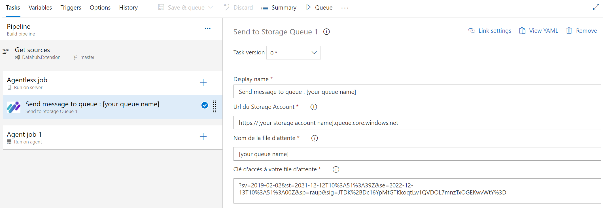
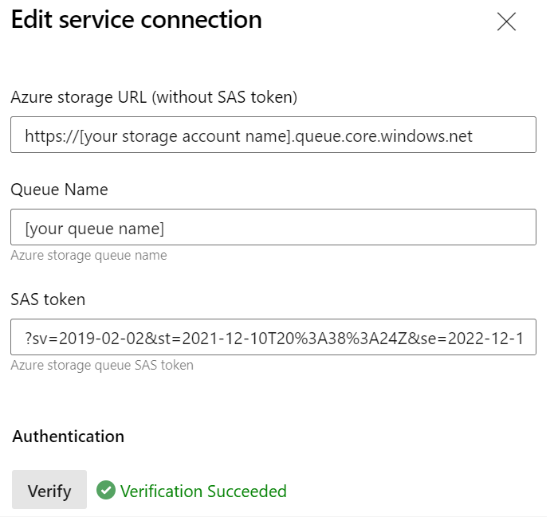
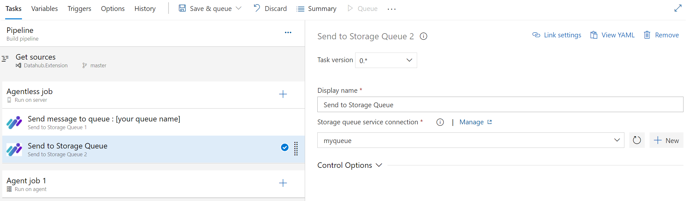

Cela fait maintenant des années que j'utilise quotidiennement **Azure DevOps**. J'ai pu connaitre sa version **OnPremise** nommée **Team Foundation Server**, puis sa première version **SaaS** nommée **Visual Studio Team Services**.
Vous ne le savez peut-être pas, mais il est possible d'étendre les fonctionnalitées d'**Azure DevOps** au travers d'extensions.
Ces extensions vont vous permettre de pouvoir étendre les capacité d'Azure devOps pour répondre à vos enjeux de productivité.
Vous allez pouvoir étendre vos **boards** Azure, la gestion des **repositories** Azure, vos pipelines de **CI/CD**, ...

Le marketplace d'Azure DevOps propose déjà de nombreuses extensions, mais il est possible que vous ne trouviez pas votre bonheur. Dans ce cas, vous pouvez vous même développer vos propres extensions. 

!!! note
    Les possibilités d'extensions sont énormes mais sont malheuresuement très peu documenté. L'article [Azure DevOps extensibility points](https://docs.microsoft.com/en-us/previous-versions/azure/devops/extend/reference/targets/overview) liste en partie les extensions possibles.

Je vous propose dans cet article d'étendre les capacités de vos pipelines de **CI/CD** avec une **agentless task** ou **server task**.

!!! note
    J'aurais préféré vous faire un comparatif de ce type de tâche entre les extensions **Azure DevOps** et les **Github Action**, malheureusement **Github** ne propose pas encore ce type de fonctionnalité. C'est bien dommage !

## Développer sa propre tâche agentless.

### Une tâche agentless, c'est quoi et pourquoi j'en aurais besoin ?

Lorsque vous éxecutez un pipeline dans **Azure DevOps** pour compiler, analyser, tester ou deployer un composant vous utilisez un agent. Cet agent une "machine" sur lequel **Azure DevOps** va demander de réaliser des actions (compilation dotnet par exemple). Mais il est possible de demander à **Azure DevOps** d'executer lui-même certaines tâches. On parle alors d'**agentless task** ou de **server task**. 

Les possibilités de ce type de tâches est cependant limité. Vous ne pourrez réaliser que 3 types d'operations :

- HttpRequest : Vous permet de réaliser une requêtes **HTTPS**,
- ServiceBus : Vous permet d'envoyer un message dans une file d'attente sur **Azure**,
- HttpRequestChain : Vous permet de réaliser une suite de requêtes **HTTPS**.

Mais dans de nombreux cas vous n'aurez besoin que de ça :

- Imaginons que vous souhaitez notifier automatiquement une application de votre SI d'une mise à jour d'un composant ou d'une application sur un environnement depuis votre pipeline Azure DevOps. Vous n'avez peut-être pas besoin de soliciter un agent pour cela. Peut-être qu'une ou plusieurs requêtes **HTTPS** seraient suffisantes.
- Imaginons que vous souhaitez provisionner vos propres agents **Azure DevOps** éphèmères (cf. [mon article](../classroom/02.azureClassroom.batch.md)). Il serait préférable de se passer d'un agent pour en provisionner un autre !

### Pas besoin de savoir coder pour cela !

Et oui, l'implémentation de ce type de tâche ne nécessite aucune compétence dans un language ou framework autre que le format "json".

POur commencer il vous faudra installer localement [Node.js](https://nodejs.org/en/) puis installer tfx-cli via l'utilitaire **npm** installé avec **Node.js**.

Si vous êtes sur Linux/OSX :

```bash 
sudo npm install -g tfx-cli
```

Si vous êtes sur Windows :

```bash
npm install -g tfx-cli
```

Ensuite dans votre répertoire de travailler vous aller créer 2 dossiers et 3 fichiers comme ceci :

```  
  |--- images                        
      |--- extension-icon.png         // l'icone de votre extension
  |--- buildandreleasetask            
      |--- task.json                  // la tâche agentless 
  |--- vss-extension.json             // le manifeste de votre extension
```

!!! warning 
    L'icone de votre extension doit être au format **PNG** et respecté une dimension bien précise : 128x128 pixels. En dehors de cela, vous être complètement libre.

!!! note
   Il n'est pas obligatoire de respecter les noms des dossiers et des fichiers, mais pour plus de compréhension, je conseille de respecter une nomenclature proche de celle-ci.


Commençons par l'implémentation de notre manifeste.

#### Le fichier vss-extension.json

Le fichier manifeste est un descriptif de votre extension. Votre extension pouvant contenir plusieurs éléments, ce fichier va permettre de les lister et de préciser quelques informations obligatoires pour être sur le **marketplace Azure Devops**.

Ci-dessous un exemple de manifest :

```json
{
    "manifestVersion": 1,
    "id": "test-push-to-storagequeue",
    "publisher": "Pmorisseau",
    "version": "1.0.7",
    "name": "test-push-to-storagequeue",
    "description": "test-push-to-storagequeue",
    "public": false,
    "categories": [ "Azure Pipelines" ],
    "targets": [
        {
            "id": "Microsoft.VisualStudio.Services"
        }
    ],
    "icons": {
        "default": "images/icon.png"
    },
    "files": [
        {
            "path": "buildandreleasetask"
        }
    ],
    "contributions": [
        {
            "id": "sendtostoagequeue1",
            "description": "Agentless task that push a message to an azure queue",
            "type": "ms.vss-distributed-task.task",
            "targets": [ "ms.vss-distributed-task.tasks" ],
            "properties": {
                "name": "buildandreleasetask"
            }
        }        
    ]
}
```

Ce qu'il est important de retenir à propos des différents attributs :

- **id**, doit être constant au fil des évolutions de votre extension. C'est lui qui permet d'identifier de façon unique votre extension,
- **version**, doit toujours être incrémenté avant d'être publié sur le marketplace,
- **public**, permet de rendre publique ou non votre extension. Une version publique de votre extension le restera même si ultérieurement vous la repassé en privée,
- **files**, doit lister tous les dossier qui devront être intégré dans votre extension,
- **contribution** :
  
  - **id** est un identifiant unique et doit correspondre au nom de la tâche (attribut **name** dans le fichier **task.json**),
  - **type**, doit être "ms.vss-distributed-task.task" dans le cas d'une **agentless task**,
  - **targets**, doit contenir "ms.vss-distributed-task.tasks" dans le cas d'une **agentless task**,
  - **properties** :

    - **name** doit correspondre au dossier contenant le fichier **task.json**.


!!! note 
    Microsoft met à disposition une documentation détaillé [ici](https://docs.microsoft.com/fr-fr/azure/devops/extend/develop/manifest?view=azure-devops)

Passons maintenant à l'implémentation de notre tâche.

#### Le fichier task.json

Imaginons que nous souhaitons réaliser une tâche permettant d'envoyer des message dans une storage queue.
Voici ce que pourrais donner notre fichier **task.json** :

```json
{
    "$schema": "https://raw.githubusercontent.com/Microsoft/azure-pipelines-task-lib/master/tasks.schema.json",
    "id": "bee81c33-f056-4721-a4fd-7141e07c42ad",
    "name": "sendtostoagequeue1",
    "friendlyName": "Send to Storage Queue",
    "description": "",
    "helpMarkDown": "Send to Storage Queue",
    "category": "Azure Pipelines",
    "author": "Pmorisseau",
    "visibility": [
        "Build",
        "Release"
    ],
    "runsOn": [
        "Server",
        "ServerGate"
    ],
    "version": {
        "Major": 0,
        "Minor": 0,
        "Patch": 1
    },       
    "instanceNameFormat": "Send message to queue : $(queueName)",
    "inputs": [
        {
            "name": "storageAccountUrl",
            "type": "string",
            "label": "Url du Storage Account",
            "defaultValue": "",
            "required": true
        },
        {
            "name": "queueName",
            "type": "string",
            "label": "Nom de la file d'attente",
            "defaultValue": "",
            "required": true
        },
        {
            "name": "storageAccountSasToken",
            "type": "string",
            "label": "Clé d'accès à votre file d'attente",
            "defaultValue": "",
            "required": true
        }        
    ],
    "execution": {
        "HttpRequest": {
            "Execute": {
                "EndpointUrl": "{{storageAccountUrl}}/{{queueName}}/messages$(storageAccountSasToken)",
                "Method": "POST",
                "Body": "<QueueMessage><MessageText>Lorem Ipsum dolor sit amet !</MessageText></QueueMessage>",
                "Headers": "{\n\"Content-Type\":\"application/xml\"\n}",
            }
        }
    } 
}    
```

Ce qu'il est important de retenir c'est que :

- l'attribut **id** doit être unique et constant au fil des évolution de votre tâche,
- l'attribut **mane** doit correspondre à un **id** du noeud **contributions** dans le fichier **vss-extension.json**, 
- l'attribut **runsOn** doit contenir **Server** et/ou **ServerGate** pour être considéré comme une tâche **agentless**, 
- le noeud **inputs** doit contenir tous les paramètres de votre tâches,
- le noeud **execution** doit contenir la commande **agentless** à executer.  

!!! note
    Le schéma complet est disponible [ici](https://raw.githubusercontent.com/Microsoft/azure-pipelines-task-lib/master/tasks.schema.json)

Notre exemple ci-dessus une fois déployé dans **Azure DevOps** va nous mettre a disposition une nouvelle tâche qui va ressembler dans un pipeline classique à cela :



Et dans un pipeline yaml, à cela :

```yaml
- task: Pmorisseau.test-push-to-storagequeue.sendtostoagequeue1.sendtostoagequeue1@0
  displayName: 'Send message to queue : [your queue name]'
  inputs:
    storageAccountUrl: 'https://[your storage account name].queue.core.windows.net'
    queueName: '[your queue name]'
    storageAccountSasToken: '?sv=2019-02-02&st=2021-12-12T10%3A51%3A39Z&se=2022-12-13T10%3A51%3A00Z&sp=raup&sig=JTDK%2BDc16YpMtGTKkoqtLw1QVDOL7mnzTxOGEKwvWtY%3D'
```

Le souci, c'est que l'on est obligé de rensseigner dans notre pipeline des données sensibles comme l'url ou la clé d'accès à notre api. Ce qui peut-être une faille de sécurité.

Pas de souci, on peut aussi créer ses propres **service connections**.

### Créer son service connection

Tout d'abord, il va falloir modifier le fichier manifeste (vss-extension.json) pour déclarer le nouveau type de **service connection**. Dans le noeud **contributions** on va rajouter :

```json
        {
            "id": "storagequeue",
            "description": "Storage Queue",
            "type": "ms.vss-endpoint.service-endpoint-type",
            "targets": [
                "ms.vss-endpoint.endpoint-types"
            ],
            "properties": {
                "name": "storagequeue",
                "displayName": "Storage Queue",
                "url": {
                    "displayName": "Azure storage URL (without SAS token)",
                    "required": true
                },
                "inputDescriptors": [
                    {
                        "id": "queueName",
                        "name": "Queue Name",
                        "description": "Azure storage queue name",
                        "inputMode": "textbox",
                        "isConfidential": false,
                        "validation": {
                            "isRequired": true,
                            "dataType": "string",
                            "maxLength": 200
                        }
                    },   
                    {
                        "id": "sasToken",
                        "name": "SAS token",
                        "description": "Azure storage queue SAS token",
                        "inputMode": "passwordbox",
                        "isConfidential": false,
                        "validation": {
                            "isRequired": true,
                            "dataType": "string",
                            "maxLength": 500
                        }
                    }                                          
                ],
                "dataSources": [
                    { 
                        "name": "TestConnection",
                        "endpointUrl": "{{endpoint.url}}/{{endpoint.queueName}}/messages$(endpoint.sasToken)",
                        "resultSelector": "xpath://QueueMessagesList"
                    }
                ],                                  
                "authenticationSchemes": [
                    {
                        "type": "ms.vss-endpoint.endpoint-auth-scheme-none"
                    }
                ]
            }
        }
```

Ce qu'il est important de retenir à propos des différents attributs :

- **id** est un identifiant unique,
- **type**, doit être "ms.vss-endpoint.service-endpoint-type",
- **targets**, doit contenir "ms.vss-endpoint.endpoint-types",
- **properties** :

  - **url** correspond à l'url de votre service,
  - **inputDescriptors** doit contenir l'ensemble des paramètres complémentaire à votre url,
  - **dataSource** et l'item **TestConnection** (exactement orthographié comme cela) permet de définir le test de connexion de votre **service connection**,

    - **endpointUrl** correspond à l'url appelé lors du test de connexion,
    - **resultSelector** correpond à la vérification à réaliser sur la réponse lors du test de connexion

  - **authenticationSchemes** définit le mode d'authentification parmis :
  
    - **Authentification de base** (le type "ms.vss-endpoint.endpoint-auth-scheme-basic") avec un identifiant et un mot de passe encodé en base 64 dans l'entête HTTP,
    - **Authentification basée sur un jeton** (le type "ms.vss-endpoint.endpoint-auth-scheme-token") avec un jeton dans l'entête HTTP,
    - **Authentification par certificat** (le type "ms.vss-endpoint.endpoint-auth-scheme-cert") avec certificat,
    - **Sans athentification** (le type "ms.vss-endpoint.endpoint-auth-scheme-none") pour les autres cas.
  
!!! note
    Les différents type d'authentification sont décrit [ici](https://docs.microsoft.com/fr-fr/azure/devops/extend/develop/auth-schemes?view=azure-devops)

Ensuite, il va falloir modifier notre fichier **task.json** pour utiliser notre **service connection** en remplaçant le contenu du noeud **inputs** par :

```json
        {
            "name": "connectedServiceName",
            "aliases": [
                "serviceConnection",
                "genericService"
            ],
            "type": "connectedService:storagequeue",
            "label": "Storage queue service connection",
            "defaultValue": "",
            "required": true,
            "helpMarkDown": "Select an storage queue service connection"
        }
```

Il faudra veiller à ce que l'attribut **type** correspond à "connectedService:[id du **service connection** dans le fichier manifeste]".

Et modifier le contenu du noeud **executions** par :

```json
        "HttpRequest": {
            "Execute": {
                "EndpointId": "$(connectedServiceName)",
                "EndpointUrl": "{{endpoint.url}}/{{endpoint.queueName}}/messages$(endpoint.sasToken)",
                "Method": "POST",
                "Body": "<QueueMessage><MessageText>Lorem Ipsum dolor sit amet !</MessageText></QueueMessage>",
                "Headers": "{\n\"Content-Type\":\"application/xml\"\n}",
            }
        }   
```

Il faudra veiller à ce que :

- l'attribut **EndpointId** correspond à "$([l'attribut **name** dans le noeud **inputs**])",
- les paramètres du **service connection** soit préfixé par "endpoint.".

!!! note
    Il y a 2 syntaxes possible pour faire référence à un paramètre :

    - {{le_nom_de_l_attribut}} : sera intéprété comme un texte devant être converti en url (httpencode).
    - $(le_nom_de_l_attribut) : ne sera pas intéprété et donc sera utilisé tel quel.

    Dans notre exemple, le **sasToken** contenant un ensemble de paramètres au format **Http query**, il ne doit donc pas être converti.

Notre exemple n°2, une fois déployé dans **Azure DevOps** va nous mettre a disposition un nouveau **service connection** qui va ressembler à cela :



Il va aussi modifier la tâche qui va maintenant ressembler à cela :



Et dans un pipeline yaml, à cela :

```yaml
- task: Pmorisseau.test-push-to-storagequeue.sendtostoagequeue2.sendtostoagequeue2@0
  displayName: 'Send to Storage Queue'
  inputs:
    serviceConnection: myqueue
```

#### Les limitations

Les limitations sur l'implémentation des services connections sont nombreuses et parfois un peu frustrantes :

- les paramètres décrit dans le noeud **inputDescriptors** ne peuvent pas être utilisés si l'attribut **isConfidential** est définit à "true",
- les modes d'authentification permis sont trop peu nombreux. Il aurait été bienvenue de permettre les athentifications modernes comme **oauth2.0** et les authentifications simples comme l'**apikey** ou le **sasToken** dans la **query http**,
- l'**inputMode**, **password** ne sert à rien dans le noeud **inputDescriptors**,
  
  !!! note
      Dans notre exemple le **sasToken** de notre storage queue restera toujours en clair. 

Maintenant que nous avons preparé notre extension avec notre nouvelle tâche **agentless**, il ne nous reste plus qu'à la publier ! 

### Publier sur le marketplace

Pour pouvoir utiliser nos extensions sur **Azure DevOps** il faut préalablement publier celle-ci sur le **marketplace** d'**Azure DevOps**.


## Références

- [Azure DevOps extensibility points](https://docs.microsoft.com/en-us/previous-versions/azure/devops/extend/reference/targets/overview)
- [Server Task Authoring](https://github.com/Microsoft/azure-pipelines-tasks/blob/master/docs/authoring/servertaskauthoring.md)
- [Tfx cli](https://github.com/microsoft/tfs-cli)
- [Ajouter une extension de tâche de pipeline personnalisée](https://docs.microsoft.com/fr-fr/azure/devops/extend/develop/add-build-task?view=azure-devops)
- [Task Json Schema](https://raw.githubusercontent.com/Microsoft/azure-pipelines-task-lib/master/tasks.schema.json)
- [Référence du manifeste de l’extension](https://docs.microsoft.com/fr-fr/azure/devops/extend/develop/manifest?view=azure-devops)
- [Schémas d’authentification du point de terminaison de service](https://docs.microsoft.com/fr-fr/azure/devops/extend/develop/auth-schemes?view=azure-devops)

## Remerciement

_Rédigé par Philippe MORISSEAU, Publié le 14 Décembre 2021_