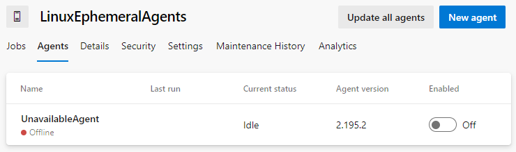

Une solution de bout en bout pour éxecuter des agents **Azure DevOps** conteneurisés dans votre réseau d'entreprise, ça vous dit ? Vous pourrez ainsi utiliser **Azure DevOps Services** pour gérer le déploiement de vos applications et services même dans les zones sécurisés de votre SI. Dans mes précédents articles j'avais effleuré le sujet ([Azure DevOps : Créer sa propre task agentless](06.azuredevops.ephemeralagents.md) et [Azure Batch, le mal-aimé](../classroom/02.azureClassroom.batch.md)), dans cet article je vous propose de détailler comment mettre tout cela en place.

## Pourquoi le faire ?

- Si vous souhaitez utiliser **Azure DevOps Services** pour déployer vos applications et services dans votre SI d'entreprise qui est isolé d'un point de vue réseau.
- Si vous souhaitez utiliser des conteneurs pour vos opérations de **build** et/ou de déploiements afin d'éviter tout effet de bords liés aux précédentes executions de pieline **CI/CD**. 
- Si vous souhaitez réduire les temps de **build** et de déploiement de vos pipelines en pré-installant vos **frameworks** et outils **legacy** sur vos agents.

## L'architecture

Je vous propose d'orchestrer vos agents **Azure DevOps** avec **Azure Batch**. L'ensemble de l'architecture sera donc sur Azure. Bien entendu c'est une proposition, il est certain que vous pouvez réaliser une architecture équivante sur un autre hébergeurs **cloud** ou sur votre **cloud** privé.


Concrètement voici le séquencement qui va se produire pour la mise à disposition d'un agent éphémère :

1. Une tâche **agentless** "Invoke Azure Function" du pipeline de **build**/deploiement **Azure DevOps** appel la function **ProvideAzDOAgent** pour demander un agent éphémère,
2. Pour chaque appel, l'**Azure Function** crée une tâche dans **Azure Batch Account**,
3. L'**Azure Batch Account** traite les tâches et affecte la tâche au bon pool de nœuds,
4. Le pool de nœuds instancie un conteneur à partir de l'image présente dans l'**Azure Container Registry**,
5. Une fois le conteneur instancié et démarré, celui-ci s'enregistre auprès d'**Azure DevOps** pour faire savoir qu'il est disponible. **Azure DevOps** lui affecte alors un **job** en attente. 
6. Le **job Azure DevOps** s'exécute dans le **Virtual Network A** et peut communiquer avec le réseau **On Premise**.

On constate que le service **Azure Batch** (et ses **pools**) ainsi qu'**Azure Container Registry** sont complètement isolés d'un point de vue réseau. Sel l'**Azure function** est accessible publiquement. Cette dernière a cependant une règle firewall limitant les appels aux plages d'IP publiques d'**Azure DevOps Services**.

!!! note
    Microsoft met à disposition les plages d'**IP** du service **Azure DevOps** pour chacun des région : [ici](https://docs.microsoft.com/fr-fr/azure/devops/organizations/security/allow-list-ip-url?view=azure-devops&tabs=IP-V4#inbound-connections)

Il ne reste donc plus qua déployer notre infrastructure sur Azure.

## L'infrastructure

Vous trouverez ci-dessous le **template ARM** permettant de déployer rapidement l'infrastructure sur Azure.  

[](https://portal.azure.com/#create/Microsoft.Template/uri/https%3A%2F%2Fraw.githubusercontent.com%2FIneaweb%2Fazure.ephemeralagentrunner%2Fmain%2Farm%2Fazuredeploy.json)
[](http://armviz.io/#/?load=https%3A%2F%2Fraw.githubusercontent.com%2FIneaweb%2Fazure.ephemeralagentrunner%2Fmain%2Farm%2Fazuredeploy.json)

Le template d'infra. ci-dessus prévoit de mettre à disposition 2 **pools** de **nodes** : Un pour les agents **Azure DevOps** sur **Windows** et un autre pour les agents sur **Linux**.

!!! note
    Etant donné que les conteneurs **Windows** ne peuvent tourner que sur des **OS Windows**, nous n'avons pas d'autres choix que de provisionner des pools avec des **OS** distincts.

### L'auto-scale

**Azure Batch** propose un système d'auto-scale des **nodes** d'un **pool**. Dans notre cas, nous allons l'utiliser pour éviter de laisser tourner des VM sur Azure pendants plusieurs heures sans opérations de **build** ou de déploiement.
Pour chacun de ces **pools**, j'ai donc rajouté le script d'auto-scale ci-dessous :

```powershell
$nbTaskPerNodes = $TaskSlotsPerNode;
$currentNodes = $TargetLowPriorityNodes;
$nbPending5min = $PendingTasks.GetSamplePercent(TimeInterval_Minute * 5) < 70 ? max($PendingTasks.GetSample(1)) : max($PendingTasks.GetSample(TimeInterval_Minute * 5));
$nbPending60min =  $PendingTasks.GetSamplePercent(TimeInterval_Minute * 60) < 70 ? max($PendingTasks.GetSample(1)) : max($PendingTasks.GetSample(TimeInterval_Minute * 60));
$totalLowPriorityNodes = $nbPending5min > max(0, $TaskSlotsPerNode * $currentNodes) ? $currentNodes + 1 : $currentNodes;
$totalLowPriorityNodes = $nbPending60min <= $TaskSlotsPerNode * max(0, $currentNodes - 1)  ? $currentNodes - 1 : $totalLowPriorityNodes;
$totalLowPriorityNodes = min(4, max($totalLowPriorityNodes, 0));
$TargetLowPriorityNodes = $totalLowPriorityNodes;
$NodeDeallocationOption = taskcompletion;
```

Ce script d'autoscale va évaluer le nombre de tâches en cours ou en attente :

- Si celui-ci est supérieur au nombre de noeud multiplié par le nombre de tâches parallèles par noeud, un nouveau noeud sera ajouté.
- Si celui-ci est inférieur au nombre de noeud - 1 multiplié par le nombre de tâches parallèles par noeud, un noeud sera libéré.

Le **Scale Out** (aujout d'un noeud) est évalué sur les 5 dernière minutes afin d'être le plus réactif possible en cas de hausse du nombre de tâches.
Le **Scale In** (suppression d'un noeud) est évalué sur la dernière heure afin de pouvoir gérer des baisses ponctuelles du nombre de tâches.

### Les limitations

Cependant, il faut savoir qu'il y a quelques petites limitations :

1. Bien que vous puissiez déployer vos **pools Azure Batch** avec **ARM**, il n'est pas possible d'incrémenter l'infrastructure du **pool**. Autrement dit, vous ne pouvez pas modifier un **pool** existant. Et, c'est même pire puisque vous aurez une erreur si votre **pool** existe déjà au moment de l'execution de votre **template ARM**. Pour palier à cette limitation, j'ai ajouté 2 paramètres "create_WindowsBatchPool" et "create_UbuntuBatchPool".
2. Lors de la création de votre **container registry**, celui-ci ne contient aucune image. Il faudra ainsi prévoir l'importation des images de vos agents **Azure DevOps**. 

Pour cette seconde limitation, je vous propose d'étudier la conteneurisation de notre agent **Azure DevOps**. 

## Conteneuriser votre agent Azure DevOps

En parcourant [dockerhub](https://hub.docker.com/) à la recherche d'une image docker de mon agent **Azure DevOps**, j'ai découvert le projet de [Czon](https://github.com/codez-one/docker-azure-pipelines-agent).
Son projet consiste à automatiser la construction d'image docker afin d'embarquer systématiquement la dernière version de l'agent **Azure DevOps**. Ainsi, sur son **repository** [dockerhub](https://hub.docker.com/r/czon/azdo-agent) **Czon** partage les images ubuntu avec la dernière version de l'agent **Azure DevOps**. Ca c'est classe !

Je me suis donc permis de **forker** son repository **Github** pour apporter quelques petites évolutions au travail déjà excellent de **Czon** et ajouter les fonctionnalités suivantes :

- Création de conteneurs sur les bases **Windows ltsc2019**, **Ubuntu 18.04** et **Ubuntu 20.04**,
- Pour chacun de ces **OS**, ajout des **frameworks dotnet core 3.1** et **dotnet 6.0**

Vous pouvez trouver mes modifications sur mon repository [Github](https://github.com/Ineaweb/docker-azure-pipelines-agent), et les images générées sur [dockerhub](https://hub.docker.com/repository/docker/pmorisseau/azdo-agent).

Il ne reste plus qu'à importer les images de **dockerhub** vers votre **Azure Container Registry** avec les commandes **Azure CLI** suivantes :

```shell
    az acr import -n [YOUR_ACR_NAME] --source docker.io/pmorisseau/azdo-agent:ubuntu-20.04-azdo -t azdo-agent:ubuntu-20.04-azdo
    az acr import -n [YOUR_ACR_NAME] --source docker.io/pmorisseau/azdo-agent:ubuntu-20.04-azdo -t azdo-agent:ubuntu-18.04-azdo
    az acr import -n [YOUR_ACR_NAME] --source docker.io/pmorisseau/azdo-agent:windows-core-ltsc2019-azdo -t azdo-agent:windows-core-ltsc2019-azdo
```

Il ne nous reste plus qu'à programmer la function qui va générer les tâches dans **Azure Batch** 

## Une Azure function pour piloter Azure Batch

Notre objectif est de permettre la création d'une tâche exécutant notre image conteneurisée dans **Azure Batch** via un simple appel **HTTP** d'une fonction **Azure**.

Pour rappel, une tâche doit s'exécuter dans un **job**. Donc si le **job** n'existe pas, il faudra le créer.
Notre **job** va permettre aussi de définir les variables d'environnements de notre agent conteneurisé. Nous allons définir comme variables d'environnment :

- L'url de notre organisation **Azure DevOps**,
- Le **personal access token** pour permettre à notre agent de s'authentifier sur l'organisation,
- Le nom du **pool** dans lequel notre agent sera ajouté,
- Le top indiquant si l'agent ne doit exécuter qu'un seul et unique **job Azure DevOps**.

Nous allons utiliser le .net 6.0 pour programmer notre **Azure Function**.
Vous trouverez [ici](https://github.com/Ineaweb/azure.ephemeralagentrunner/tree/main/src/AzFunction.BatchOrchestrator) le code source créé pour l'occasion.

Aujourd'hui seule l'authentification par jeton personnel n'est possible pour ajouter un agent **Self-Hosted** dans un **pool** sur **Azure DevOps**. 

- Celui-ci ayant une durée de validité limité dans le temps, cela implique que vous devrez régulièrement intervenir pour pouvoir le renouveler.
- Celui-ci étant lié à un utilisateur **Azure DevOps**, si celui-ci vient à partir alors ses **PAT** seront révoqués. Il faudra alors regénérer un nouveau jeton.

!!! note
    Microsoft met à disposition la procédure de création d'un **PAT** pour votre agent **Azure DevOps** : [ici](https://docs.microsoft.com/fr-fr/azure/devops/pipelines/agents/v2-windows?view=azure-devops#authenticate-with-a-personal-access-token-pat)

Voici la configuration nécessaire pour notre **Azure Function** :

| Nom | Description |
|-----|-------------|
| BatchAccountUrl | Url du service Azure Batch |
| BatchAccountName | nom du service Azure Batch |
| BatchAccountKey | clé d'accès au service Azure Batch |
| ContainerRegistryServer | Nom complet du service Azure Container Registry |
| AzDOUrl | Url de notre organisation Azure DevOps |
| AzDOToken | Personal access token permettant à notre agent de s'authentifier sur l'organisation |
| AzDOUbuntuPool | Nom du pool contenant les agents s'exécutant sur Ubuntu |
| AzDOWindowsPool | Nom du pool contenant les agents s'exécutant sur Windows | 

## L'intégration avec Azure DevOps

Maintenant que nous avons notre solution opérationnelle sur Azure, il faut permettre à nos pipelines **Azure DevOps** de demander un agent et d'utiliser celui-ci lorsqu'il est disponible.

Avant tout, il faut créer les **pool** d'agents sur **Azure DevOps**. [Cette document de Microsoft](https://docs.microsoft.com/fr-fr/azure/devops/pipelines/agents/pools-queues?view=azure-devops&tabs=yaml%2Cbrowser#creating-agent-pools) explique la procédure. 

Ensuite, nous allons ajouter dans notre pipeline un job **Agentless** ou **Server-side** avec une tâche **Invoke Azure Function**. Cette tâche devra réaliser une requête **HTTP POST**.

Ci-dessous un exemple de pipeline yaml utilisant cette tâche.

```yaml
  jobs:
  - job: RequestAzDOAgent
    pool: server
    steps:
    - task: AzureFunction@1
      displayName: 'Request new ephemeral agent'
      inputs:
        function: 'https://[YOUR_FUNCTION_NAME].azurewebsites.net/api/ProvideAzDOAgent'
        key: '[YOUR_FUNCTION_KEY]'
        body: |
        {
            "AgentOSType":"ubuntu-latest"
        }
  - job: RunWithEphemeralAgent
    dependsOn: RequestAzDOAgent
    pool:
      name: '[AzDOUbuntuPool]'
    steps:
    - bash: 
      displayName: 'Bash Script'
```

!!! note
    Les attributs YOUR_FUNCTION_NAME et YOUR_FUNCTION_KEY auront été récupérés depuis votre **Azure Function** précédement déployé et configuré.
    L'attribut AzDOUbuntuPool correspond au nom du **pool** définit dans **Azure DevOps**


Et voila !!!

Enfin non, presque... 
En effet, lorsque vous allez lancer votre pipeline celui-ci se soldera par échec systématique vous indiquant qu'il n'y a pas d'agent dans votre pool. En effet, entre le moment ou vous allez faire votre demande d'agent et le moment ou celui-ci est disponible, il peut se passer quelques secondes ou quelques minutes (si c'est la première execution de la journée par exemple). Dans tous les cas, **Azure DevOps** va automatiquement lancer le **job** suivant censé s'executer sur votre agent éphèmere. Ne trouvant aucun agent, le pipeline **Azure DevOps considère qu'il n'y aura jamais aucun agent dans ce pool à tort et tombe en erreur.

Mais alors comment dire à notre instance de pipeline de patienter ?

Ma solution consiste à enregistrer un agent "fictif" dans le **pool**. Pour cela, rien de plus simple, il suffit de suivre la procédure d'installation d'un agent **Self-Hosted**, puis de desinstaller celui-ci sans le désenregistrer.Ainsi vous conserver dans votre **pool** un agent **Offline**, mais cela sera suffisant pour faire patienter **Azure DevOps** le temps que votre agent éphèmere soit disponible.

 

C'est moche, mais ça marche !