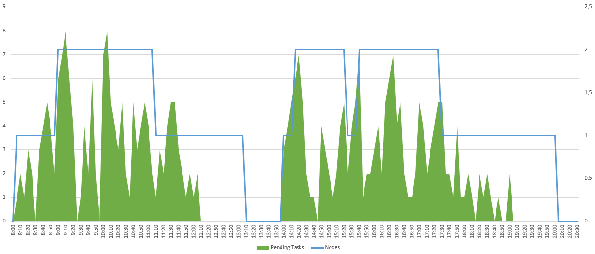
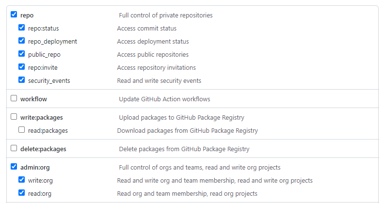

Une solution de bout en bout pour exécuter des **GitHub Actions Runner** conteneurisés dans votre réseau d'entreprise, ça vous dit ? Vous pourrez ainsi utiliser **GitHub** pour gérer le déploiement de vos applications et services même dans les zones sécurisées de votre SI. 

Dans un précédent article je vous ai proposé de mettre en place une solution vous permettant de provisionner à la demande vos agents **Azure DevOps** (cf. [Azure DevOps : Vos propres agents à la demande dans votre SI](06.azuredevops.ephemeralagents.md)). Je vous propose de faire la même chose mais avec **GitHub**. 

## Pourquoi le faire ?

Pour les mêmes raisons qu'avec [Azure DevOps Services](06.azuredevops.ephemeralagents.md), à savoir :

- Si vous souhaitez utiliser **GitHub Actions** pour déployer vos applications et services dans votre SI d'entreprise isolé d'un point de vue réseau.
- Si vous souhaitez utiliser des conteneurs pour vos opérations de **build** et/ou de déploiement afin d'éviter les effets de bord liés aux précédentes exécutions de pipeline **CI/CD**. 
- Si vous souhaitez réduire le temps de **build** et de déploiement de vos pipelines en préinstallant vos **frameworks** et outils **legacy** sur vos agents.

## L'architecture

Je vous propose d'orchestrer vos **GitHub Actions Runner** avec **Azure Batch**. L'ensemble de l'architecture sera donc sur **Azure**. Bien entendu, c'est une proposition, il est certain que vous pouvez réaliser une architecture équivalente sur un autre hébergeur **cloud** ou sur votre **cloud** privé.


Concrètement voici le séquencement qui va se produire pour la mise à disposition d'un agent éphémère :

1. **GitHub** appelle la fonction **ProvideActionsRunner** pour demander un **runner** éphémère,
2. Pour chaque appel, l'**Azure Function** crée une tâche dans **Azure Batch Account**,
3. L'**Azure Batch Account** traite les tâches et affecte la tâche au bon **pool** de nœuds,
4. Le **pool** de nœuds instancie un conteneur à partir de l'image présente dans l'**Azure Container Registry**,
5. Une fois le conteneur instancié et démarré, celui-ci s'enregistre auprès de **GitHub** pour faire savoir qu'il est disponible. **GitHub** lui affecte alors un **job** en attente. 
6. Le **job GitHub** s'exécute dans le **Virtual Network A** et peut communiquer avec le réseau **On Premise**.

On constate que le service **Azure Batch** (et ses **pools**) ainsi qu'**Azure Container Registry** sont complètement isolés d'un point de vue réseau. Seule l'**Azure Function** est accessible publiquement. Cette dernière a cependant une règle firewall limitant les appels aux plages d'IP publiques de **GitHub**.

!!! note
    **GitHub** met à disposition les plages d'**IP** de ses services à partir de cette [api](https://api.github.com/meta)

Il ne reste donc plus qu'à déployer notre infrastructure sur **Azure**.

## L'infrastructure

J'ai mis à jour l'infrastructure préalablement mise en place pour **Azure DevOps Service** avec les quelques spécificités de **GitHub**. 
Vous trouverez ci-dessous le **template ARM** permettant de déployer rapidement l'infrastructure pour **GitHub** et pour **Azure DevOps**).  

[](https://portal.azure.com/#create/Microsoft.Template/uri/https%3A%2F%2Fraw.githubusercontent.com%2FIneaweb%2Fazure.ephemeralagentrunner%2Fmain%2Farm%2Fazuredeploy.json)
[](http://armviz.io/#/?load=https%3A%2F%2Fraw.githubusercontent.com%2FIneaweb%2Fazure.ephemeralagentrunner%2Fmain%2Farm%2Fazuredeploy.json)

Ce **template** d'infra. met à disposition 2 **pools** de **nodes** : un pour les **Actions Runner** sur **Windows** et un autre pour les **Actions Runner** sur **Linux**.

!!! note
    Etant donné que les conteneurs **Windows** ne peuvent tourner que sur des **OS Windows**, nous n'avons pas d'autres choix que de provisionner des pools avec des **OS** distincts.

### L'auto-scale

**Azure Batch** propose un système d'**auto-scale** des **nodes** d'un **pool**. Dans notre cas, nous allons l'utiliser pour éviter de laisser tourner des **VM** sur **Azure** pendant plusieurs heures sans opérations de **build** ou de déploiement.
Pour chacun de ces **pools**, j'ai donc rajouté le script d'**auto-scale** ci-dessous :

```powershell
$nbTaskPerNodes = $TaskSlotsPerNode;
$currentNodes = $TargetLowPriorityNodes;
$nbPending5min = $PendingTasks.GetSamplePercent(TimeInterval_Minute * 5) < 70 ? max($PendingTasks.GetSample(1)) : max($PendingTasks.GetSample(TimeInterval_Minute * 5));
$nbPending60min = $PendingTasks.GetSamplePercent(TimeInterval_Minute * 60) < 70 ? 1000 : max($PendingTasks.GetSample(TimeInterval_Minute * 60));
$totalLowPriorityNodes = $nbPending5min > max(0, $TaskSlotsPerNode * $currentNodes) ? $currentNodes + 1 : $currentNodes;
$totalLowPriorityNodes = $nbPending60min <= $TaskSlotsPerNode * max(0, $currentNodes - 1)  ? $currentNodes - 1 : $totalLowPriorityNodes;
$totalLowPriorityNodes = min(4, max($totalLowPriorityNodes, 0));
$TargetLowPriorityNodes = $totalLowPriorityNodes;
$NodeDeallocationOption = taskcompletion;
```

Ce script va évaluer le nombre de tâches en cours ou en attente :

- Si celui-ci est supérieur au nombre de nœud multiplié par le nombre de tâches parallèles, un nouveau nœud sera ajouté.
- Si celui-ci est inférieur au nombre de nœud - 1 multiplié par le nombre de tâches parallèles, un nœud sera libéré.

Le **Scale-Out** (ajout d'un nœud) est évalué sur les 5 dernières minutes afin d'être le plus réactif possible en cas de hausse du nombre de tâches.
Le **Scale-In** (suppression d'un nœud) est évalué sur la dernière heure afin de pouvoir gérer les baisses ponctuelles de tâches.

Voici un exemple de ce que pourrait donner l'activité sur une journée :



### Les limitations

Cependant, il faut savoir qu'il y a quelques petites limitations :

1. Bien que vous puissiez déployer vos **pools Azure Batch** avec **ARM**, il n'est pas possible d'incrémenter l'infrastructure du **pool**. Autrement dit, vous ne pouvez pas modifier un **pool** existant. Et, c'est même pire puisque vous aurez une erreur si votre **pool** existe déjà au moment de l'exécution de votre **template ARM**. Pour compenser cette limitation, j'ai ajouté 2 paramètres "create_WindowsBatchPool" et "create_UbuntuBatchPool".
2. Lors de la création de votre **container registry**, celui-ci ne contient aucune image. Il faudra ainsi prévoir l'importation des images de vos **Actions Runner**. 

Pour cette seconde limitation, je vous propose d'étudier la conteneurisation de notre **Actions Runner**. 

## Conteneuriser votre actions runner

Je suis reparti de mon travail pour la conteneurisation des agents **Azure DevOps** pour l'appliquer aux **Actions Runner**.

Vous pouvez trouver mes adaptations sur mon repository [GitHub](https://github.com/Ineaweb/docker-github-actions-runner), et les images générées sur [dockerhub](https://hub.docker.com/repository/docker/pmorisseau/githubactions-runner).

Il ne reste plus qu'à importer les images de **dockerhub** vers votre **Azure Container Registry** avec les commandes **Azure CLI** suivantes :

```shell
    az acr import -n [YOUR_ACR_NAME] --source docker.io/pmorisseau/githubactions-runner:ubuntu-20.04-actionsrunner -t githubactions-runner:ubuntu-20.04-actionsrunner
    az acr import -n [YOUR_ACR_NAME] --source docker.io/pmorisseau/githubactions-runner:ubuntu-20.04-actionsrunner -t githubactions-runner:ubuntu-18.04-actionsrunner
    az acr import -n [YOUR_ACR_NAME] --source docker.io/pmorisseau/githubactions-runner:windows-core-ltsc2019-actionsrunner -t githubactions-runner:windows-core-ltsc2019-actionsrunner
```

Maintenant, passons à la programmation de la fonction qui va générer les tâches dans **Azure Batch**.

## Une Azure function pour piloter Azure Batch

Notre objectif est de permettre la création d'une tâche exécutant notre image conteneurisée dans **Azure Batch** via l'appel **HTTPS** d'une fonction **Azure**.

Pour rappel, une tâche doit s'exécuter dans un **job**. Donc si le **job** n'existe pas, il faudra le créer.
Notre **job** va permettre aussi de définir les variables d'environnements de notre agent conteneurisé. Dans notre cas, nous devons définir comme variables d'environnement :

- L'url de l'organisation **GitHub** ou l'url du **repo** personnel,
- Le **token** pour permettre à notre agent de s'enregistrer,
- Les **tags** qui permettront d'affecter le bon **runner** au bon **job GitHub**,
- Le top indiquant si l'agent ne doit exécuter qu'un seul **job GitHub Actions**.

Nous allons utiliser le .NET 6.0 pour programmer notre **Azure Function**.
Vous trouverez [ici](https://github.com/Ineaweb/azure.ephemeralagentrunner/tree/main/src/AzFunction.BatchOrchestrator) le code source amélioré pour gérer à la fois **Azure Devops** et **GitHub**.

Sur **GitHub** le jeton permettant d'enregistrer notre **runner** a une validité d'une heure. Il faut donc prévoir de demander systématiquement un nouveau jeton pour chaque **job**. Pour cela, il faut appeler l'api **GitHub**. 

!!! note
    **GitHub** fournit une documentation d'**api** complète permettant de récupérer ce **token** pour :

    - [GitHub enterprise](https://docs.github.com/en/rest/reference/actions#create-a-registration-token-for-an-enterprise)
    - [GitHub organization](https://docs.github.com/en/rest/reference/actions#create-a-registration-token-for-an-organization)
    - [GitHub repository](https://docs.github.com/en/rest/reference/actions#create-a-registration-token-for-a-repository)

Mais pour pouvoir appeler l'api, il faut être authentifié ! 
Il existe 3 méthodes :

- **GitHub App** : Vous permet de créer une application permettant à vos utilisateurs d'accéder au travers de celle-ci aux services de **GitHub**.
- **OAuth App** : Vous permet de créer une application permettant d'accéder à la place de l'utilisateur aux services de **GitHub**.
- **Personal Access Token** : Vous permet d'accéder aux services de **GitHub** en se faisant passer pour vous.

Dans mon cas, j'ai opté pour la solution la plus simple à mettre en œuvre : le **Personal Access Token**. Mais je vous recommande fortement d'opter pour l'**OAuth App**.

Pour créer votre **Personal Access Token** :

1. Cliquez sur **Settings** dans l'onglet de votre compte,
2. Cliquez sur **Developer settings** et ensuite **Personal access tokens**,
3. Puis **Generate new token**
4. Saisissez un libellé et une durée de validité.
5. Sélectionnez les scopes. Dans notre cas, si vous souhaitez créer des **runners** au niveau de votre organisation il faudra cocher `admin:org`. Et si vous souhaitez créer des runner au niveau de vos **repos**, il faudra cocher `repo`.
    
6. Enfin cliquez sur **Generate token**. Votre **token** s'affiche. Sauvegardez-le puisqu'il ne sera plus visible ensuite !

Voici donc la configuration nécessaire pour notre **Azure Function** :

| Nom | Description |
|-----|-------------|
| BatchAccountUrl | **Url** du service **Azure Batch** |
| BatchAccountName | Nom du service **Azure Batch** |
| BatchAccountKey | Clé d'accès au service **Azure Batch** |
| ContainerRegistryServer | Nom complet du service **Azure Container Registry** |
| UbuntuPool | Nom du pool contenant les agents s'exécutant sur **Ubuntu** |
| WindowsPool | Nom du pool contenant les agents s'exécutant sur **Windows** |
| GithubToken | **Personal access token** permettant de demander un **token** pour l'enregistrement du **runner** | 

## L'intégration avec GitHub

Maintenant que nous avons notre solution opérationnelle sur **Azure**, il faut permettre à nos **workflows GitHub** de demander un **runner** et d'utiliser celui-ci lorsqu'il est disponible.

Ce qui est super avec **GitHub** contrairement à **Azure DevOps Services**, c'est la multitude de **webhooks**.
**GitHub** propose notamment un **webhook** pour les **jobs**.  

!!! note
    **GitHub** fournit une documentation de **webhook** et de **payload** complète [ici](https://docs.github.com/en/developers/webhooks-and-events/webhooks/webhook-events-and-payloads)

Dans notre cas, nous allons souscrire notre **Azure function** aux **webhooks** de **GitHub**.

Pour cela :

1. dans les **Settings** de votre **repo** ou de votre **organization** cliquez sur **Webhooks**,
2. cliquez sur **Add Webhooks**,
3. dans **Payload URL** saisissez l'url complète de votre **function** : https://`[VotreAzureFunction]`.azurewebsites.net/api/ProvideActionsRunner?code=`[VotreSecret]`
4. dans **Content Type** sélectionnez `application/json`
5. cochez `Let me select individual events.`
6. décochez `Pushes`
7. cochez `Workflow jobs`
8. Enfin cliquez sur **Add webhooks**

Maintenant à chaque fois que vous aurez un nouveau **job GitHub**, votre **Azure function** recevra une notification pour créer un **runner**.

Il ne reste plus qu'à créer le **workflow GitHub** !

Pour indiquer que vous souhaitez un agent **self-hosted** vous devez préciser pour vos jobs : `runs-on: [self-hosted]`.
Et pour indiquer le type d'OS que vous souhaitez utiliser, il faudra ajouter un autre label : `ubuntu-18.04`, `ubuntu-latest` ou `windows-latest`.

Par exemple :

```yaml
name: Test Agent
on:
  push:
    branches: 
      - master
      - main
      
jobs:
  use-selfhosted-ubuntu1804:
    runs-on: [self-hosted, ubuntu-18.04]
    steps:
      - uses: actions/checkout@v2
      - name: Fetch release version
        run: |
          echo "Hello world !"

  use-selfhosted-ubuntu2004:
    runs-on: [self-hosted, ubuntu-latest]
    steps:
      - uses: actions/checkout@v2
      - name: Fetch release version
        run: |
          echo "Hello world !"

  use-selfhosted-windows:
    runs-on: [self-hosted, windows-latest]
    steps:
      - uses: actions/checkout@v2
      - name: Fetch release version
        run: |
          echo "Hello world !"
```

## Conclusion

Après vous avoir montré qu'il était possible de provisionner ses propres agents **Azure DevOps Services** dans son SI, je réitère ma démonstration sur **GitHub**. L'usine logicielle change mais le concept fonctionne toujours.

C'est aussi l'occasion de comparer les forces et les faiblesses de chacun.

**GitHub** est incontestablement le grand vainqueur avec :

- la multitude de **webhooks** disponible permettant d'implémenter des scénarii interactifs affectant l'écosystème environnant.
- l'enregistrement des **runners** avec un jeton temporaire qui est bien plus sécurisé que le **Personal Access Token** d'**Azure DevOps**.

Mais **Azure DevOps** n'a pas dit son dernier mot ! 

## Références

- [GitHub : Api Meta](https://docs.github.com/en/rest/reference/meta)
- [GitHub : Api Actions](https://docs.github.com/en/rest/reference/actions)
- [GitHub : Basic Authentication](https://docs.github.com/en/rest/overview/other-authentication-methods#basic-authentication)
- [GitHub : Webhook events and payloads](https://docs.github.com/en/developers/webhooks-and-events/webhooks/webhook-events-and-payloads)
- [Terraform module for scalable self hosted GitHub action runners](https://github.com/philips-labs/terraform-aws-github-runner)

## Remerciements

- [Michael Maillot](https://twitter.com/michael_maillot) : pour la relecture

_Rédigé par Philippe MORISSEAU, Publié le 22 Février 2022._