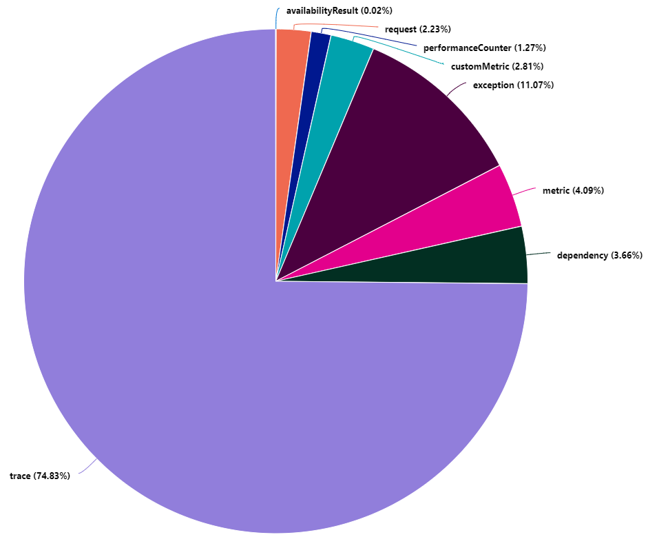
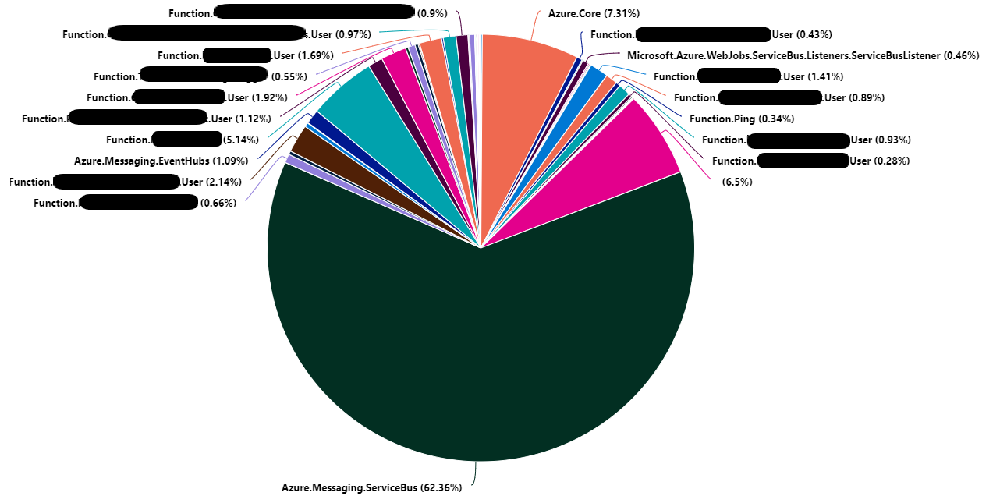

Mettre en place le monitoring de vos **Azure Function** est essentiel (surtout pour vos applications en production). Mais il arrive que celles-ci produisent beaucoup plus de logs que nécessaire. Dans ce cas, vous pouvez avoir un impact financier non négligeable sur **Application Insights/Log Analytics**. Voici quelques astuces pour limiter cela.

## Monitorer les volumes de logs

Afin de comprendre pourquoi vos coûts de d'ingestion de logs explose sur **Application Insights/Log Analytics**, il faut identifier quel type de logs est le plus présent. Pour cela rien de plus simple. Depuis **Log Analytics** exécutez la requêtes **Kusto** suivante :

``` kusto
union *
| where timestamp > ago(7d)
| summarize sum(_BilledSize) by itemType
| render piechart 
```

Cette requête vous génère un graphique camembert avec la répartition du volume de logs facturable par type de logs.



Dans cet exemple, on constate que les logs de type `trace` représentent plus de 74% du volume de logs facturable. 

Concentrons-nous sur ces logs `trace` pour identifier maintenant quels sont les sources qui produisent le plus de volume. Peut-être qu'une application en particulier génère trop de logs. Depuis **Log Analytics** exécutez maintenant la requêtes **Kusto** suivante :

``` kusto
traces
| where timestamp > ago(7d)
| summarize sum(_BilledSize) by cloud_RoleName
| render piechart
```


Dans l'exemple ci-dessus, on constate que les sources de nos logs sont variés et plutôt reparties. Ce n'est pas toujours la bonne piste !

Si ce n'est pas l'une des sources l'origine de notre volume de logs peut-être que c'est une librairie, un SDK utilisé par nos **Azure Function** qui est la source de nos malheurs. 

!!! note
    Le runtime des **Azure Function** classe les logs par `category`. Ces `category` sont accessibles dans les `customDimensions` des logs `trace`.  

On va pour cela exécuter la requêtes **Kusto** suivante :

``` kusto
traces
| where timestamp > ago(7d)
| summarize sum(_BilledSize) by tostring(customDimensions.Category)
| render piechart 
```



Dans l'exemple, ci-dessus il apparait que la catégorie `Azure.Messaging.ServiceBus` représente 62% du volume de logs `trace`. Ramener au volume total des logs cela représente : 46,5 %.

Maintenant que nous avons identifié notre origine. Il faut s'assurer de la pertinence des logs. Peut-être que ces logs sont nécessaires ?
Une simple exploration des logs sur les 30 dernières minutes (ou plus cela depend de votre contexte) permet d'analyser rapidement les logs :

``` kusto
traces
| where timestamp > ago(30m) and customDimensions.Category == "Azure.Messaging.ServiceBus"
```


On constate dans notre cas que ce sont des logs permettant de tracer les envois et réceptions de message vers et depuis **Azure ServiceBus**.

Nous considérons que ces logs ne sont pas pertinents (simple hypothèse, ce n'est pas une généralité). Ces logs peuvent être retirés de l'ingestion d'**Azure Application Insights/Log Analytics**. Mais avant d'intervenir il faut vérifier la répartition de ces logs par niveau de sévérité.

Pour cela, la requête **Kusto** suivante va nous aider :

``` kusto
traces
| where timestamp > ago(30m) and customDimensions.Category == "Azure.Messaging.ServiceBus"
| summarize count() by tostring(customDimensions.LogLevel)
| render piechart 
```


On constate que 99% des logs sont du niveau de sévérité `Information`.

Ce processus d'analyse montre qu'une simple remédiation au niveau de la configuration des **Azure Function** peut permettre de réduire de 46% le volume de logs. Cette remédiation consiste à monter le niveau de verbosité à `Warning` pour les logs de la catégorie `Azure.Messaging.ServiceBus`.  

## Remédiation au niveau des Azure Function

Je ne vais pas vous expliquer comment configurer votre **Azure function** pour qu'elle puisse envoyer ses logs dans **Application Insights**. [Cet article de Microsoft](https://docs.microsoft.com/fr-fr/azure/azure-functions/configure-monitoring?tabs=v2#enable-application-insights-integration) l'explique très bien.

En revanche, ce que cette documentation n'explique pas bien, c'est que la liste des catégories décrite [ici](https://docs.microsoft.com/fr-fr/azure/azure-functions/configure-monitoring?tabs=v2#configure-categories) n'est pas exhaustive.

En effet, l'ensemble des catégories précédemment identifiées durant l'analyse peuvent être configurées.

Pour monter le niveau de verbosité à `Warning` pour les logs de la catégorie `Azure.Messaging.ServiceBus`, il suffit de modifier le fichier `host.json` en ajoutant `"Azure.Messaging.ServiceBus": "Warning"`.

On aura un fichier qui ressemblera à cela :

``` json
{
  "logging": {
    "logLevel": {
      "default": "Information",
      "Azure.Messaging.ServiceBus": "Warning"
    }
  }
}
```

Et c'est tout !

## Conclusion

Il est important de prendre le temps d'analyser la nature des logs. Les services **Application Insights** et **Log Ananlytics** offrent d'excellent moyens d'analyse et de recherche. Dans une démarche **FinOps**, ils peuvent s'avérer être des outils très pratique. En effet, au travers de cet exemple j'ai réussi à réduire de 46% le volume de logs ingéré par **Application Insights/Log Ananlytics**.
Dans l'hypothèse où nous avions 10 Go de logs ingérés par jour (sur la région **France Central**), cela reviendrait à une économie de 350 € par mois.

## Références

- [Microsoft : Comment configurer l’analyse pour Azure Functions](https://docs.microsoft.com/fr-fr/azure/azure-functions/configure-monitoring?tabs=v2)
- [azure-sdk-for-net - issue : [QUERY] Service bus telemetry seems excessive](https://github.com/Azure/azure-sdk-for-net/issues/25865)

## Remerciements

_Rédigé par Philippe MORISSEAU, Publié le 28 Juin 2022._