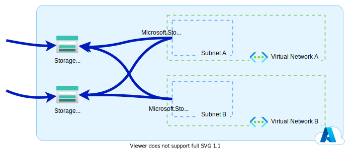
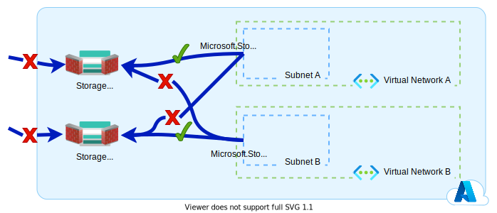
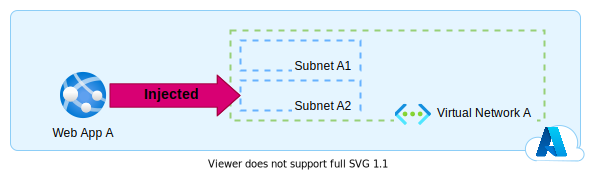

[retour](../index.md)

## Azure : Private Endpoint, Service Endpoint, Dedicated Service, Service Tags & Firewall

Il m'arrive régulièrement de constater que les clients utilisant Azure sont un peu perdu lorsqu'il s'agit de mettre en place la sécurisation réseau de leurs services managés. Et j'avoue qu'ils n'ont pas tort. Devant les nombreuses possibilités et exceptions proposées par le cloud de Microsoft, comment ne pas être paumé !

Je vous propose un petit cours de rattrapage sur le sujet de l'isolation réseau des services managés Azure.

### Private Endpoint & Private Link

Le mécanisme de **Private Endpoint** / **Private Link** peut s'apparenter à celui d'un VPN.
Il faut imaginer que cela est comparable à votre client VPN que vous lancez lorsque vous êtes en télé-travail pour vous connecter sur le réseau de votre employeur. Lorsque vous vous authentifiez sur votre logiciel VPN, votre carte réseau virtuelle s'active et vous donne une adresse IP privée du réseau de votre employeur.
Sur Azure, vous pouvez comparer le **Private Endpoint** à la carte réseau virtuelle et votre **Private Link** au logiciel client-serveur VPN.

Concrètement sur Azure, avec **Private Endpoint** / **Private Link**, vous allez pouvoir attribuer à votre service managé une adresse IP privée dans le **subnet** de votre choix. Et vous allez pouvoir ainsi interagir avec votre service azure tout en restant d'un point de vue réseau dans votre **Virtual Network**.
Mais, cela n'est généralement pas suffisant si vous souhaitez protéger votre service managé de l'exterieur. Mettre en place un **Private Endpoint** ne limite pas l'accès de votre ressource à votre **subnet**.

Dans l'exemple ci-dessus on constate que notre **Event Hubs A** bien qu'il ait un **Private Endpoint** dans le **Subnet A** est accessible depuis le **Subnet B** et internet.

Si on souhaite restreindre son accès, il va falloir mettre en place des règles firewall. 
Dans le cas d'un **Private Endpoint** / **Private Link**, la règle est très simple : 
- **Deny : All**

En effet, il faut savoir que les règles firewall au niveau du service managé ne s'appliquent pas au **Private Endpoint**. 

Avec cette règle firewall vous bloquez ainsi tous les autres accès possibles à votre service managé.

_A Noter : Vous ne pouvez pas appliquer de règle firewall à votre **Private Endpoint** en associant un **Network Security Group** à la **Network Interface** lié à votre **Private Endpoint**._

### Service Endpoint

Le mécanisme de **Service Endpoint** vous permet d'acceder depuis votre **Subnet** via le **backbone** Azure à vos services managés sans jamais passer par internet. En gros, Microsoft vous garanti que la communication restera interne au cloud Azure.

Dans l'exemple ci-dessus, en activant le **Service Endpoint** *Microsoft.Storage* sur le **Subnet A**, on s'assure que la communication passera uniquement sur le **backbone** Azure pour atteindre la ressource **Storage Account A**.

Encore une fois, cela n'est pas suffisant si vous souhaitez isoler votre service managé.
- Premièrement, le **Service Endpoint** vous permet un accès sécurisé via le **backbone** Azure à l'ensemble des instances du service managé en question (Par exemple : l'ensemble des **Storage Account**). 
- Ensuite, tout comme le **Private Endpoint**, cela ne limite pas l'accès de votre ressource à un unique **subnet**. 

S'il on souhaite isoler notre service managé, il va falloir mettre en places des règles firewall. 
Dans le cas d'un **Service Endpoint**, la règle est plutôt simple : 
- **Allow : [Votre Subnet]**
- **Deny : All**

Dans l'exemple ci-dessus, nous avons uniquement autorisé le **Subnet A** sur le **Storage Account A** et le **Subnet B** sur le **Storage Account B**.

Attention, si votre service managé doit contacter une de vos ressources de votre **Virtual Network**, il le fera avec une adresse IP public. Ce qui vous obligera à autoriser l'inbound trafic depuis une IP public.

### Dedicated service

Le mécanisme de **Dedicated service** consiste à injecter dans un **subnet** un service managé.

Par ce mécanisme, au moment de l'instanciation du service managé, une adresse IP privée du subnet lui sera affecté. Ainsi, vous pouvez appeler ou être appelé par votre service managé avec une adresse IP privée et sans avoir recours à l'utilisation d'un **Private Endpoint** / **Private Link**.
L'exemple le plus connu sur Azure est la fonctionnalité **Vnet integration** de l'**Application Service** (Web App, Function App).

_A Noter : Contrairement au **Private Endpoint**, vous n'aurez pas une adresse IP privée fixe._

Encore une fois, l'utilisation de **Dedicated service** n'implique pas que votre service ne sera pas joignable depuis internet ou un autre **Virtual Network** et ne pourra pas joindre un autre service en dehors de votre **Virtual Network** (Comme le montre le schéma ci-dessus). Il faudra mettre en place des règles firewall.
La règle est plutôt simple : 
- **Allow : [Votre Subnet]**
- **Deny : All**

Dans l'exemple ci-dessus, nous avons uniquement autorisé le **Subnet A1** sur la **Web App A** et le **Subnet B1** sur le **Web App B**.

### Service Tag

Ce mécanisme permet de simplifier les règles firewall en apposant des étiquettes sur des types de services managés et des régions azure.
Imaginons que vous souhaitez bloquer tout le trafic sortant depuis votre **Subnet** sauf celui à destination de votre storage account : Vous avez mis en place un **Service Endpoint** *Microsoft.Storage*.
Pour réaliser cela vous allez créer un **Network Security Group** dans lequel vous allez bloquer le trafic vers internet et autoriser le trafic vers votre storage account, puis associer votre **Network Security Group** à votre subnet.

Les **Service Tag** peuvent aussi être utilisé dans les règles firewall de nombreux services managés azure (**Web App**, **Function App**, ...)

### Conclusion

L'utilisation du **Private Endpoint** / **Private Link** :
- est légèrement complexe à mettre en place, 
- est relativement économique (à partir de 6,57 € / mois).
- est recommandé en cas d'inbound/outbound trafic : De votre **Virtual Network** vers ou à destination de votre service managé.

L'utilisation du **Service Endpoint** :
- est simple à mettre en place, 
- n'implique pas de frais supplémentaires.
- est recommandé uniquement en cas d'outbound trafic : De votre **Virtual Network** vers votre service managé.

L'utilisation du **Dedicated service** :
- est simple à mettre en place, 
- est parfois onéreux (**Application Service Environment**, **Integration Service Environnement**, ...). 
- est recommandé en cas d'inbound/outbound trafic : De votre **Virtual Network** vers ou à destination de votre service managé.

Comme vous pouvez le constatez chaque fonctionnalité de sécurisation réseau a son utilité. Et vous pouvez très bien mixer celles-ci pour obtenir le niveau de sécurité souhaité.

*Ci-dessus un exemple d'application web recevant des évènements provenant d'un event grid et stockant ceux-ci dans un Storage Account.*

#### Références

- [Intégrer des services Azure à des réseaux virtuels pour l’isolement réseau](https://docs.microsoft.com/fr-fr/azure/virtual-network/vnet-integration-for-azure-services)
- [Configurer des restrictions d’accès dans Azure App Service](https://docs.microsoft.com/fr-fr/azure/app-service/app-service-ip-restrictions)
- [Configurer des pare-feux et des réseaux virtuels dans Stockage Azure](https://docs.microsoft.com/fr-fr/azure/storage/common/storage-network-security?tabs=azure-portal)

#### Remerciement

- [Etienne Louise](https://www.linkedin.com/in/etienne-louise-78154063/) : pour la relecture
- [David Dubourg](https://www.linkedin.com/in/dubourg-david-7413779/) : pour la relecture
- [Laurent Mondeil](https://www.linkedin.com/in/laurent-mondeil-0a87a743/) : pour la relecture
- [Quentin Joseph](https://www.linkedin.com/in/quentin-joseph-a4962b87/) : pour la relecture

_Rédigé par Philippe MORISSEAU, Publié le 13 Septembre 2021_

[retour](../index.md)