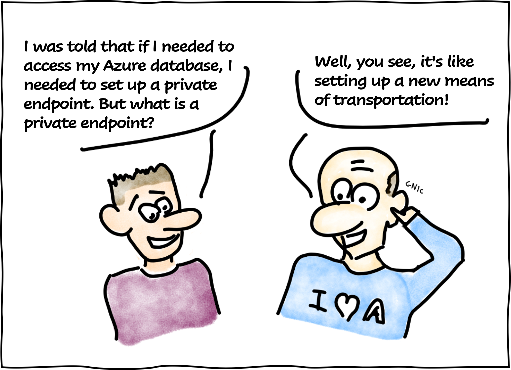
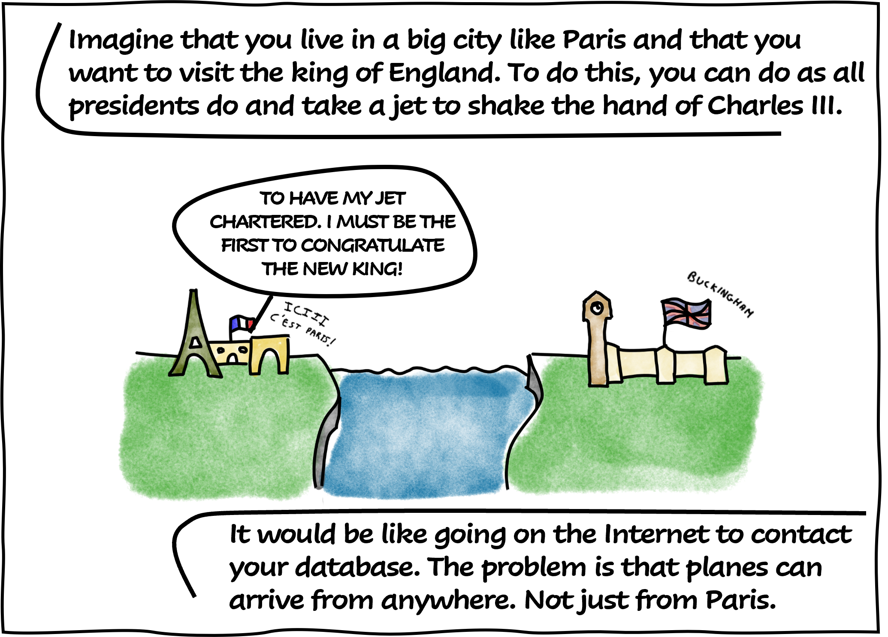
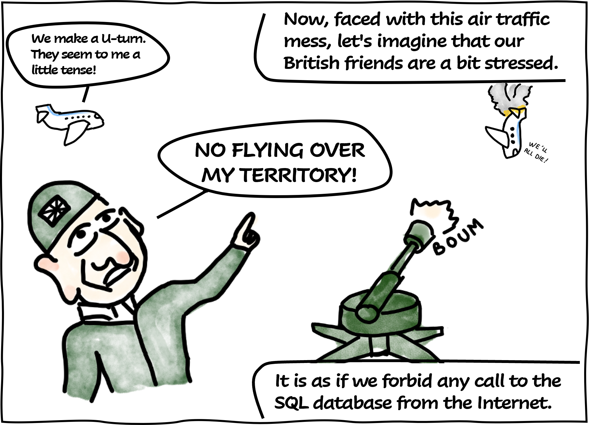
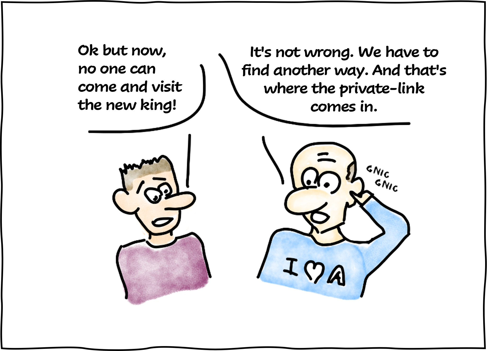
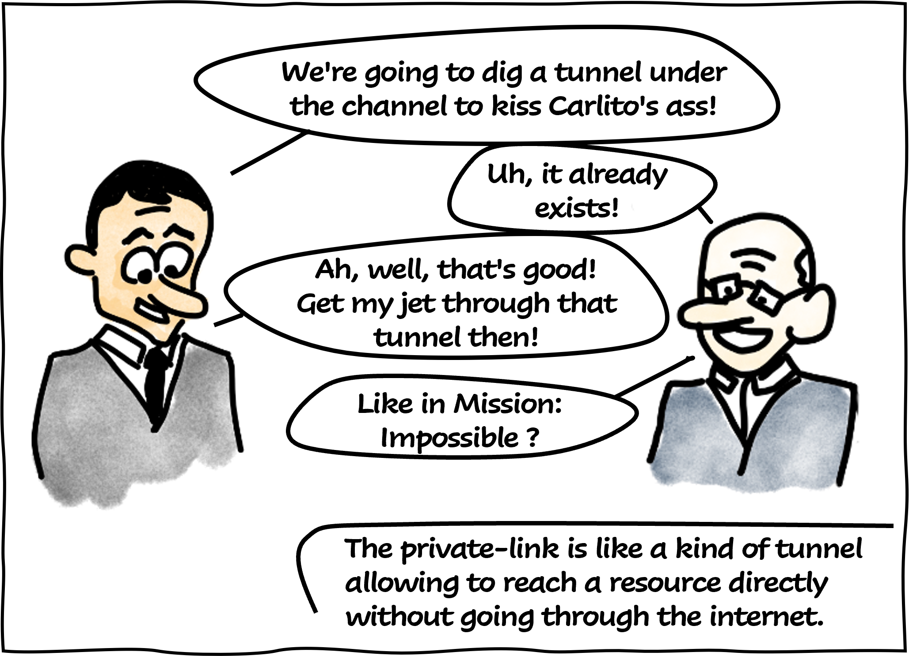
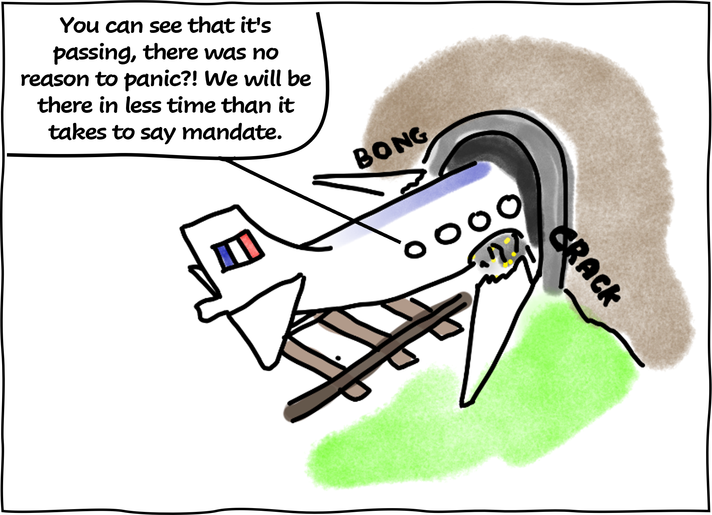
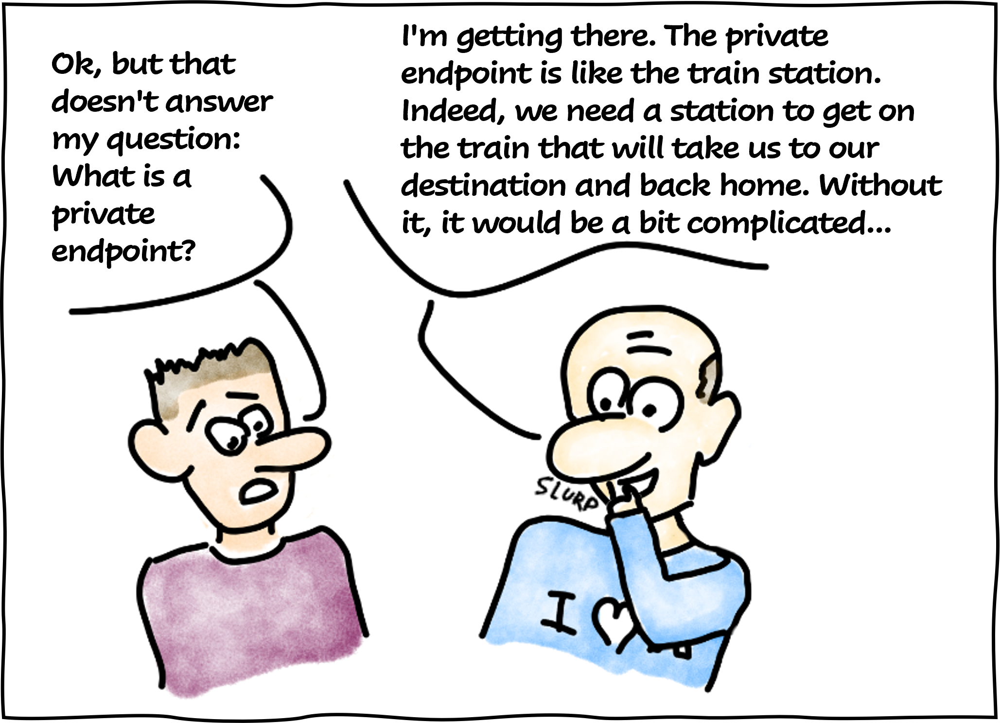
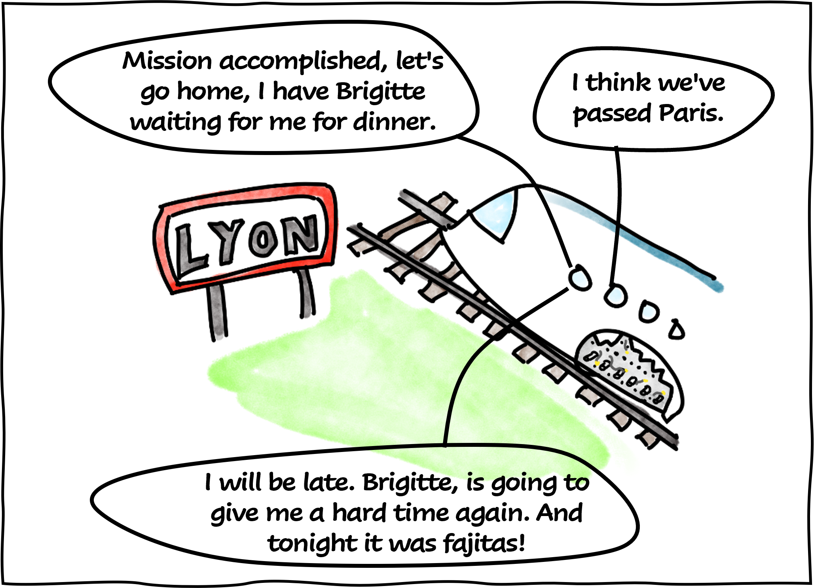
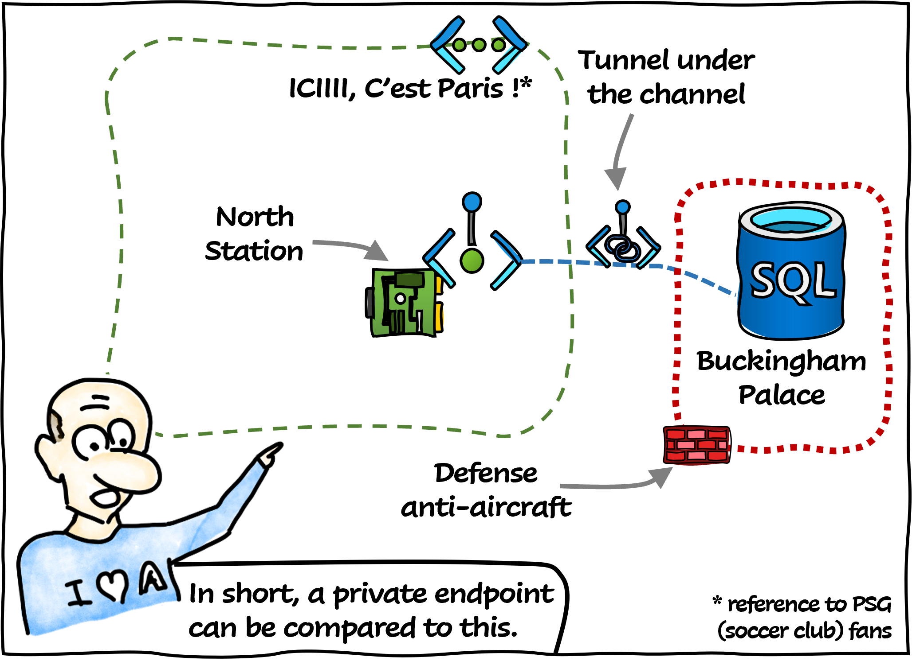

# Private Endpoint

It's been several months since I've published articles. Indeed, I have been very busy. But, I had an idea that was in my head for several weeks. After a while, I started it!

And here is the result...

This is the first episode of a long (I hope) series. I was directly inspired by the blogs I had the pleasure to browse a few years ago (Marion Montaigne's and the LHC's).

I present you **Professor Somlintom** !

## References

- [What is a private endpoint?](https://learn.microsoft.com/en-us/azure/private-link/private-endpoint-overview?WT.mc_id=AZ-MVP-5004832)
- [Tu mourras moins bête (blog of Marion Montaigne)](http://tumourrasmoinsbete.blogspot.com/)
- [LHC-France (The LHC comic book)](https://www.lhc-france.fr/spip.php?article689)
- [Ray Tomlinson (One of the internet daddies, source of inspiration for the narrator)](https://fr.wikipedia.org/wiki/Ray_Tomlinson)

## Thanks

- [Jean-Philippe SENON](https://www.linkedin.com/in/jeanphilippesenon/) : for the proofreading
- [Samy Mameri](https://www.linkedin.com/in/samy-mameri-60649079/) : for the proofreading
- [Michael Maillot](https://twitter.com/michael_maillot) : for the proofreading
- [Charlie Bethuys](https://www.linkedin.com/in/charlie-bethuys/) : for the proofreading
- [Stephane Deloison](https://www.linkedin.com/in/stephane-deloison-6230bb11/) : for the proofreading

_Written by Philippe MORISSEAU, Published on February 11, 2023._