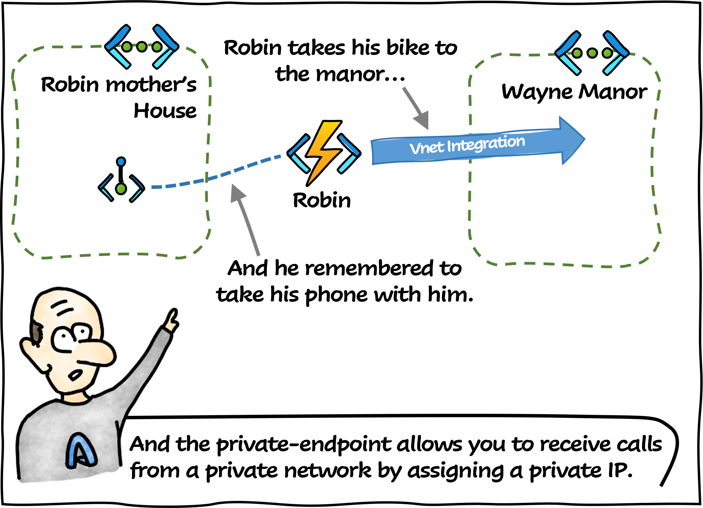

# Private Endpoint VS Vnet Integration

Today **Professor Somlinton** explains the difference between private-endpoint and vnet integration!

## References

- [What is a private endpoint?](https://learn.microsoft.com/en-us/azure/private-link/private-endpoint-overview?WT.mc_id=AZ-MVP-5004832)
- [Tu mourras moins bête (blog of Marion Montaigne)](http://tumourrasmoinsbete.blogspot.com/)
- [LHC-France (The LHC comic book)](https://www.lhc-france.fr/spip.php?article689)
- [Ray Tomlinson (One of the internet daddies, source of inspiration for the narrator)](https://fr.wikipedia.org/wiki/Ray_Tomlinson)

## Thanks

- [Etienne Louise](https://www.linkedin.com/in/etienne-louise-78154063/) : for the proofreading

_Written by Philippe MORISSEAU, Published on February 20, 2023._