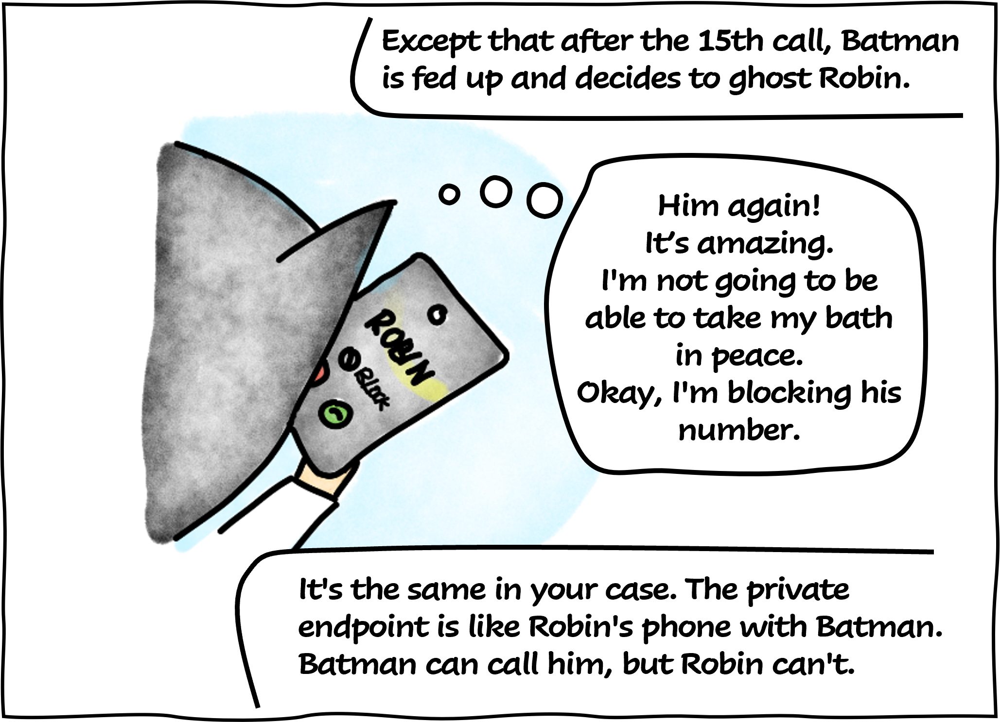
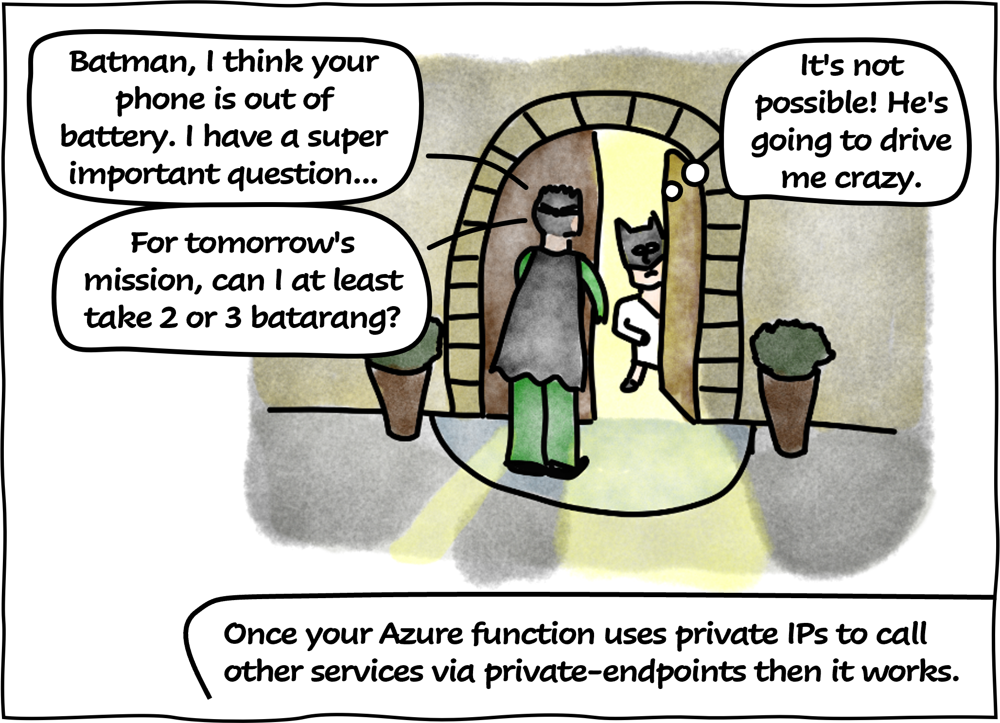
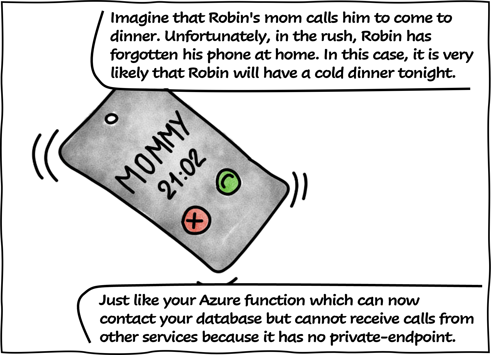

# SPN, SMI et UMI

Today **Professor Somlintom** explains the difference between the service principal name, the system-assigned managed identity and the user-assigned managed identity!

*Please note that Tony Parker's activities at Villard-de-Lans are pure fiction and serve only to explain the point.*

## References

- [What are managed identities for Azure resources?](https://learn.microsoft.com/en-us/azure/active-directory/managed-identities-azure-resources/overview?WT.mc_id=AZ-MVP-5004832)
- [Application and service principal objects in Azure Active Directory](https://learn.microsoft.com/en-us/azure/active-directory/develop/app-objects-and-service-principals?WT.mc_id=AZ-MVP-5004832)

## Thanks

- [Stephane Deloison](https://www.linkedin.com/in/stephane-deloison-6230bb11/) : for the proofreading

_Rédigé par Philippe MORISSEAU, Publié le 13 Mars 2023_