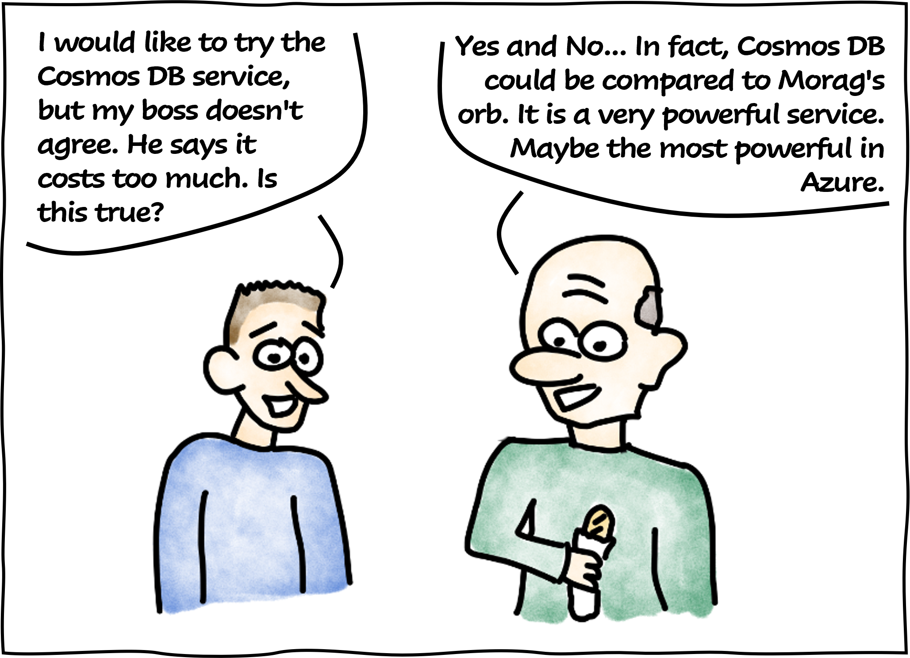
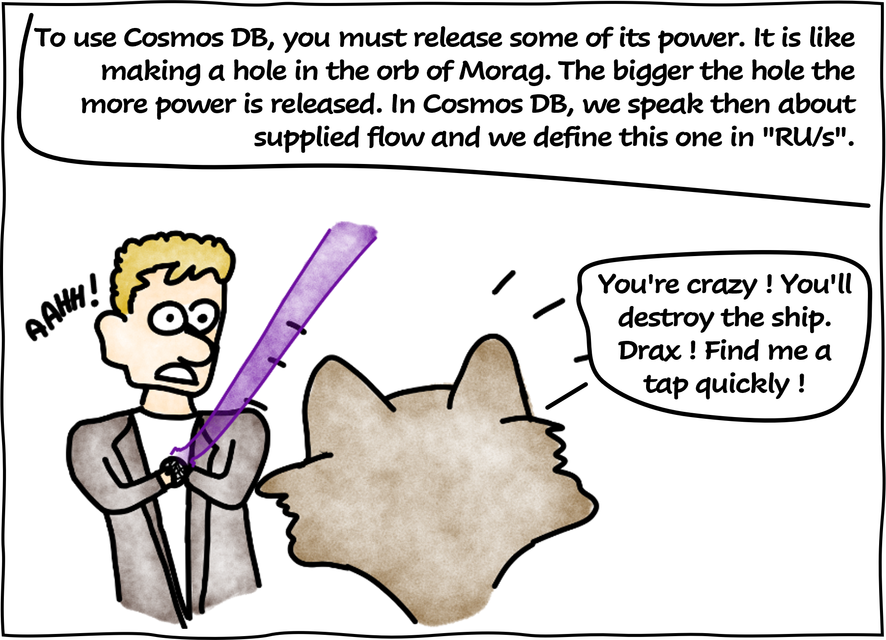
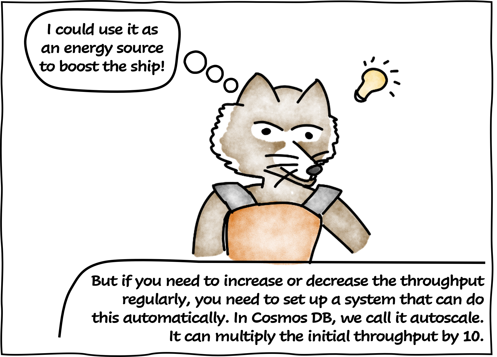
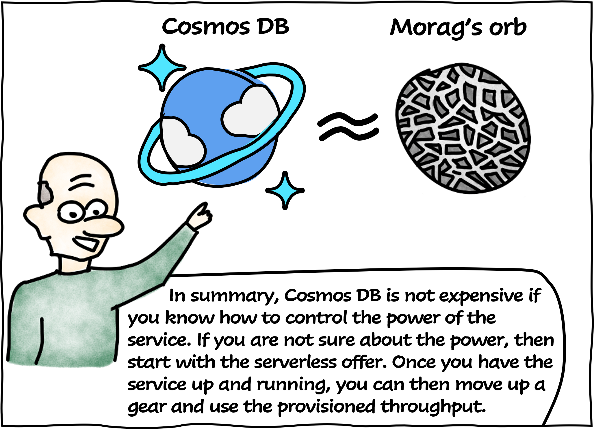

# CosmosDB, it's like Morag's orb

Today **Professor Somlinton** reassures you about using CosmosDB, one of the most powerful services in Azure.

## References

- [Request Units in Azure Cosmos DB](https://learn.microsoft.com/en-us/azure/cosmos-db/request-units?WT.mc_id=AZ-MVP-5004832)
- [Introduction to provisioned throughput in Azure Cosmos DB](https://learn.microsoft.com/en-us/azure/cosmos-db/set-throughput?WT.mc_id=AZ-MVP-5004832)
- [Create Azure Cosmos DB containers and databases with autoscale throughput](https://learn.microsoft.com/en-us/azure/cosmos-db/provision-throughput-autoscale?WT.mc_id=AZ-MVP-5004832)
- [Azure Cosmos DB serverless](https://learn.microsoft.com/en-us/azure/cosmos-db/serverless?WT.mc_id=AZ-MVP-5004832)

## Thanks

_Written by Philippe MORISSEAU, Published on March 27, 2023._