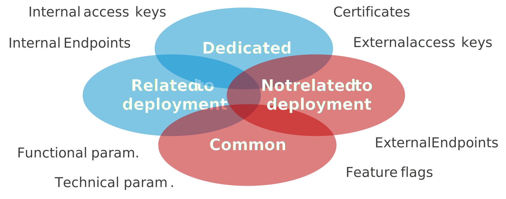

In my last talk *GitOps, Continuous Delivery and environments: how to escape hell!*, a participant pointed out to me that it would be good to show concretely how to set up a GitOps approach with modern tools.

Being a fan of Azure managed services, I therefore suggest that you study how to set up a GitOps approach with Azure App Configuration.

## Why adopt a GitOps approach?

Commençons par un petit rappel. 

The GitOps approach is the result of the meeting of the world of developers and the world of administrators and operators. This meeting took place at the time of the democratization of the DevOps approach. Developers working with administrators, the two (once well-separated) worlds have inspired each other and one of the results is the GitOps approach.

But what is GitOps?

The GitOps approach is simply the use of code management tools like git to manage the configuration parameters of an application. These tools offer the following advantages:

- Centralization: thanks to the repository server,
- Historization: thanks to commits,
- Governance: thanks to access control,
- Automation: thanks to CI/CD pipelines.

Does that mean it's the new standard?

Yes and no. This will mainly depend on the context of your application. If you manage a monolithic application, you may not need to implement a GitOps approach. Maybe you can just manage your application's configuration settings directly in your pipeline. "Keep it simple and stupid!".

You will find the benefit of setting up a GitOps approach as soon as you have to manage a distributed application. Indeed, in your configuration settings, you will have to manage attributes common to the components of your architecture (such as connection strings to your databases) and attributes that are not related to the deployment of your components (such as certificates). These parameters will be managed independently of your components.



## Overview of Azure App Configuration

The Azure App Configuration service will allow you to set up a GitOps approach on Azure.
Indeed, this managed service will allow you to manage and distribute your configuration parameters to your applications.

Microsoft offers SDKs for this service available in many languages: .NET, Java, Python, JavaScript, ...

You will therefore be able to use this service to distribute your configuration to your Function Apps, Web Apps, Container Instances, Kubernetes Services, ...

There are 2 pricing tiers: *Free* and *Standard*. You will find that the *Free* level may be interesting but only for non-production environments. The absence of SLAs and quotas are simply not an option for a production application (unless you have a taste for risk).

!!! note
    To learn more, I invite you to consult the Microsoft documentation: [here](https://docs.microsoft.com/en-us/azure/azure-app-configuration/overview)

## Architecture

Enough with *blabla* and let's go straight to the heart of the matter. Let's start with a small architectural diagram.
The goal is to use Azure DevOps and Azure App Configuration together to distribute the configuration to the different elements of our distributed application.


We will push the configuration from Azure DevOps to Azure App Configuration and configure our various components of our distributed architecture to retrieve the configuration from the latter.

It is possible to indicate in Azure App Configuration that one of the parameters is in Azure Key vault. Your application will then directly retrieve the configuration in the vault from the key indicated by Azure App Configuration.

There are 2 ways to connect to Azure App Configuration:

- with an access key,
- with a managed identity (System Assigned or User Assigned).

I strongly recommend that you use the second solution; the first should only be used if you have no other solution.

You can also isolate this service from a network point of view by using a Private Endpoint. But in this case, you will have to make sure to use *Self-hosted Azure DevOps agents to deploy your configuration.
Here is an example of an architecture diagram with network isolation:


Finally, if you want your components to be notified on every configuration change, you can add the Event Grid System Topic service.


!!! note
    It is not possible to network isolate an Event Grid System Topic with a Private Endpoint. To solve this problem, it will be necessary to make a "small hole" via Service Tag to authorize traffic coming from your Event Grid (cf.: [my article on network isolation](../../../classroom/01.azureClassroom.VnetEndpointFirewall/#service-tag)).

## Implementation in your applications

### Configure your .NET apps to use Azure App Configuration

To configure your .NET applications, you will need to add the nuget package `Microsoft.Azure.AppConfiguration.AspNetCore` for your ASP.NET Core or `Microsoft.Extensions.Configuration.AzureAppConfiguration` for all your other .NET Core apps.

Next, you need to configure the service.

Here is an example of a simple configuration of your ASP.NET core application:

```csharp
var builder = WebApplication.CreateBuilder(args);

builder.Host.ConfigureAppConfiguration(builder =>
{
    var settings = builder.Build();
    //Connect to your App Config Store
    builder.AddAzureAppConfiguration(options =>
    {
        options.Connect(new Uri(settings["AppConfig:Endpoint"]), new ManagedIdentityCredential())
    });
    // ...
}); 
```

In this example, we're using the managed identity to authenticate the app to the Azure App Configuration service.

Finally, you must give the `App Configuration Data Reader` (RBAC) role at the Azure App Configuration level to your ASP.NET core application.

### Refresh the configuration in "Pull" mode

Being able to load your app configuration from Azure App Configuration is good. But performing a restart of the application to load the new configuration is not always ideal.
The Azure App Configuration SDK overcomes this problem by detecting the modification of the configuration and reloading it automatically.

First of all, make sure that the middleware of Azure App Configuration is configured. To do this in the `HostBuilder`, you must add the service via `AddAzureAppConfiguration`.

```csharp
builder.Host.ConfigureAppConfiguration(builder =>
{
    // ...   
})
.ConfigureServices(services =>
{
    services.AddControllersWithViews();
    services.AddAzureAppConfiguration();
});
```

Then activate the middleware at the `WebApplication` level via `UseAzureAppConfiguration`.

```csharp
var app = builder.Build();
app.UseHttpsRedirection();
app.UseAzureAppConfiguration();
// ...
```

Next, we'll use a "sentinel" parameter in Azure App Configuration. Each time this parameter is changed, it will indicate that the configuration must be reloaded.

Here is an example :

```csharp
builder.AddAzureAppConfiguration(options =>
{
    options.Connect(new Uri(settings["AppConfig:Endpoint"]), new ManagedIdentityCredential())
        .ConfigureRefresh(refresh => refresh.Register("TestApp:Settings:Sentinel", true);
});
// ...
```

In this example, we will condition the refresh of all the parameters to the update of `TestApp:Settings:Sentinel`.

Thus our application will regularly check the value of our "sentinel" parameter. By default the frequency is set to 30 seconds. But you can set the frequency yourself:

```csharp
// ...    
refresh.Register("TestApp:Settings:Sentinel", true).SetCacheExpiration(new TimeSpan(0, 0, 10))
// ...
```

In this example, we will check the "sentinel" parameter every 10 seconds.

!!! Warning
    Be careful not to set the frequency too high. Indeed, if you want to make sure that your configuration can be refreshed very quickly, you will be tempted to reduce it to one second or even less. But it must be taken into account that each web app will do this verification independently. By setting to 1 second, your components will poll at least 2.6 million times per month Azure App Configuration. Let's say you have 10 components in your architecture, then that goes up to 26 million requests. You will then have a significant impact on the costs of your Azure App Configuration service (~ 140 € / month).

If you absolutely want to have a solution that takes your new configuration into account almost instantly, then I advise you to refresh the configuration of your application in "Push" mode.

### Refresh the configuration in "Push" mode

The principle is that each change made to your configuration in Azure App Configuration triggers a notification that is captured by your components. This solution will use another service: the Event Grid System Topic.

In the case of an ASP.NET core component, you will need:

1. Create a webhook capable of registering with the Event Grid,
2. Set up the mechanism for refreshing the settings.

Let's start with the webhook. To do this, we must add the nuget package `Azure.Messaging.EventGrid` to our project. Then, create a dedicated controller with a POST method. Like this :

```csharp
using Azure.Messaging.EventGrid;
using Azure.Messaging.EventGrid.SystemEvents;
using Microsoft.AspNetCore.Mvc;

namespace [yournamespace].Controllers
{
    [ApiController]
    [Route("[controller]")]
    public class ConfigurationController : ControllerBase
    {
        [HttpPost]
        public async Task<IActionResult> Post()
        {
            BinaryData events = await BinaryData.FromStreamAsync(Request.Body);
            EventGridEvent[] eventGridEvents = EventGridEvent.ParseMany(events);

            foreach (EventGridEvent eventGridEvent in eventGridEvents)
            {
                // Handle system events
                if (eventGridEvent.TryGetSystemEventData(out object eventData))
                {
                    // Handle the subscription validation event
                    if (eventData is SubscriptionValidationEventData subscriptionValidationEventData)
                    {
                        var responseData = new SubscriptionValidationResponse()
                        {
                            ValidationResponse = subscriptionValidationEventData.ValidationCode
                        };
                        return new OkObjectResult(responseData);
                    }
                    // Handle the app configuration keyvalue event
                    else if (eventData is AppConfigurationKeyValueModifiedEventData || eventData is AppConfigurationKeyValueDeletedEventData)
                    {
                        // TO DO
                    }
                }
            }
            return new OkObjectResult(string.Empty);
        }
    }
}
```

We are now able to capture events pushed by the Event Grid. You must now trigger the refresh of the configuration.
To do this, you must create a class in charge of triggering the refresh with the middleware of Azure App Configuration. Here is an example :

```csharp
using Microsoft.Extensions.Configuration.AzureAppConfiguration;

namespace [yournamespace]
{
    public class OnDemandConfigurationRefresher : IOnDemandConfigurationRefresher
    {
        private readonly List<IConfigurationRefresher> _configurationRefreshers = new List<IConfigurationRefresher>();

        public OnDemandConfigurationRefresher(IConfiguration configuration)
        {
            var configurationRoot = configuration as IConfigurationRoot;

            if (configurationRoot == null)
            {
                throw new InvalidOperationException("The 'IConfiguration' injected in OnDemandConfigurationRefresher is not an 'IConfigurationRoot', and needs to be as well.");
            }

            foreach (var provider in configurationRoot.Providers)
            {
                if (provider is IConfigurationRefresher refresher)
                {
                    _configurationRefreshers.Add(refresher);
                }
            }
        }

        public void RefreshAllRegisteredKeysAsync(PushNotification pushNotification)
        {
            _configurationRefreshers.ForEach(r => r.ProcessPushNotification(pushNotification));
        }
    }
}
```

And add this class as a service.

```csharp
builder.Host.ConfigureAppConfiguration(builder =>
{
    // ...   
})
.ConfigureServices(services =>
{
    services.AddControllersWithViews();
    services.AddAzureAppConfiguration();
    services.AddScoped<IOnDemandConfigurationRefresher, OnDemandConfigurationRefresher>();
});
```

Finally, implement triggering the refresh from the webhook:

```csharp
using Azure.Messaging.EventGrid;
using Azure.Messaging.EventGrid.SystemEvents;
using Microsoft.AspNetCore.Mvc;
using Microsoft.Extensions.Configuration.AzureAppConfiguration;
using Microsoft.Extensions.Configuration.AzureAppConfiguration.Extensions;

namespace [yournamespace].Controllers
{
    [ApiController]
    [Route("[controller]")]
    public class ConfigurationController : ControllerBase
    {
        private readonly IOnDemandConfigurationRefresher _azureAppConfigurationRefresher;

        public ConfigurationController(IOnDemandConfigurationRefresher azureAppConfigurationRefresher)
        {
            _configuration = configuration;
            _azureAppConfigurationRefresher = azureAppConfigurationRefresher;
        }

        [HttpPost]
        public async Task<IActionResult> Post()
        {
            BinaryData events = await BinaryData.FromStreamAsync(Request.Body);
            EventGridEvent[] eventGridEvents = EventGridEvent.ParseMany(events);

            foreach (EventGridEvent eventGridEvent in eventGridEvents)
            {
                // Handle system events
                if (eventGridEvent.TryGetSystemEventData(out object eventData))
                {
                    // Handle the subscription validation event
                    if (eventData is SubscriptionValidationEventData subscriptionValidationEventData)
                    {
                        var responseData = new SubscriptionValidationResponse()
                        {
                            ValidationResponse = subscriptionValidationEventData.ValidationCode
                        };
                        return new OkObjectResult(responseData);
                    }
                    // Handle the app configuration keyvalue event
                    else if (eventData is AppConfigurationKeyValueModifiedEventData || eventData is AppConfigurationKeyValueDeletedEventData)
                    {
                        eventGridEvent.TryCreatePushNotification(out PushNotification pushNotification);
                        _azureAppConfigurationRefresher.RefreshAllRegisteredKeysAsync(pushNotification);
                    }
                }
            }
            return new OkObjectResult(string.Empty);
        }
    }
}
```

And There you go !

You can then increase the cache expiration to one or more days: `SetCacheExpiration(TimeSpan.FromDays(10))`.

This solution has a drawback. If at the time of your configuration change your component is not available, the event will not be captured and the configuration will not be updated.
You can overcome this problem by using a Service Bus queue between your Event Grid and your Web app. This way, your component can then retrieve the configuration change as soon as it becomes available again.


### Configure to use Azure App Configuration with Azure Key vault

In your configuration settings, it is not uncommon to find sensitive elements such as access keys, passwords, connection strings. It is strongly recommended to protect these sensitive parameters in a safe. Azure App Configuration allows you to reference sensitive settings of your configuration and indicate their location in Azure Key vault. This way your application can easily retrieve the value of the parameter directly from the vault. Additionally, as with all other configuration settings, you will be able to notify your components of a change in the vault.

To do this, it's very simple, all you have to do is modify the setting of Azure App Configuration in your component. Here is an example using managed identities:

```csharp
builder.AddAzureAppConfiguration(options =>
{
    options.Connect(new Uri(settings["AppConfig:Endpoint"]), new ManagedIdentityCredential())
        .ConfigureRefresh(refresh => refresh.Register("TestApp:Settings:Sentinel", true)
        .ConfigureKeyVault(kv => kv.SetCredential(new ManagedIdentityCredential()));
});
// ...
```

!!! note
    Your application (via its managed identity) must be authorized to retrieve (GET) the values ​​in Azure Key vault.

## Conclusion

In this first part we saw how to set up Azure App Configuration with our applications.
We will see in the second part, how to automate the configuration update with Azure DevOps. 

[To be continued...](02.gitops.AzureAppConfiguration.md)

## References

- [Microsoft : Azure App Configuration](https://docs.microsoft.com/en-us/azure/azure-app-configuration/)
- [Azure App Configuration refresh on demand](https://www.bustroker.com/notes/azure-app-configuration-refresh-on-demand/)
  
## Thanks

- [Etienne Louise](https://www.linkedin.com/in/etienne-louise-78154063/) : for the proofreading and the comment that led me to publish this article
- [David Dubourg](https://www.linkedin.com/in/dubourg-david-7413779/) : for the proofreading
- [Michael Maillot](https://twitter.com/michael_maillot) : for the proofreading

_Written by Philippe MORISSEAU, Published on April 25, 2022._