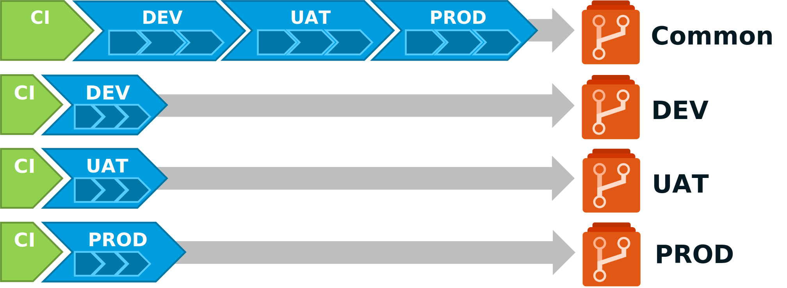

In Part 2 we saw how to use git repositories and Azure DevOps pipelines to manage and push configuration to Azure App Configuration. But our configurations will certainly be different depending on our environments. How to manage these distinct configurations?
Modifying the configuration of the acceptance environment does not have to impact the configuration of the integration or production environment. Does that mean I have to put this in separate files? in separate repositories? or even elsewhere?

## Manage your environment configuration

First, you need to ask yourself a few questions:

 - Do you need to have a configuration history specific to each of your environments?
 - How many environment parameters (apart from sensitive parameters) you will have to manage?
 - What is the frequency of your environment updates?

If you have many environment settings, using one configuration file per environment in your repo. git is probably the solution.

If you plan to change your environment configuration regularly, maybe repos per environment is a good solution.

It's really going to depend on your situation. I will still offer you to describe some solutions that can be implemented with Azure DevOps.

### Manage your environment configuration with Azure DevOps libraries.

If you don't need the history of your environment configurations, the Azure DevOps libraries are sufficient.


Used jointly in your CD pipeline with a task of the `replacetokens` type, you can then overload your common configuration with the specificities of your environments.

For example, if you define in an Azure DevOps library the parameters:

- NB_NODES: Number of nodes in your cluster,
- ALLOW_ANONYMOUS_ACCESS: Top indicating if the WebApp is accessible without authentication,
- SUPER_ADMIN_USER: Identity of the super administrator of the cluster.

Using the `replacetokens` task, you will have a configuration file in your git repository like this:

  ```yaml
  TestApp:Settings:Param1: ValueOfParam1
  TestApp:Settings:Param2: ValueOfParam2
  All:Settings:Param3: ValueOfParam3
  Cluster:Settings:NbNodes: #{NB_NODES}#
  WebApp:Settings:AllowAnonymousAccess: #{ALLOW_ANONYMOUS_ACCESS}#
  Cluster:Settings:SuperAdmin: #{SUPER_ADMIN_USER}#
  ```

The downside is that you will have another configuration repository to manage. This is not ideal in terms of maintainability.

### Manage your environment configuration in separate folders.

In this case, if you have many environment settings, using one configuration file per environment in your repository git might be the solution.


Let's go back to our example with the parameters:

- NB_NODES: Number of nodes in your cluster,
- ALLOW_ANONYMOUS_ACCESS: Top indicating if the WebApp is accessible without authentication,
- SUPER_ADMIN_USER: Identity of the super administrator of the cluster.

You will have :

- a *config.json* file containing the common configuration parameters containing:
    ```json
    {
        "TestApp:Settings:Param1": "ValueOfParam1",
        "TestApp:Settings:Param2": "ValueOfParam2",
        "All:Settings:Param3": "ValueOfParam3",
        "Cluster:Settings:NbNodes": 2,
        "WebApp:Settings:AllowAnonymousAccess": true,
        "Cluster:Settings:SuperAdmin": null
    }
    ```
- a *config.dev.json* file containing the configuration parameters specific to the *DEV* environment,
    ```json
    {
        "Cluster:Settings:SuperAdmin": "admin_dev@test.fr"
    }    
    ``` 
- a *config.uat.json* file containing the configuration parameters specific to the *UAT* environment,
    ```json
    {
        "WebApp:Settings:AllowAnonymousAccess": false,
        "Cluster:Settings:SuperAdmin": "admin_uat@test.fr"
    }
    ``` 
- a *config.prd.json* file containing configuration parameters specific to the *PROD* environment.
    ```json
    {  
        "Cluster:Settings:NbNodes": 5,
        "WebApp:Settings:AllowAnonymousAccess": false,
        "Cluster:Settings:SuperAdmin": "admin_prd@test.fr"
    }
    ``` 

Then using this powershell script you can merge the files in order to have a complete configuration file:

```powershell
# Arguments that get passed to the script when running it
param (
    [Parameter(Position=1)]
    $jsonSrcFile,
    [Parameter(Position=2)]
    $jsonEnvFile
)

Install-Module -Name JoinModule -Force -Verbose -Scope CurrentUser

# LoadJson function that will read Json file and deserialize it
function LoadJson {
    param (
        $FileName
    )
	# Load file content to a string array containing all Json file lines
    [string[]]$fileContent = Get-Content $FileName
    $content = ''
    # Convert a string array to a string
    foreach ($line in $fileContent) { $content = $content + "`n" + $line }
    # Deserialize a string to the PowerShell object
    $json = ConvertFrom-Json $content
    # return the object
    Write-Output $json
}
 
# WriteJson function that writes the Json content to a file
function WriteJson {
    param (
        $FileName,
        $Content
    )
	#Serialize a PowerShell object to string
    $result = ConvertTo-Json $Content
    #write to a file
    Set-Content -Path $FileName -Value $result
}

function MergeObject {
    param (
        $1,
        $2
    )

    $Merged = $1 | Merge $2

    Write-Output $Merged;
}
 
# Loading json, setting new values and writing it back to disk
$jsonSrc = LoadJson $jsonSrcFile
$jsonEnv = LoadJson $jsonEnvFile
$merged = MergeObject $jsonSrc $jsonEnv 
WriteJson $jsonEnvFile $merged
```

The downside is that if you make a change in one of the environment configuration files it will cause a version increment for all environments. For example, if your configuration is currently in version `1.0.0` and you make a change following a configuration problem on the *UAT* configuration, you will increment to version `1.0.1` for all your environments even if the configuration was correct in production.

In addition, you will not be able to apply governance to limit the modification of your production environment to a restricted user population. We certainly want to allow our team to quickly modify the configuration in *DEV* but not do the same in *PROD*.

### Manage your environment setup with separate repos

If you want to independently track changes to your environments and limit access to your environments' configurations, you may need to distribute your environments' configuration across separate repos.


If we take the example above with 3 environments *DEV*, *UAT* and *PROD*, it will take 4 git repository of configuration.

- One for the configuration common to the environments,
- One for environment-specific configuration of *DEV*,
- One for the environment-specific configuration of *UAT*,
- One for environment-specific configuration of *PROD*.

The big drawback of this solution is that this method quickly multiplies the number of repositories. This will bring complexity to your Azure DevOps project.

## Deploy your environment configuration

Now that we have a vague idea of ​​how we want to manage our configuration, we must be able to deploy it correctly and at the right time. You have to ask yourself the following question: When should I change the configuration on my environment?

From my point of view there are 2 totally different cases that will require modifying your configuration:

- When a modification is made to the application:
  
    - Evolution of the application,
    - Fixed app behavior

- When you make a change to your environment:
  
    - Renewal of a certificate or password,
    - Modification of a technical parameter,
    - Activation of a feature already deployed (Feature flag),
    - ...

Your deployment pipeline of your configuration must be adapted to these 2 cases.

### Deploy your environment configuration following an application modification.

In the event that you bring an application evolution, you will want to test/verify your configuration on non-production environments before deploying it in production. You have to model yourself on the pipelines of your application components.

For example, if your application is hosted on three environments: *DEV*, *UAT*, and *PROD*, you should have a CI/CD pipeline that will look like this:


Your *yaml* Azure DevOps pipeline with a branching model TBD will look like this:

```yaml
trigger:
- main
- release/*

stages:
- stage: Prepare
  displayName: Prepare
  jobs:  
  - job: PrepareConfiguration
    displayName: Prepare configuration
    pool:
      vmImage: 'ubuntu-latest'
    steps:
    # 
    # Define steps to prepare configuration for each environnments
    #
    # Publie l'artefact
    - task: PublishBuildArtifacts@1
      displayName: 'Publish Artifact: drop'
- stage: DeployDEV
  displayName: Deploy DEV
  dependsOn: Prepare  
  jobs:
  - deployment: DeployConfig
    pool: 
      vmImage: 'ubuntu-latest'
    environment: DEV
    workspace:
      clean: all
    strategy:
      runOnce:
        deploy:
          steps:
            # 
            # Define steps to publish configuration for DEV environnment
            #
- stage: DeployUAT
  displayName: Deploy UAT
  dependsOn: DeployDEV
  condition: and(succeeded(), startsWith(variables['Build.SourceBranch'], 'refs/heads/release/'))
  jobs:
  - deployment: DeployConfig
    pool: 
      vmImage: 'ubuntu-latest'
    environment: UAT
    workspace:
      clean: all
    strategy:
      runOnce:
        deploy:
          steps:
            # 
            # Define steps to publish configuration for UAT environnment
            #
- stage: DeployPRD
  displayName: Deploy PROD
  dependsOn: DeployUAT
  condition: and(succeeded(), startsWith(variables['Build.SourceBranch'], 'refs/heads/release/'))
  jobs:
  - deployment: DeployConfig
    pool: 
      vmImage: 'ubuntu-latest'
    environment: PRD
    workspace:
      clean: all
    strategy:
      runOnce:
        deploy:
          steps:
            # 
            # Define steps to publish configuration for PROD environnment
            #
```

Thus, you ensure that your configuration will be tested and validated on your non-production environments before deploying your configuration in production.

### Deploy your configuration to modify an environment.

But when you want to modify your configuration after an event specific to your environment and not linked to a modification of your application, you do not need to validate your configuration on other environments. Your deployment need is specific to an environment.
Why redeploy a configuration in *DEV* when you only need to modify the configuration in *UAT* or *PROD*?

In this case, one solution is to create a specific pipeline for each environment in addition to the previous one.


Now, let's take our 3 methods to manage our configuration and see how to apply this approach to each of them.

#### Déployer votre configuration en utilisant Azure DevOps Library

Unfortunately, today with Azure DevOps, there is no easy and fully integrated way to trigger a pipeline following a library modification.
If you still want to do it, you will have to go through the development box and use the different APIs of Azure DevOps.
You will need to develop an Azure Function with a TimeTrigger to regularly check if there has been an update on the libraries and trigger your pipeline.

You will agree that the use of Azure DevOps Libraries is not very suitable for use with specific pipelines per environment.

!!! note
    If you are all the same motivated to do this, here are the Azure DevOps APIs that you will have to use:

    - [Azure DevOps API : Get Variables Groups](https://docs.microsoft.com/en-us/rest/api/azure/devops/distributedtask/variablegroups/get-variable-groups?view=azure-devops-rest-6.0&WT.mc_id=AZ-MVP-5004832),
    - [Azure DevOps API : Run Pipeline](https://docs.microsoft.com/en-us/rest/api/azure/devops/pipelines/runs/run-pipeline?view=azure-devops-rest-6.0&WT.mc_id=AZ-MVP-5004832)

#### Deploy your configuration using folders in your git repository

If you have made the choice to use separate folders and files for each environment in your git repository, the implementation will be much easier. Indeed, you can specify in your pipeline the folders to include or exclude from the trigger.
Therefore, if you modify your configuration for a single environment, only the files in the folder corresponding to your environment will be modified.

Your environment-specific pipeline will look like this:

```yaml
trigger:
  branches :
    include :
    - main
    - release/*
  paths :
    include :
    - YOUR_ENV/*

stages:
- stage: Prepare
  displayName: Prepare
  jobs:  
  - job: PrepareConfiguration
    displayName: Prepare configuration
    pool:
      vmImage: 'ubuntu-latest'
    steps:
    # 
    # Define steps to prepare configuration for each environnments
    #
    # Publie l'artefact
    - task: PublishBuildArtifacts@1
      displayName: 'Publish Artifact: drop'
- stage: Deploy
  displayName: Deploy YOUR_ENV
  dependsOn: Prepare  
  jobs:
  - deployment: DeployConfig
    pool: 
      vmImage: 'ubuntu-latest'
    environment: YOUR_ENV
    workspace:
      clean: all
    strategy:
      runOnce:
        deploy:
          steps:
            # 
            # Define steps to publish configuration for DEV environnment
            #
```

And in order not to trigger the configuration pipeline common to the environments, it will be necessary to modify this one to exclude the triggering at the time of a modification specific to an environment. That is :

```yaml
trigger:
  branches :
    include :
    - main
    - release/*
  paths :
    exclude :
    - YOUR_ENV/*
```

#### Deploy your configuration using git repositories

If you have chosen to use separate git repositories to manage the configuration of each environment, the solution is even simpler, you will only have to define your specific pipeline in each of your repositories.



For each of the specific pipelines, remember to reference the repository containing your common configuration.
To do this, you will need to add in your *yaml* pipeline:

```yaml
trigger:
  branches :
    include :
    - main
    - release/*

resources:
  repositories:
  - repository: common
    type: git
    name: YOUR_COMMON_REPOSITORY_NAME
```

And for your common pipeline, you will have to think about referencing the repos containing the environment-specific configurations. For instance :

```yaml
trigger:
  branches :
    include :
    - main
    - release/*

resources:
  repositories:
  - repository: DEV
    type: git
    name: YOUR_DEV_REPOSITORY_NAME
  - repository: UAT
    type: git
    name: YOUR_UAT_REPOSITORY_NAME
  - repository: PROD
    type: git
    name: YOUR_PROD_REPOSITORY_NAME
```

## Conclusion

Here is the proof that you can easily adopt a GitOps approach with Azure App Configuration and Azure DevOps.
You have seen that not everything is perfect. It would have been nice to be able to trigger a pipeline following the modification of an Azure DevOps library. Maybe this feature will be available in future releases of Azure DevOps. By the way, how is it with the other competing product of Azure DevOps but also owned by Microsoft: Github?

We will see this in the fourth part.

To be continued...

## References

- [Azure DevOps : YAML schema reference for Azure Pipelines](https://docs.microsoft.com/en-us/azure/devops/pipelines/yaml-schema/?view=azure-pipelines&WT.mc_id=AZ-MVP-5004832)
  
## Thanks

_Written by Philippe MORISSEAU, Published on May 25, 2022._
