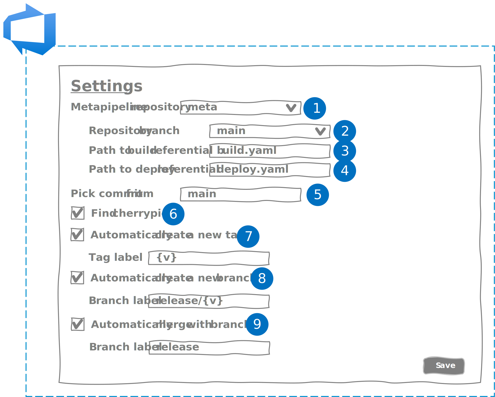
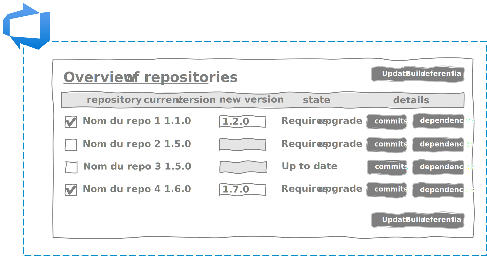

During the first part we detailed how we could reach the limits of DevOps and spin our approach. Then, in the second part, I explained to you an idea that would allow you to go beyond the limits.
In this third part of a single chapter, I will present the concrete implementation of our idea.

## Implementation

### Our goals through the implementation of our idea

Before rushing headlong into the realization of our idea, we must take a step back and ask ourselves the right questions. What should our solution bring?

Our solution must allow the project team to:

- maintain an agile rhythm and ceremonies,
- simplify the deployment process,
- guarantee the quality of components over time.

Our solution must offer the customer the possibility of:

- reduce the time between approval and Go Live,
- intervene quickly in the event of a breakdown,
- guarantee the quality of the application over time.

### What we don't want

It is obvious that each client, each company, each project has its own organization. Our solution should not impose a specific organization. This would go against agility and the DevOps approach.

Our solution should not constrain:

- to a branching model. Our solution must be compatible with Gitflow, GithubFlow, Trunk Based Development or custom processes.
- a production process. Each company having its own application delivery process with its own non-production environments, our solution must adapt to the organization and not the other way around.
- to a semantic versioning. Our solution must allow any type of semantic versioning: SemVer1.0, SemVer2.0, ...
- to a technical environment. Each business IS has its own ecosystem with its OS, its frameworks, its hosting solutions (cloud, on premise, etc.). Our solution should not impose a cloud host for example.

In the end, our solution must be as "agnostic" as possible.

### The choice of the software production platform

Having said that, our solution must still be anchored to a software production solution. Having a great affinity and a good knowledge of Microsoft's stack, my choice quickly fell on Azure DevOps Services, Microsoft's SaaS software factory.

Azure DevOps Services offers the advantage of being able to integrate your own extensions (or those already available on the marketplace). You can :

- create your web extensions to increase the functionality of Azure DevOps interfaces in react,
- develop in powershell or in node.js your task extensions to increase the functionality of your CI/CD pipelines,
- define your own connections in order to secure and simplify communications between Azure DevOps and your services.

In our case, we made 2 extensions:

- A web extension to simplify updating the build repositories (cf. [Part 2 - Chapter 2](05.comment.build.md)) and deployment (cf. [Part 2 - Chapter 3](06.comment.deploy.md)) in:
    - going through all the repositories,
    - identifying the repositories that have evolved at a glance,
    - selecting the integrated front repositories,
    - defining the version of each component

- A task extension to simplify the orchestration of builds and deployments in our meta-pipeline by:
    - integrating into a CI/CD pipeline,
    - managing the semantic versioning defined in our build repository,
    - taking into account the branching model of the project,
    - managing build dependencies,
    - managing manual or automatic approvals,
    - managing deployment dependencies.

### The web extension

Here is the cinematic imagined in Azure DevOps for our user:


When arriving on the web extension, 2 tabs allow him to:

- to visualize all the git repositories of the project,
- to access the solution parameters.

The settings tab will allow our user to be able to configure the solution in order to respond to the different project organizations.



1. Selection of the git repository containing the build and deployment repositories,
2. Selection of the branch used to update the build and deployment repositories,
3. Full path of the yaml file containing the build repository,
4. Full path of the yaml file containing the deployment repository,
5. Name of the application component branches from which the pipelines will be triggered,
6. Indicates whether to identify the commits that have been cherrypicked to exclude them from the evolution search for a component (for example, in the case of Trunk Based Development , cherrypick are used to make hotfixes),
7. Indicates whether you want to create a tag when you upgrade your component. If so, you can customize your tag, the "{v}" instruction corresponding to your version number. For example, if you define "v{v}" and the version number is "1.0.1" then your tag will be "v1.0.1".
8. Indicates whether you want to create a branch when you upgrade your component. If so, you will be able to customize your branch. For example, if you enter release/{v}, then the version number will be prefixed with "release/" in your branch.
9. Indicates whether you want to perform a merge on a branch when you upgrade your component. If yes, indicate the name of the branch towards which you wish to carry out your merge.

!!! sample
    If the team uses the gitflow, then it will be necessary to carry out the following configuration:
    ```
    Pick commit from : "main"
    Find cherrypick : unchecked
    Automatically create a new tag : checked
    Automatically create a new branch : unchecked
    Automatically merge with branch : unchecked
    ```

The git repositories visualization tab allows you to visualize all the repositories of your application and to have an instant overview of the components requiring a version upgrade.



Depending on the settings, the system will automatically determine if there have been updates (new commits) on the component's repository.

The user has the final say and can decide to embed the component by checking the box and entering a version number.

By default, the extension will take the last commit of the branch, but it is possible to select it by going to the details of commits.


Finally, the dependency management interface will allow you to define build and deployment dependencies.


### The task extension

For the task extension, it must be as simple as possible to allow quick and easy integration.

The number of parameters is therefore limited to the strict minimum:

- a selector to indicate whether you want to use the extension for the build or for the deployment,
- in order to avoid requisitioning all available build or deployment agents, a parameter to indicate the maximum number of agents to use in parallel,
- a parameter indicating the location of the build or release repository,
- a parameter indicating the location of the build manifest.

!!! sample 
    Here is an example of our build task in the meta-pipeline:
    ``` yaml
    steps:
      - task: meta-pipeline-build-deploy-task@0
        displayName: 'Meta-pipeline Task : Build'
        inputs:
            EnvironmentStage: Build
            NbAgents: 3
            Referential: '$(System.DefaultWorkingDirectory)\build.yml'
            BuildManifest: '$(Build.ArtifactStagingDirectory)\manifest.yml'
    ```

!!! sample 
    Here is an example of our meta-pipeline deployment task:
    ``` yaml
    steps:
      - task: meta-pipeline-build-deploy-task@0
        displayName: 'Meta-pipeline Task : Deploy'
        inputs:
            EnvironmentStage: Deploy   
            NbAgents: 3
            Referential: '$(System.DefaultWorkingDirectory)\deploy.yml'  
            BuildManifest: '$(Build.ArtifactStagingDirectory)\manifest.yml'
    ```

### Choices

Unfortunately, due to a lack of time and resources, we had to deprioritize features, particularly the web extension.
For example, we haven't yet implemented the dependency configuration interface.
However, this has less impact for experimentation. Indeed, the dependencies between the components are rarely modified. Editing the Yaml files (build and release) initially makes it possible to overcome this lack.

## The experiment / The first feedback

Our solution has now been running for 18 months to manage a solution of more than 40 git repositories, as many CI pipelines and around 30 CI/CD pipelines.
And the feedback is positive on several aspects.

### Facilitation

The facilitation lies in the existence of the meta-pipeline. This one plays the role of orchestra conductor by making sure to build and to deploy the components for us. The team and especially the tech. lead finds themselves relieved to have a new member who takes care of this for them. The team can now focus fully on implementing the components.

### Speed

The orchestration and parallelization of builds and deployments make it possible to optimize the CI/CD process as much as possible. As soon as a component is finished being built or deployed, our orchestrator automatically moves on to the next component. The team no longer needs to monitor notifications to trigger the deployment of the next component.

### Reliability

The use of build and deployment repositories makes it possible to systematize the orchestration. Our conductor plays the score to the letter!
In addition, automation reduces manual operations and therefore the risk of errors or omissions.

### Traceability

The commits made at each repository modification, the meta-pipeline logs and the generation of the manifesto are all elements that allow for traceability:

- on all updates of components and their dependencies from commits made on the git repository,
- on what really happened during the execution of our meta-pipeline (which component failed and when?) from the logs,
- on all versions of each component at each execution of the meta-pipeline from the manifest.

### Reproductivity

Thanks to the manifest, it is possible to redeploy with less effort all the components of the application even to its previous state (several sprints before).

!!! warning
    This does not mean that the solution allows you to manage all the rollback of your application, and in particular of your data. But if you are careful to take into account the scalability of your data models in the design of your components with or without tools (entity framework, liquibase, ...) you shouldn't have too many problems at the time of the rollback.

## Conclusion

For the moment, the solution we have put in place is still green. Admittedly, we have tested it for a long time with a client and many times on proof of concept, but from my point of view it still requires a certain number of adjustments and improvements to be brought up to date. available to everyone.
If you wish to participate, contribute or react, I invite you to contact me privately via LinkedIn. I will be delighted to discuss with you.

I think I have said everything on the subject during the 7 articles that make up this series. What should be remembered above all is that it is possible in all circumstances to apply a DevOps approach, whether for a very small monolithic application or a huge distributed application.

The DevOps approach does not stop at setting up the CI/CD pipeline. This is an approach that will inevitably impact your organization: developers, architects, integrators, testers, operators, but also business representatives (Product Owner, Business Analyst). And for the latter, the Agility + DevOps couple takes on its full meaning.

## Thanks

- [Michael Maillot](https://twitter.com/michael_maillot) : for proofreading
- [Laurent Mondeil](https://www.linkedin.com/in/laurent-mondeil-0a87a743/) : for proofreading
- [Samy Mameri](https://www.linkedin.com/in/samy-mameri-60649079/) : for proofreading
- [Oussama Mouchrit](https://www.linkedin.com/in/mouchritoussama/) : for proofreading
- [Nicolas Giraud](https://www.linkedin.com/in/nicolas-giraud-17a44383/) : for the idea of ​​the state machine
- [Fabrice Weinling](https://www.linkedin.com/in/%E2%99%A0-fabrice-weinling-%E2%99%A0-414187114/) : for proofreading
- [Etienne Louise](https://www.linkedin.com/in/etienne-louise-78154063/) : for proofreading

_Written by Philippe MORISSEAU, Published on February 08, 2022_