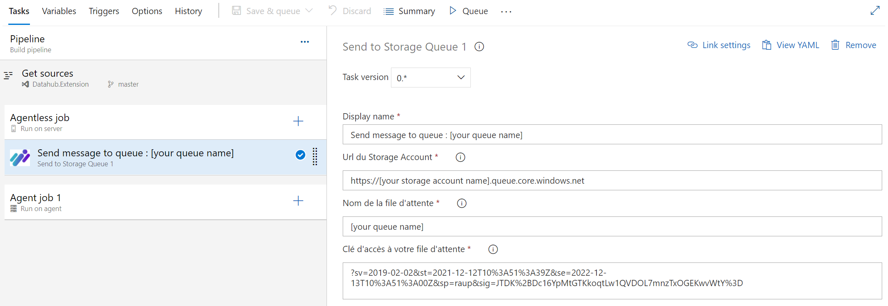
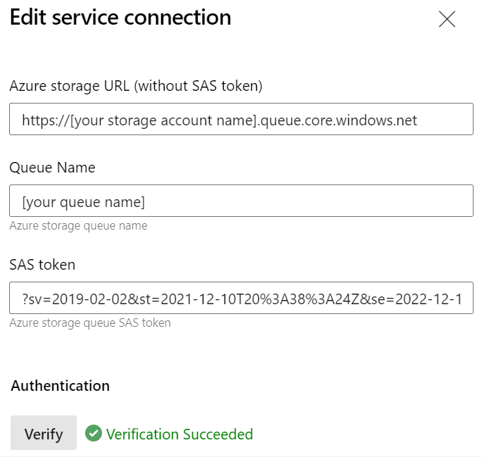
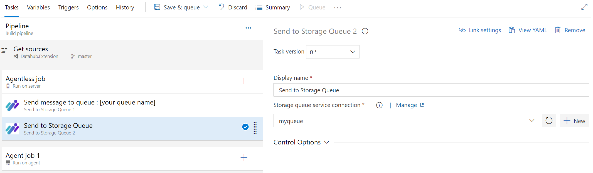
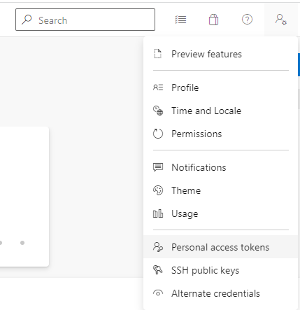
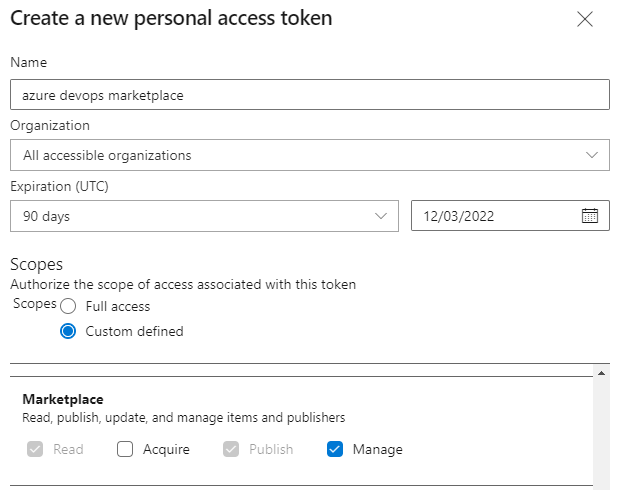
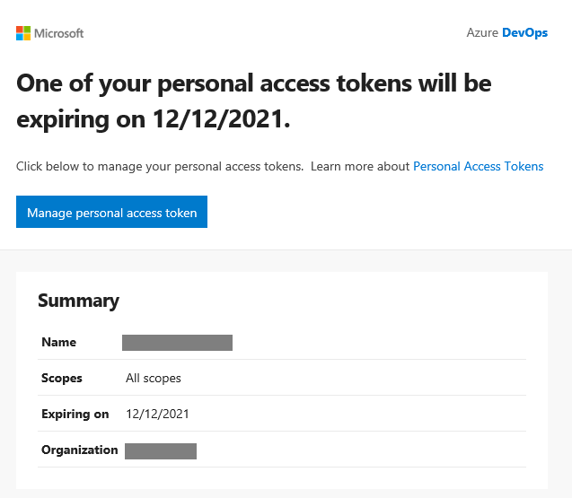

!!! important
    This article written in French will be translated into English in the next few days. stay tuned ;-).

Cela fait maintenant des années que j'utilise quotidiennement **Azure DevOps**. J'ai pu connaitre sa version **On-Premise** nommée **Team Foundation Server**, puis sa première version **SaaS** nommée **Visual Studio Team Services**.

Vous ne le savez peut-être pas, mais il est possible d'étendre les fonctionnalités d'**Azure DevOps** au travers d'extensions. Ces extensions vont vous permettre d'étendre les capacités d'**Azure DevOps** pour répondre à vos enjeux de productivité.
Vous allez pouvoir personnaliser vos **boards** Azure, la gestion de vos **repositories** Azure, vos pipelines **CI/CD**, ...

Le **marketplace** d'**Azure DevOps** propose déjà de nombreuses extensions gratuites et payantes. Mais il est possible que vous ne trouviez pas votre bonheur. Dans ce cas, vous pouvez vous même développer vos propres extensions. 

!!! note
    Les possibilités d'extensions sont énormes mais sont malheureusement très peu documentées. L'article [Azure DevOps extensibility points](https://docs.microsoft.com/en-us/previous-versions/azure/devops/extend/reference/targets/overview?WT.mc_id=AZ-MVP-5004832) liste en partie les extensions possibles.

Je vous propose dans cet article d'étendre les capacités de vos pipelines de **CI/CD** avec une **agentless task** ou **server task**.

!!! note
    J'aurais préféré vous faire un comparatif de ce type de tâche entre les extensions **Azure DevOps** et les **Github Action**, malheureusement **Github** ne propose pas encore ce type de fonctionnalité. C'est bien dommage !

## Développer sa propre tâche agentless

### Une tâche agentless, c'est quoi et pourquoi j'en aurais besoin ?

Lorsque vous exécutez un pipeline dans **Azure DevOps** pour compiler, analyser, tester ou déployer un composant vous utilisez un agent. Cet agent est une "machine" sur laquelle **Azure DevOps** va demander de réaliser des actions (une compilation .NET par exemple). Mais il est possible de demander à **Azure DevOps** d'exécuter lui-même certaines tâches. On parle alors d'**agentless task** ou de **server task**. 

Les possibilités de ce type de tâches sont cependant limitées. Vous ne pourrez réaliser que 3 types d'opérations :

- **HttpRequest** : pour réaliser une requête **HTTP/S**,
- **ServiceBus** : pour envoyer un message dans une file d'attente d'**Azure Service Bus**,
- **HttpRequestChain** : pour réaliser une suite de requêtes **HTTP/S**.

Mais, dans de nombreux cas vous n'aurez besoin que de cela :

- Imaginons que vous souhaitez notifier automatiquement une application de votre SI d'une mise à jour applicative sur un environnement depuis votre pipeline Azure DevOps. Vous n'avez peut-être pas besoin de solliciter un agent pour cela ? Peut-être qu'une ou plusieurs requêtes **HTTP/S** seraient suffisantes.
- Imaginons que vous souhaitez provisionner vos propres agents **Azure DevOps** éphémères (cf. [mon article](../classroom/02.azureClassroom.batch.md)). Il serait préférable de se passer d'un agent pour en provisionner un autre !

!!! note
    Les tâches **agentless** sont executées depuis les serveurs **Azure DevOps** qui ont des plages d'**IP** bien définies (cf. [documentation microsoft](https://docs.microsoft.com/fr-fr/azure/devops/organizations/security/allow-list-ip-url?view=azure-devops&tabs=IP-V4#inbound-connections&WT.mc_id=AZ-MVP-5004832)). Elles offrent donc l'avantage d'être plus faciles à **whitelister** auprès des **firewalls** que les agents **Microsoft Hosted**.  

### Pas besoin de savoir coder pour cela !

Et oui, l'implémentation de ce type de tâche ne nécessite aucune compétence dans un langage ou **framework** autre que le format "json".

Pour commencer, il vous faudra installer localement **[Node.js](https://nodejs.org/en/)** puis installer **tfx-cli** via l'utilitaire **npm** installé avec **Node.js**.

Si vous êtes sur Linux/OSX :

```bash 
sudo npm install -g tfx-cli
```

Si vous êtes sur Windows :

```bash
npm install -g tfx-cli
```

Ensuite dans votre répertoire de travail, vous allez créer 2 dossiers et 3 fichiers comme ceci :

```  
  |--- images                        
      |--- extension-icon.png         // l'icône de votre extension
  |--- buildandreleasetask            
      |--- task.json                  // la tâche agentless 
  |--- vss-extension.json             // le manifeste de votre extension
```

!!! warning 
    L'icône de votre extension doit être au format **PNG** et respecter une dimension bien précise : 128x128 pixels. En dehors de cela, vous être complètement libre.

!!! note
    Il n'est pas obligatoire de respecter les noms des dossiers et des fichiers. Mais pour plus de compréhension, je conseille de respecter une nomenclature proche de celle-ci.

Commençons par l'implémentation du manifeste.

#### Le fichier vss-extension.json

Le fichier manifeste est un descriptif de l'extension. L'extension pouvant contenir plusieurs éléments, ce fichier va permettre de les lister et de préciser quelques informations obligatoires pour être sur le **marketplace Azure Devops**.

Ci-dessous un exemple de manifeste :

```json
{
    "manifestVersion": 1,
    "id": "test-push-to-storagequeue",
    "publisher": "Pmorisseau",
    "version": "1.0.7",
    "name": "test-push-to-storagequeue",
    "description": "test-push-to-storagequeue",
    "public": false,
    "categories": [ "Azure Pipelines" ],
    "targets": [
        {
            "id": "Microsoft.VisualStudio.Services"
        }
    ],
    "icons": {
        "default": "images/icon.png"
    },
    "files": [
        {
            "path": "buildandreleasetask"
        }
    ],
    "contributions": [
        {
            "id": "sendtostoagequeue1",
            "description": "Agentless task that push a message to an azure queue",
            "type": "ms.vss-distributed-task.task",
            "targets": [ "ms.vss-distributed-task.tasks" ],
            "properties": {
                "name": "buildandreleasetask"
            }
        }        
    ]
}
```

Ce qu'il est important de retenir à propos des différents attributs :

- **id** : doit être constant au fil des évolutions de l'extension. C'est lui qui permet d'identifier de façon unique l'extension,
- **version** : doit toujours être incrémenté avant d'être publié sur le **marketplace**,
- **public** : permet de rendre publique ou non l'extension. Une version publique de l'extension le restera même si ultérieurement vous la repassez en privée,
- **files** : doit lister tous les dossiers qui devront être intégrés dans l'extension,
- **contribution** :
  
    - **id** : est un identifiant unique et doit correspondre au nom de la tâche (attribut **name** dans le fichier **task.json**),
    - **type** : doit être `ms.vss-distributed-task.task` dans le cas d'une **agentless task**,
    - **targets** : doit contenir `ms.vss-distributed-task.tasks` dans le cas d'une **agentless task**,
    - **properties** :

        - **name** : doit correspondre au dossier contenant le fichier **task.json**.


!!! note 
    Microsoft met à disposition une documentation détaillée [ici](https://docs.microsoft.com/fr-fr/azure/devops/extend/develop/manifest?view=azure-devops&WT.mc_id=AZ-MVP-5004832)

Passons maintenant à l'implémentation de la tâche.

#### Le fichier task.json

Imaginons que nous souhaitons réaliser une tâche permettant d'envoyer des messages dans une **storage queue**.
Voici ce que pourrait donner le fichier **task.json** :

```json
{
    "$schema": "https://raw.githubusercontent.com/Microsoft/azure-pipelines-task-lib/master/tasks.schema.json",
    "id": "bee81c33-f056-4721-a4fd-7141e07c42ad",
    "name": "sendtostoagequeue1",
    "friendlyName": "Send to Storage Queue",
    "description": "",
    "helpMarkDown": "Send to Storage Queue",
    "category": "Azure Pipelines",
    "author": "Pmorisseau",
    "visibility": [
        "Build",
        "Release"
    ],
    "runsOn": [
        "Server",
        "ServerGate"
    ],
    "version": {
        "Major": 0,
        "Minor": 0,
        "Patch": 1
    },       
    "instanceNameFormat": "Send message to queue : $(queueName)",
    "inputs": [
        {
            "name": "storageAccountUrl",
            "type": "string",
            "label": "Url du Storage Account",
            "defaultValue": "",
            "required": true
        },
        {
            "name": "queueName",
            "type": "string",
            "label": "Nom de la file d'attente",
            "defaultValue": "",
            "required": true
        },
        {
            "name": "storageAccountSasToken",
            "type": "string",
            "label": "Clé d'accès à votre file d'attente",
            "defaultValue": "",
            "required": true
        }        
    ],
    "execution": {
        "HttpRequest": {
            "Execute": {
                "EndpointUrl": "{{storageAccountUrl}}/{{queueName}}/messages$(storageAccountSasToken)",
                "Method": "POST",
                "Body": "<QueueMessage><MessageText>Lorem Ipsum dolor sit amet !</MessageText></QueueMessage>",
                "Headers": "{\n\"Content-Type\":\"application/xml\"\n}"
            }
        }
    } 
}    
```

Ce qu'il est important de retenir c'est que :

- l'attribut **id** doit être unique et constant au fil des évolutions de la tâche,
- l'attribut **name** doit correspondre à un **id** du nœud **contributions** dans le fichier **vss-extension.json**, 
- l'attribut **runsOn** doit contenir **Server** et/ou **ServerGate** pour être considéré comme une tâche **agentless**, 
- le nœud **inputs** doit contenir tous les paramètres de la tâche,
- le nœud **execution** doit contenir la commande **agentless** à executer.  

!!! note
    Le schéma complet est disponible [ici](https://raw.githubusercontent.com/Microsoft/azure-pipelines-task-lib/master/tasks.schema.json)

Notre exemple ci-dessus, une fois déployé dans **Azure DevOps**, va mettre à disposition une nouvelle tâche qui, dans un pipeline classique, ressemblera à cela :



Et dans un pipeline yaml, à cela :

```yaml
- task: Pmorisseau.test-push-to-storagequeue.sendtostoagequeue1.sendtostoagequeue1@0
  displayName: 'Send message to queue : [your queue name]'
  inputs:
    storageAccountUrl: 'https://[your storage account name].queue.core.windows.net'
    queueName: '[your queue name]'
    storageAccountSasToken: '?sv=2019-02-02&st=2021-12-12T10%3A51%3A39Z&se=2022-12-13T10%3A51%3A00Z&sp=raup&sig=JTDK%2BDc16YpMtGTKkoqtLw1QVDOL7mnzTxOGEKwvWtY%3D'
```

Cependant, on est obligé de renseigner dans notre pipeline des données sensibles comme l'url ou la clé d'accès à notre api. Cela peut être considéré comme une faille de sécurité.

Pas de souci, on peut aussi créer ses propres **service connections**.

### Créer son service connection

Tout d'abord, il va falloir modifier le fichier manifeste (**vss-extension.json**) pour déclarer le nouveau type de **service connection**. 

Dans le nœud **contributions**, on va rajouter :

```json
        {
            "id": "storagequeue",
            "description": "Storage Queue",
            "type": "ms.vss-endpoint.service-endpoint-type",
            "targets": [
                "ms.vss-endpoint.endpoint-types"
            ],
            "properties": {
                "name": "storagequeue",
                "displayName": "Storage Queue",
                "url": {
                    "displayName": "Azure storage URL (without SAS token)",
                    "required": true
                },
                "inputDescriptors": [
                    {
                        "id": "queueName",
                        "name": "Queue Name",
                        "description": "Azure storage queue name",
                        "inputMode": "textbox",
                        "isConfidential": false,
                        "validation": {
                            "isRequired": true,
                            "dataType": "string",
                            "maxLength": 200
                        }
                    },   
                    {
                        "id": "sasToken",
                        "name": "SAS token",
                        "description": "Azure storage queue SAS token",
                        "inputMode": "passwordbox",
                        "isConfidential": false,
                        "validation": {
                            "isRequired": true,
                            "dataType": "string",
                            "maxLength": 500
                        }
                    }                                          
                ],
                "dataSources": [
                    { 
                        "name": "TestConnection",
                        "endpointUrl": "{{endpoint.url}}/{{endpoint.queueName}}/messages$(endpoint.sasToken)",
                        "resultSelector": "xpath://QueueMessagesList"
                    }
                ],                                  
                "authenticationSchemes": [
                    {
                        "type": "ms.vss-endpoint.endpoint-auth-scheme-none"
                    }
                ]
            }
        }
```

Ce qu'il est important de retenir à propos des différents attributs :

- **id** : est un identifiant unique,
- **type** : doit être `ms.vss-endpoint.service-endpoint-type`,
- **targets** : doit contenir `ms.vss-endpoint.endpoint-types`,
- **properties** :

    - **url** : corresponde à l'url du service,
    - **inputDescriptors** : doit contenir l'ensemble des paramètres complémentaire à l'url,
    - **dataSource** et l'item **TestConnection** (exactement orthographié comme cela) : permettent de définir le test de connexion du **service connection**,

        - **endpointUrl** : corresponde à l'url appelée lors du test de connexion,
        - **resultSelector** : correpond à la vérification à réaliser sur la réponse lors du test de connexion,

    - **authenticationSchemes** : définit le mode d'authentification parmi :
    
        - **Authentification de base** avec le type `ms.vss-endpoint.endpoint-auth-scheme-basic` dans le cas d'une authentification avec un identifiant et un mot de passe encodé en base 64 dans l'en-tête **HTTP**,
        - **Authentification basée sur un jeton** avec le type `ms.vss-endpoint.endpoint-auth-scheme-token` dans le cas d'une authentification avec un jeton dans l'en-tête **HTTP**,
        - **Authentification par certificat**  avec le type `ms.vss-endpoint.endpoint-auth-scheme-cert`  dans le cas d'une authentification avec certificat,
        - **Sans athentification** avec le type `ms.vss-endpoint.endpoint-auth-scheme-none` lorsqu'il n'y a pas d'authentification.
  
!!! note
    Les différents types d'authentification sont décrits [ici](https://docs.microsoft.com/fr-fr/azure/devops/extend/develop/auth-schemes?view=azure-devops&WT.mc_id=AZ-MVP-5004832)

Ensuite, il va falloir modifier le fichier **task.json** pour utiliser notre **service connection** en remplaçant le contenu du nœud **inputs** par :

```json
        {
            "name": "connectedServiceName",
            "aliases": [
                "serviceConnection",
                "genericService"
            ],
            "type": "connectedService:storagequeue",
            "label": "Storage queue service connection",
            "defaultValue": "",
            "required": true,
            "helpMarkDown": "Select an storage queue service connection"
        }
```

Il faudra veiller à ce que l'attribut **type** corresponde à `connectedService:[id du service connection dans le fichier manifeste]`.

Et modifier le contenu du nœud **executions** par :

```json
        "HttpRequest": {
            "Execute": {
                "EndpointId": "$(connectedServiceName)",
                "EndpointUrl": "{{endpoint.url}}/{{endpoint.queueName}}/messages$(endpoint.sasToken)",
                "Method": "POST",
                "Body": "<QueueMessage><MessageText>Lorem Ipsum dolor sit amet !</MessageText></QueueMessage>",
                "Headers": "{\n\"Content-Type\":\"application/xml\"\n}"
            }
        }   
```

Il faudra veiller à ce que :

- l'attribut **EndpointId** corresponde à `$([l'attribut name dans le nœud inputs])`,
- les paramètres du **service connection** soient préfixés par "endpoint.".

!!! note
    Il y a 2 syntaxes possibles pour faire référence à un paramètre :

    - `{{le_nom_de_l_attribut}}` : sera intéprété comme un texte devant être converti en url (**httpencode**).
    - `$(le_nom_de_l_attribut)` : ne sera pas intéprété et donc sera utilisé tel quel.

    Dans notre exemple, le **sasToken** contenant un ensemble de paramètres au format **Http query**, il ne doit donc pas être converti.

Notre exemple n°2, une fois déployé dans **Azure DevOps**, va mettre à disposition un nouveau **service connection** qui ressemblera à cela :



Il modifiera aussi la tâche qui ressemblera à cela :



Et dans un pipeline yaml, à cela :

```yaml
- task: Pmorisseau.test-push-to-storagequeue.sendtostoagequeue2.sendtostoagequeue2@0
  displayName: 'Send to Storage Queue'
  inputs:
    serviceConnection: myqueue
```

Maintenant, le pipeline ne contient plus de données "sensibles".

#### Les limitations

Les limitations d'implémentation des **service connections** sont nombreuses et parfois un peu frustrantes :

- les paramètres décrits dans le nœud **inputDescriptors** ne peuvent pas être utilisés si l'attribut **isConfidential** est définit à "true",
- les modes d'authentification permis sont trop peu nombreux. Il aurait été bienvenue de permettre les authentifications modernes comme l'**oauth 2.0** et les authentifications simples comme l'**apikey** ou le **sasToken** dans l'url de la requête **HTTP**,
- l'**inputMode password** ne sert à rien dans le nœud **inputDescriptors**.

!!! note
    Dans notre exemple le **sasToken** de notre storage queue restera toujours en clair. 

Maintenant que nous avons preparé notre extension avec notre nouvelle tâche **agentless**, il ne nous reste plus qu'à la publier ! 

### Publier sur le marketplace

Pour pouvoir utiliser nos extensions sur **Azure DevOps**, il faut préalablement publier celle-ci sur le **marketplace** d'**Azure DevOps**.

!!! note
    Il vous faut obligatoirement un compte déjà enregistré dans une organisation **Azure DevOps** pour publier sur le **marketplace**.

1. Connectez-vous à votre organisation **Azure DevOps** : https://dev.azure.com/[votre organisation]
2. Une fois connecté, générez un **personal acces token** en cliquant sur **User settings** puis sur **Personal access tokens**.

    

3. Créez un nouveau **Personal access token** en précisant bien **All accessible organisations** et en cochant **Manage** sous **Marketplace**.

    

4. Cliquez sur **Create** et notez bien la clé retournée, c'est votre **Personal access token**.
5. Exécutez la commande ci-dessous pour packager l'extension :
   ```bash
    tfx extension create --manifest-globs vss-extension.json
   ```
6. Exécutez la commande ci-dessous pour publier l'extension sur le marketplace :
   ```bash
    tfx extension publish --manifest-globs vss-extension.json --share-with [liste des organisations avec qui vous voulez partager votre extension (séparé par une virgule)]
   ```
7. durant le processus de publication, il vous sera demandé de saisir votre **personal access token**.

!!! attention
    Votre **personal access token** a systématiquement une date d'expiration. Vous recevrez une notification par email (envoyé par azuredevops@microsoft.com) 5 jours avant l'expiration.

    

    Pensez à renouveler votre **token** !

Votre extension est maintenant publiée. 

Vous pouvez consulter celle-ci directement sur le [marketplace](https://marketplace.visualstudio.com/azuredevops). Pour cela, une fois connecté, cliquez sur **Publish extensions**.

## Conclusion

Bien que les capacités d'**Azure DevOps** peuvent être étendues sur de nombreux aspects, il s'avère que la documentation Microsoft pour aider les développeurs est souvent éparpillée et/ou incomplète.

Dans cet article, j'ai essayé de vous montrer un exemple simple d'extension. Pour cela, bien que je connaisse le système d'extension, j'ai dû m'y reprendre de nombreuses fois pour avoir une extension opérationnelle. Les nombreuses limitations sont souvent des facteurs de frustration.

Cependant, les **github action** ne permettant pas aujourd'hui ce type de tâche, nous n'avons pas vraiment le choix avec les outils Microsoft... Il reste encore beaucoup de choses à améliorer de ce point de vue !

## Références

- [Azure DevOps extensibility points](https://docs.microsoft.com/en-us/previous-versions/azure/devops/extend/reference/targets/overview?WT.mc_id=AZ-MVP-5004832)
- [Server Task Authoring](https://github.com/Microsoft/azure-pipelines-tasks/blob/master/docs/authoring/servertaskauthoring.md)
- [Tfx cli](https://github.com/microsoft/tfs-cli)
- [Ajouter une extension de tâche de pipeline personnalisée](https://docs.microsoft.com/fr-fr/azure/devops/extend/develop/add-build-task?view=azure-devops&WT.mc_id=AZ-MVP-5004832)
- [Task Json Schema](https://raw.githubusercontent.com/Microsoft/azure-pipelines-task-lib/master/tasks.schema.json)
- [Référence du manifeste de l’extension](https://docs.microsoft.com/fr-fr/azure/devops/extend/develop/manifest?view=azure-devops&WT.mc_id=AZ-MVP-5004832)
- [Schémas d’authentification du point de terminaison de service](https://docs.microsoft.com/fr-fr/azure/devops/extend/develop/auth-schemes?view=azure-devops&WT.mc_id=AZ-MVP-5004832)

## Remerciements

- [Oussama Mouchrit](https://www.linkedin.com/in/mouchritoussama/) : pour la relecture
- [Laurent Mondeil](https://www.linkedin.com/in/laurent-mondeil-0a87a743/) : pour la relecture
- [Michael Maillot](https://twitter.com/michael_maillot) : pour la relecture
- [Fabrice Weinling](https://www.linkedin.com/in/%E2%99%A0-fabrice-weinling-%E2%99%A0-414187114/) : pour la relecture

_Rédigé par Philippe MORISSEAU, Publié le 14 Décembre 2021_