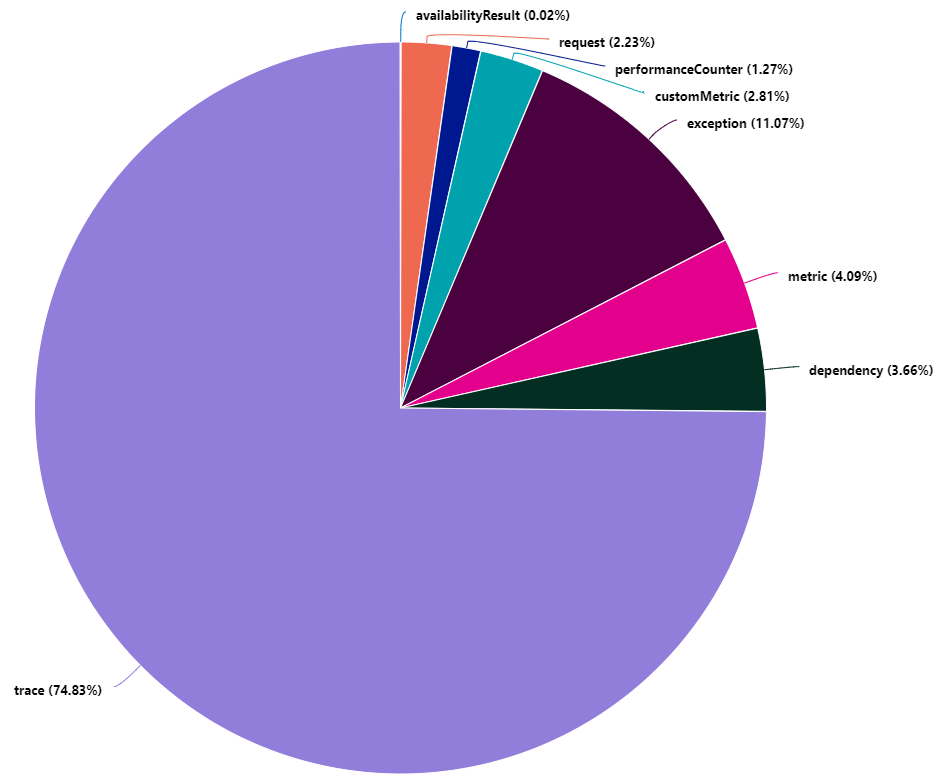
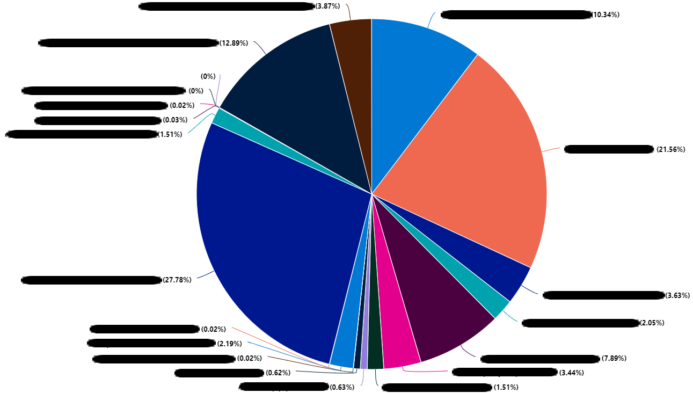
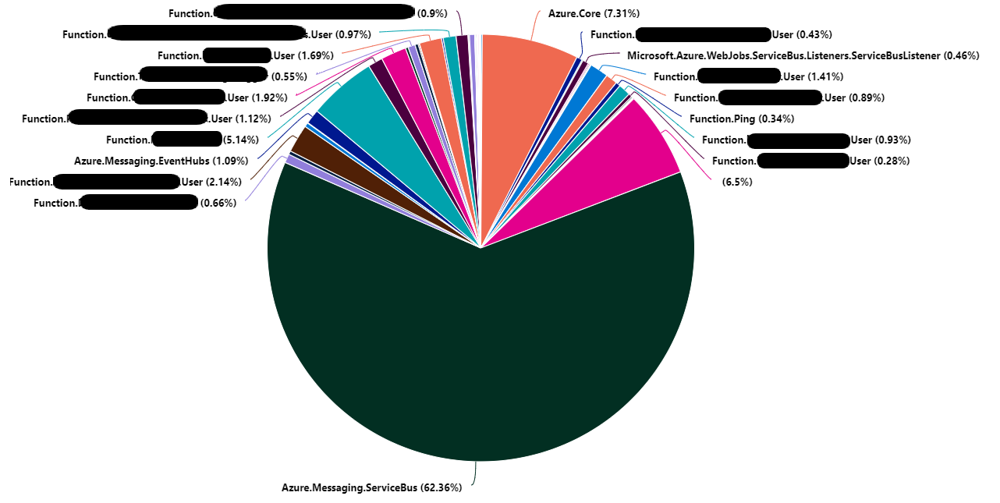
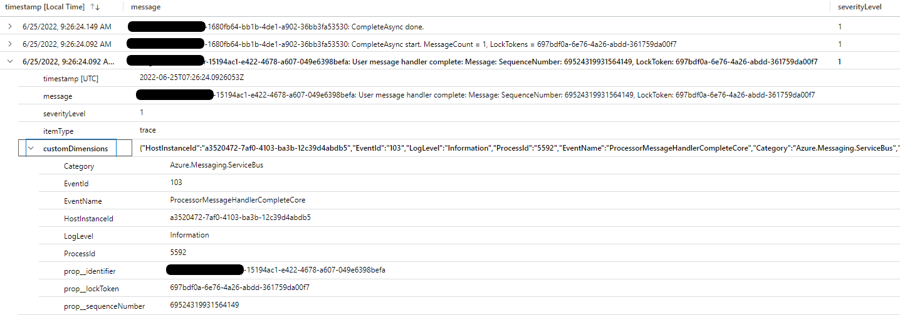
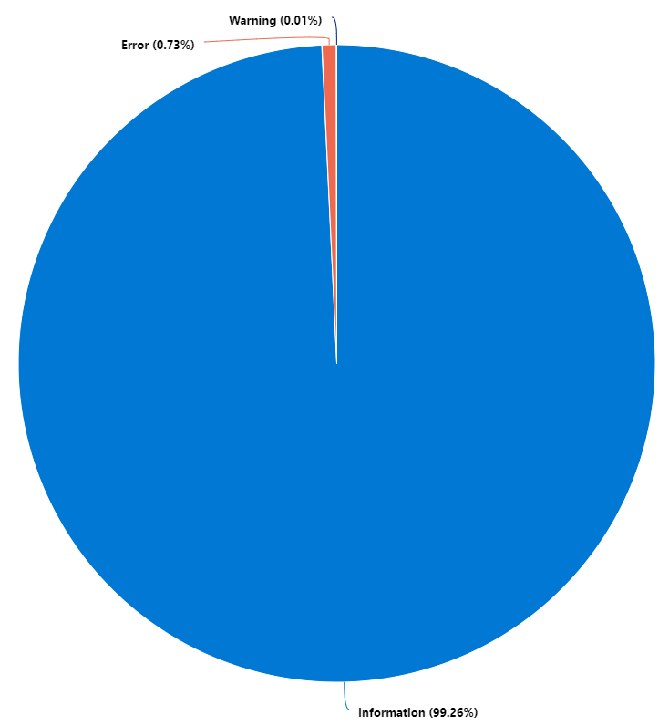

Setting up the monitoring of your **Azure Function** is essential (especially for your applications in production). But it happens that these produce many more logs than necessary. In this case, you can have a significant financial impact on **Application Insights/Log Analytics**. Here are some tips to limit this.

## Monitor log volumes

In order to understand why your log ingestion costs are exploding on **Application Insights/Log Analytics**, you need to identify the most common types of logs. From **Log Analytics** run the following **Kusto** query:

``` kusto
union *
| where timestamp > ago(7d)
| summarize sum(_BilledSize) by itemType
| render piechart 
```

This query generates a pie chart with the distribution of the volume of billable logs by type of logs.



In this example, we can see that `trace` type logs represent more than 74% of the volume of billable logs.

Let's focus on these `trace` logs to now identify which sources are producing the most volume. Maybe a particular application generates too many logs. From **Log Analytics** now run the following **Kusto** query:

``` kusto
traces
| where timestamp > ago(7d)
| summarize sum(_BilledSize) by cloud_RoleName
| render piechart
```



In the example above, we see that the sources of our logs are varied and rather distributed. This is not always the right track!

If this is not one of the sources at the origin of our volume of logs, perhaps it is a library, an SDK used by our **Azure Function** which is the source of our misfortunes.

!!! note
    The **Azure Function** runtime classifies logs by `category`. These `category` are accessible in the `customDimensions` of the `trace` logs.

To do this, we will execute the following **Kusto** query:

``` kusto
traces
| where timestamp > ago(7d)
| summarize sum(_BilledSize) by tostring(customDimensions.Category)
| render piechart 
```



In the example above it appears that the category `Azure.Messaging.ServiceBus` represents 62% of the volume of `trace` logs. Reduced to the total volume of logs, this represents: 46.5%.

Now that we have identified our origin. It is necessary to ensure the relevance of the logs. Maybe these logs are needed?
A simple exploration of the logs over the last 30 minutes (or more depending on your context) allows you to quickly analyze the logs:

``` kusto
traces
| where timestamp > ago(30m) and customDimensions.Category == "Azure.Messaging.ServiceBus"
```



In our case, we see that these are logs allowing us to trace the sending and reception of messages to and from **Azure ServiceBus**.

We consider that these logs are not relevant (simple assumption, it is not a generality). These logs can be removed from **Azure Application Insights/Log Analytics** ingestion. But before intervening it is necessary to check the distribution of these logs by severity level.

For this, the following **Kusto** query will help us:

``` kusto
traces
| where timestamp > ago(30m) and customDimensions.Category == "Azure.Messaging.ServiceBus"
| summarize count() by tostring(customDimensions.LogLevel)
| render piechart 
```



It can be seen that 99% of the logs are of the `Information` severity level.

This analysis process shows that a simple remediation at the **Azure Function** configuration level will reduce the volume of logs by 46%. This remediation consists of raising the verbosity level to `Warning` for the logs of the `Azure.Messaging.ServiceBus` category.

## Remediation at the Azure Function level

I won't explain how to configure your **Azure function** so that it can send its logs to **Application Insights**. [This Microsoft article](https://docs.microsoft.com/en-us/azure/azure-functions/configure-monitoring?tabs=v2#enable-application-insights-integration&WT.mc_id=AZ-MVP-5004832) explains it very well.

However, what this documentation does not explain well is that the list of categories described [here](https://docs.microsoft.com/en-us/azure/azure-functions/configure-monitoring?tabs=v2#configure-categories&WT.mc_id=AZ-MVP-5004832) is not exhaustive.

Indeed, all the categories previously identified during the analysis can be configured.

To raise the verbosity level to `Warning` for logs in the `Azure.Messaging.ServiceBus` category, simply modify the `host.json` file by adding `"Azure.Messaging.ServiceBus": "Warning"` .

We will have a file that will look like this:

``` json
{
  "logging": {
    "logLevel": {
      "default": "Information",
      "Azure.Messaging.ServiceBus": "Warning"
    }
  }
}
```

And that's all !

## Conclusion

It is important to take the time to analyze the nature of the logs. The **Application Insights** and **Log Analytics** services offer excellent means of analysis and research. In a **FinOps** approach, they can prove to be very practical tools. Indeed, through this example I managed to reduce by 46% the volume of logs ingested by **Application Insights/Log Analytics**.
Assuming that we had 10 GB of logs ingested per day (in the **France Central** region), this would amount to a saving of €350 per month.

## References

- [Microsoft : How to configure monitoring for Azure Functions](https://docs.microsoft.com/en-us/azure/azure-functions/configure-monitoring?tabs=v2&WT.mc_id=AZ-MVP-5004832)
- [azure-sdk-for-net - issue : [QUERY] Service bus telemetry seems excessive](https://github.com/Azure/azure-sdk-for-net/issues/25865)

## Thanks

- [Nicolas Bregent](https://www.linkedin.com/in/nicolasbregent/) : for proofreading
- [Fabrice Weinling](https://www.linkedin.com/in/fabrice-weinling-414187114/) : for proofreading
- [Etienne Louise](https://www.linkedin.com/in/etienne-louise-78154063/) : for proofreading 
- [Samy Mameri](https://www.linkedin.com/in/samy-mameri-60649079/) : for proofreading

_Written by Philippe MORISSEAU, Published on June 27, 2022._